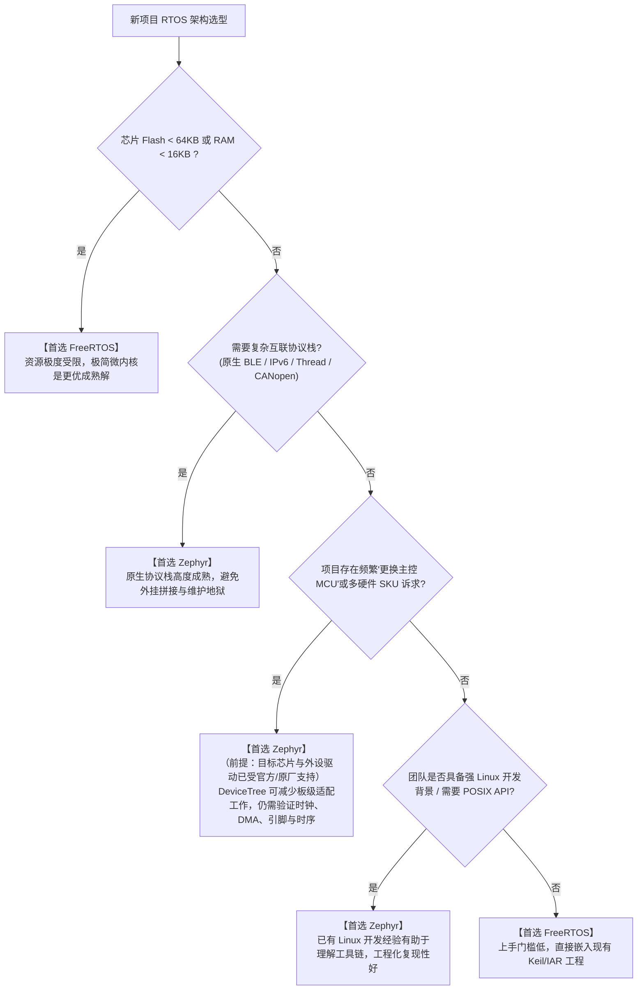

# 场景选型决策树与选型矩阵

## 1. 架构师选型决策树（Decision Tree）

在面对一个全新嵌入式产品立项时，技术决策不应凭个人主观喜好，而应顺着硬件规格、通信协议、维护周期与团队技术栈进行严格判定：

---

## 2. 加权选型评估示例

> [!NOTE]
> **评分性质说明（Disclaimer & Guidance）**：  
> 以下表格中的**权重与打分均为作者基于典型嵌入式/物联网场景经验给出的示例权重与定性主观评分**，仅用于提供系统化的决策研讨框架，不可作为不可更改的客观物理测定结果。各团队在实际立项时，**必须根据自身项目的具体约束（如 BOM 成本上限、团队技术栈背景、产品维护周期与硬件驱动就绪度）动态调整各维度权重并独立重新打分**。

| 评估维度 | 示例参考权重 | FreeRTOS 主观评分 | Zephyr 主观评分 | 核心工程权衡依据 |
| :--- | :--- | :--- | :--- | :--- |
| **资源占用 (Footprint)** | 15% | **9.8** | 7.0 | FreeRTOS 极简核心仅数 KB，适应低至 16KB Flash 的极小 MCU |
| **硬实时确定性 (Determinism)** | 20% | **9.5** | 8.8 | 位图任务选取开销较小；完整延迟与抖动仍须按目标配置实测 |
| **驱动标准化与解耦** | 20% | 5.5 | **9.6** | Zephyr 统一驱动模型与设备树分离；传统 BSP 方案依赖厂商胶水层 |
| **物联网协议栈生态** | 15% | 6.5 | **9.5** | Zephyr 原生集成开源 BLE、IPv6/LwM2M、OpenAMP，协议栈一致性极高 |
| **内存安全隔离 (MPU)** | 10% | 6.0 | **9.2** | Zephyr 原生支持用户空间与系统调用验证工具链；FreeRTOS-MPU 需手动配置 |
| **开发上手与学习曲线** | 10% | **9.5** | 6.0 | FreeRTOS 数小时即可快速集成；Zephyr 需掌握 West/CMake/DTS/Kconfig 体系 |
| **团队工程化与 CI/CD** | 10% | 6.5 | **9.4** | Zephyr 基于模块清单与容器化工具链，大型团队代码复现性与协作体验更佳 |

---

## 3. 典型落地应用场景判定建议

### 3.1 优先推荐选用 FreeRTOS 的场景
1. **低成本家电主控与传感器采集**：基于 8 位/16 位 MCU 或超低成本 Cortex-M0+ 芯片（如 Flash $\le 32\,\text{KB}$）。
2. **高速电机驱动与数字电源逆变器**：控制算法对中断响应抖动要求在纳秒级别，业务逻辑相对单一，无复杂网络协议。
3. **快速打样与轻量级外包项目**：团队工程师习惯于 Keil MDK / IAR 图形化 IDE 一键编译调试，追求数天内快速点亮。

### 3.2 优先推荐选用 Zephyr 的场景
1. **智能穿戴式手环与健康监护设备**：深度依赖低功耗蓝牙（BLE）、传感器融合、统一电源管理与低功耗状态机。
2. **复杂智能工业网关与充电桩**：多网络协议并发（Ethernet + 4G + CAN总线）、需要文件系统与 OTA 固件安全升级。
3. **异构多核 SoC 协同（AMP）**：主核跑 Linux、从核跑实时操作系统，使用 OpenAMP 和 RPMsg 进行跨核零拷贝数据通信。
4. **面向欧美跨国合规的大型商业产品**：产品需通过严格的开源合规审查、网络安全评估（PSA Certified）与长效 LTS 安全补丁维护。
