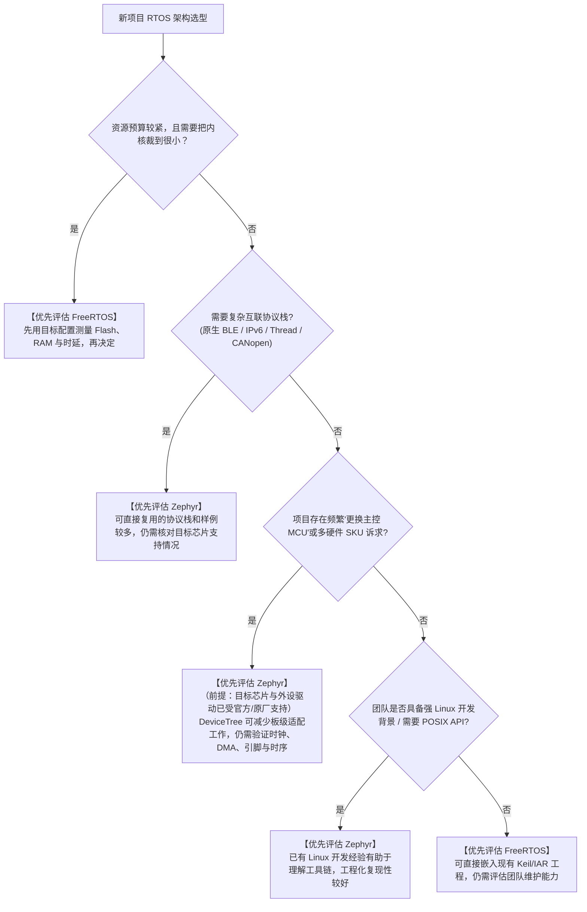

# 场景选型决策树与选型矩阵

## 1. 架构师选型决策树（Decision Tree）

在面对一个全新嵌入式产品立项时，技术决策不应凭个人主观喜好，而应顺着硬件规格、通信协议、维护周期与团队技术栈进行严格判定：

---

## 2. 选型记录表

按项目填写结果，避免将主观小数评分当作实测排名。

| 维度 | 需要记录的证据 |
| :--- | :--- |
| 内存预算 | 相同功能下的 ELF/map、栈水位与缓冲池峰值 |
| 实时性 | 中断屏蔽上限、关键任务响应时间及压力测试 |
| 硬件支持 | 目标板和外设的驱动状态、缺失功能与适配成本 |
| 协议栈 | 所需特性、吞吐、连接数和产品认证范围 |
| 隔离 | MPU 端口、对象权限与故障处理行为 |
| 维护 | 固定版本、支持期限、升级回归与团队经验 |

## 3. 典型落地应用场景判定建议

### 3.1 优先推荐选用 FreeRTOS 的场景
1. **低成本家电主控与传感器采集**：基于 8 位/16 位 MCU 或超低成本 Cortex-M0+ 芯片（如 Flash $\le 32\,\text{KB}$）。
2. **高速电机驱动与数字电源逆变器**：控制算法对中断响应抖动要求较严，业务逻辑相对单一，无复杂网络协议；具体上限应由目标硬件实测。
3. **快速打样与轻量级外包项目**：团队工程师习惯于 Keil MDK / IAR 图形化 IDE 一键编译调试，追求数天内快速点亮。

### 3.2 优先推荐选用 Zephyr 的场景
1. **智能穿戴式手环与健康监护设备**：深度依赖低功耗蓝牙（BLE）、传感器融合、统一电源管理与低功耗状态机。
2. **复杂智能工业网关与充电桩**：多网络协议并发（Ethernet + 4G + CAN总线）、需要文件系统与 OTA 固件安全升级。
3. **异构多核 SoC 协同（AMP）**：主核跑 Linux、从核跑实时操作系统，使用 OpenAMP 和 RPMsg 进行跨核零拷贝数据通信。
4. **面向欧美跨国合规的大型商业产品**：产品需通过严格的开源合规审查、网络安全评估（PSA Certified）与长效 LTS 安全补丁维护。

---

## 4. 迁移前再检查

1. 用目标板的官方样例验证关键外设与协议，再估算新增驱动的工作量。
2. 比较厂商 SDK 和上游支持的实际版本，不能按厂商名字判断协议栈成熟度。
3. 把工具链学习、构建复现和后续升级纳入成本。
4. 可按子系统选择不同系统；核间通信需验证硬件通道、缓存与协议，不是所有芯片都能直接使用 RPMsg。
