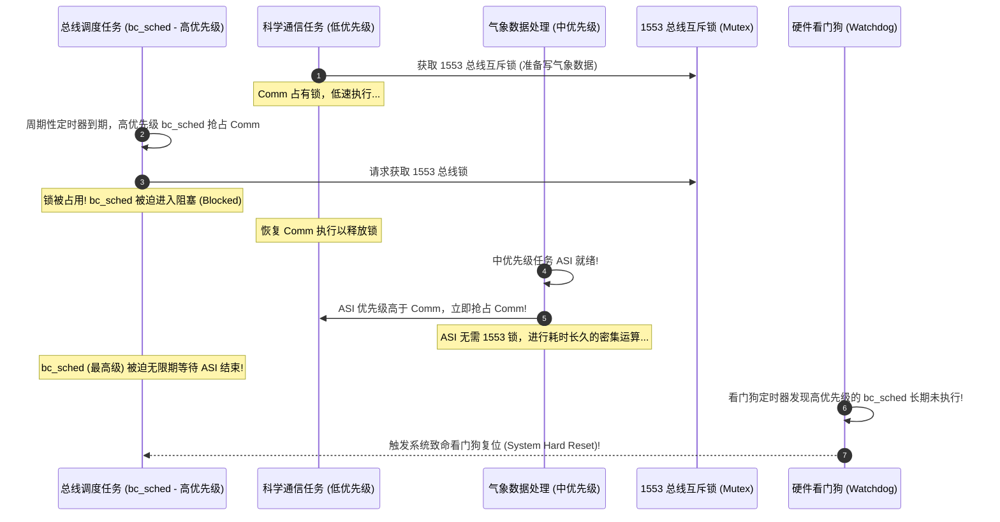

# 火星探路者优先级反转与死锁实战

## 1. 真实历史背景：火星上的惊魂死机

1997 年 7 月 4 日，NASA 的“火星探路者”（Mars Pathfinder）号探测器成功着陆火星。然而几天后，火星车着陆器开始出现高频的偶发性系统死机并触发看门狗（Watchdog）硬重启，导致大量气象科研数据丢失。

经过 NASA JPL 实验室的远程核心转储分析，确认这是一起教科书级别的**优先级反转（Priority Inversion）**事件。



---

## 2. 事故根因剖析

系统中存在三个关键任务和一个硬件资源：
1. **`bc_sched`（高优先级）**：负责 1553 航天信息总线调度，必须以极高的硬实时确定性周期执行，并向看门狗喂狗。
2. **`ASI`（中优先级）**：负责姿态与气象传感器密集数据运算，长耗时，但**完全不使用 1553 总线**。
3. **科学通信任务（低优先级）**：负责将偶尔收集到的仪器数据打包，通过 1553 总线发送。
4. **共享资源**：用于保护 1553 总线访问的互斥信号量（Mutex）。

**致命缺陷**：当时系统使用的互斥量在创建时，**默认关闭了“优先级继承”（Priority Inheritance）参数**（互斥锁参数传了 0）。

当低优先级通信任务拿到锁后，被高优先级 `bc_sched` 打断；`bc_sched` 要锁不得陷入阻塞；此时毫无关系的中优先级 `ASI` 突发就绪，由于其优先级高于通信任务，使通信任务停留在就绪列表中。高优先级的 `bc_sched` 因此被间接饿死，看门狗判定系统死锁，执行硬复位。

---

## 3. NASA 远程救赎与现代工程修复

NASA 工程师在地面仿真机架上复现后，利用 C 语言交互式 Shell 远程向火星探测器上注了一段动态调试补丁，将该互斥量的控制标志位置为 1（使能优先级继承）：

```c
/* 现代 FreeRTOS / POSIX 下的正确配置规范 */

/* 错误做法: 使用普通信号量当互斥锁 (无继承) */
SemaphoreHandle_t bad_mutex = xSemaphoreCreateBinary();

/* 正确做法: 使用专用 Mutex API (内核强制集成优先级继承 PIP) */
SemaphoreHandle_t safe_mutex = xSemaphoreCreateMutex();
```

开启优先级继承后，一旦 `bc_sched` 请求锁发生阻塞，内核瞬间将科学通信任务的优先级临时拉升至与 `bc_sched` 同级，阻止了中优先级 `ASI` 的无理抢占。通信任务数微秒内完成总线释放，`bc_sched` 顺利执行，探测器恢复正常运转。

---

## 4. 现场排查复盘：反转事件的通用定位法

NASA 的实际定位路径值得抽象为模板——当时探测器仍在火星运行，工程师**先靠遥测重建现场，再地面复现**：

1. **从复位转储入手**：看门狗复位前的核心转储/遥测快照里，逐任务记录「当前优先级 / 阻塞在哪个对象 / 该对象被谁持有」。
2. **画出三个角色的有向图**：高优先级 H（被阻塞）→ 锁 L → 持有者 M（低优先级，未运行）→ 谁在运行（中优先级 I，与三者无资源关系）——**I 不碰锁却在跑、M 想跑却被 I 压制**，即是反转的签名（signature）。
3. **核查锁的语义配置**：确认互斥量是否启用优先级继承（本案中即 `VxWorks` 互斥量选项位为 0 的问题）。若用的是二值信号量伪装互斥，直接改用真互斥 API。
4. **量化验证**：地面复现后打开执行流跟踪（SystemView/Tracealyzer 级时间线），确认 H 的阻塞时长 ≈ I 的执行时长（被无关任务压制的时间），而非自身临界区耗时。
5. **补结构性防御**：评估能否用消息传递（队列/邮箱）替代共享内存+锁——无共享即无反转，这是比任何锁协议都彻底的消除手段。

!!! tip
    **为什么看门狗救了任务却暴露了故障**：本案中复位是「正确行为」（安全机制兜底），真正的缺陷是复位风暴频率随气象任务负载升高——**凡是「负载越高、复位越频」的看门狗复位，都应首先怀疑优先级反转或死锁**，而不是盲目扩大看门狗窗口。


---

## 5. 优先级继承（PI）与优先级天花板（PCP）的正式对比

| 协议属性 | 优先级继承（PI, Priority Inheritance） | 优先级天花板（PCP, Priority Ceiling Protocol） |
| :--- | :--- | :--- |
| **提升时机** | 高优先级任务**已阻塞**在锁上，内核才临时提升持有者 | 任务**一旦获取**资源，立即升至该资源预设的天花板优先级（所有可能持锁者中的最高优先级） |
| **阻断的无界阻塞类型** | 只阻断「间接阻塞」（被无关中优先级任务压制） | 同时阻断间接阻塞与**死锁**（天花板优先级使循环等待的持有者无法互相压制） |
| **可调度性分析** | 阻塞项 $B_i$ 需逐锁求界，嵌套锁下界限推导复杂 | $B_i$ 上界为单次最长临界区，RTA 推导干净（经典结论） |
| **实现成本** | 低：仅需持有者指针 + 动态改优先级（FreeRTOS/Zephyr `k_mutex` 内建） | 高：需预先静态声明每资源天花板值，内核在每次 lock/unlock 维护系统天花板变量 |
| **RTOS 现实支持** | FreeRTOS `xSemaphoreCreateMutex`、Zephyr `k_mutex` 均内建 | 主流 MCU RTOS 几乎均不内建，需自研或上 OSEK/AUTOSAR OS（其 IPC 与资源语义源自 PCP 系） |
| **选择依据** | 通用默认；锁持有时间短、无复杂嵌套时足够 | 安全认证（工业/车规）要求可证明阻塞上界，或存在跨任务多锁嵌套时 |

!!! warning
    **PI 不防死锁**：任务 A 持锁 1 等锁 2、任务 B 持锁 2 等锁 1 时，PI 只会把两者互相提升到彼此优先级，死锁原样保留——两个任务以互相提升后的高优先级永远等下去。防死锁要靠全局加锁顺序约定（lock ordering）或改用 PCP。
