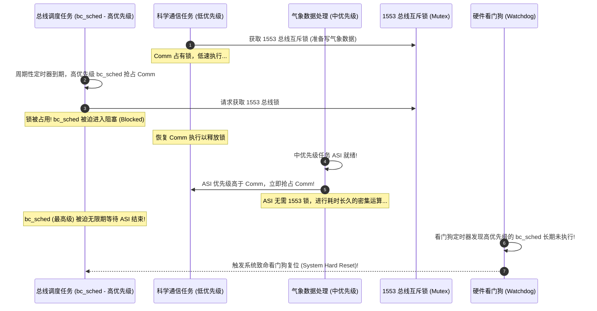

# 火星探路者优先级反转与死锁实战

## 1. 火星探路者的复位故障

1997 年 7 月 4 日，NASA 的“火星探路者”（Mars Pathfinder）号探测器成功着陆火星。然而几天后，火星车着陆器开始出现高频的偶发性系统死机并触发看门狗（Watchdog）硬重启，导致大量气象科研数据丢失。

经过 NASA JPL 实验室的远程核心转储分析，确认这是一起教科书级别的**优先级反转（Priority Inversion）**事件。



---

## 2. 事故根因剖析

系统中存在三个关键任务和一个硬件资源：
1. **`bc_sched`（高优先级）**：负责 1553 航天信息总线调度，必须以极高的硬实时确定性周期执行，并向看门狗喂狗。
2. **`ASI`（中优先级）**：负责姿态与气象传感器密集数据运算，长耗时，但**完全不使用 1553 总线**。
3. **科学通信任务（低优先级）**：负责将偶尔收集到的仪器数据打包，通过 1553 总线发送。
4. **共享资源**：用于保护 1553 总线访问的互斥信号量（Mutex）。

**致命缺陷**：当时系统使用的互斥量在创建时，**默认关闭了“优先级继承”（Priority Inheritance）参数**（互斥锁参数传了 0）。

当低优先级通信任务拿到锁后，被高优先级 `bc_sched` 打断；`bc_sched` 要锁不得陷入阻塞；此时毫无关系的中优先级 `ASI` 突发就绪，由于其优先级高于通信任务，使通信任务停留在就绪列表中。高优先级的 `bc_sched` 因此被间接饿死，看门狗判定系统死锁，执行硬复位。

---

## 3. 远程修复与优先级继承

NASA 工程师在地面仿真机架上复现后，利用 C 语言交互式 Shell 远程向火星探测器上注了一段动态调试补丁，将该互斥量的控制标志位置为 1（使能优先级继承）：

```c
/* 现代 FreeRTOS / POSIX 下的正确配置规范 */

/* 错误做法: 使用普通信号量当互斥锁 (无继承) */
SemaphoreHandle_t bad_mutex = xSemaphoreCreateBinary();

/* 正确做法: 使用专用 Mutex API (内核强制集成优先级继承 PIP) */
SemaphoreHandle_t safe_mutex = xSemaphoreCreateMutex();
```

开启优先级继承后，一旦 `bc_sched` 请求锁发生阻塞，内核瞬间将科学通信任务的优先级临时拉升至与 `bc_sched` 同级，阻止了中优先级 `ASI` 的无理抢占。通信任务数微秒内完成总线释放，`bc_sched` 顺利执行，探测器恢复正常运转。
