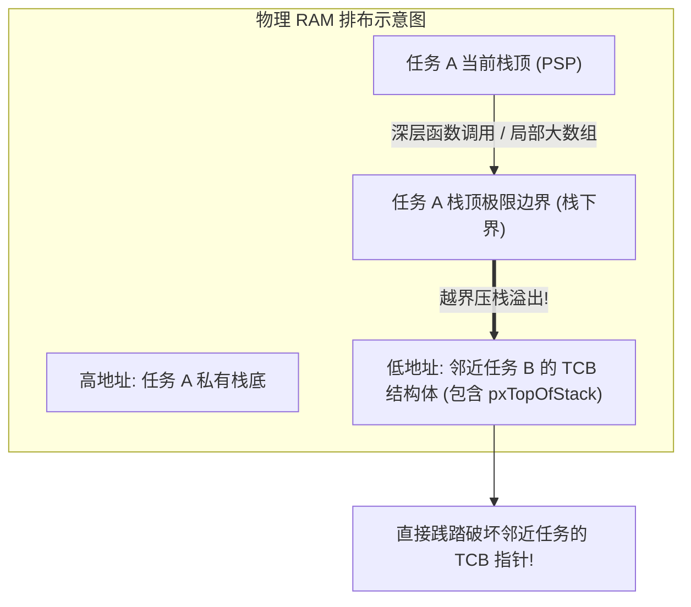

# 任务栈溢出与内存破坏分析

## 1. 静默破坏（Silent Corruption）现象

任务栈溢出可能先破坏相邻内存，随后才出现崩溃。常见现象包括：
* 某个全局变量在没有任何代码写它的情况下值被随机修改。
* 某个正在睡眠的任务莫名其妙醒来，或者在下一次切入时直接跳入 `0xFFFFFFFE`。
* 串口打印偶尔乱码，几个小时后触发随机 HardFault。

这是因为在没有内存保护的单片机中，任务私有栈是从高地址向低地址向下生长的：



---

## 2. 现场排查与捕获技术

### 2.1 方案一：Canary 水位线（Magic Watermark）
在初始化任务栈时，内核将整片栈空间填满魔数（如 `0xA5A5A5A5`）：

```c
/* 检查任务的历史最高水位线 */
UBaseType_t uxHighWaterMark = uxTaskGetStackHighWaterMark( xTaskHandle );
printf("Task remaining stack space: %lu words\n", uxHighWaterMark);
```
* 如果返回值趋近于 0，说明任务栈已濒临溢出，必须立即在创建时扩容。

### 2.2 方案二：MPU 硬件 Guard Region（零延迟就地捕获）
软件水印只能在任务切换或定时检查时后知后觉地发现。为了在溢出的**第一条指令发生瞬间**捕获现场，可以配置 ARM MPU：


---

## 3. HardFault 现场回溯手记

当系统因栈破坏落入 `HardFault_Handler` 时，通过调试器（如 GDB 或 Ozone）提取进入异常时硬件自动压入的栈帧：

```c
void prvGetRegistersFromStack( uint32_t *pulFaultStackAddress )
{
    volatile uint32_t r0  = pulFaultStackAddress[ 0 ];
    volatile uint32_t r1  = pulFaultStackAddress[ 1 ];
    volatile uint32_t r2  = pulFaultStackAddress[ 2 ];
    volatile uint32_t r3  = pulFaultStackAddress[ 3 ];
    volatile uint32_t r12 = pulFaultStackAddress[ 4 ];
    volatile uint32_t lr  = pulFaultStackAddress[ 5 ]; /* 发生 Fault 时的函数返回地址 */
    volatile uint32_t pc  = pulFaultStackAddress[ 6 ]; /* 发生 Fault 时的致命指令地址 */
    volatile uint32_t psr = pulFaultStackAddress[ 7 ];

    /* 读取 Cortex-M 系统控制块故障状态寄存器 (CFSR) */
    volatile uint32_t cfsr = SCB->CFSR;
    
    printf("[HardFault] PC = 0x%08lx, LR = 0x%08lx, CFSR = 0x%08lx\n", pc, lr, cfsr);
    while(1);
}
```

* **定位步骤**：
  1. 查看 `CFSR` 寄存器：若 `CFSR & (1 << 7)`（`MMARVALID`）置位，说明发生了 MPU 违规访问，其非法地址保存在 `SCB->MMFAR` 中。
  2. 使用 `arm-none-eabi-addr2line -e firmware.elf 0x<PC>` 即可精确定位是哪一行 C 代码引发了栈溢出。
