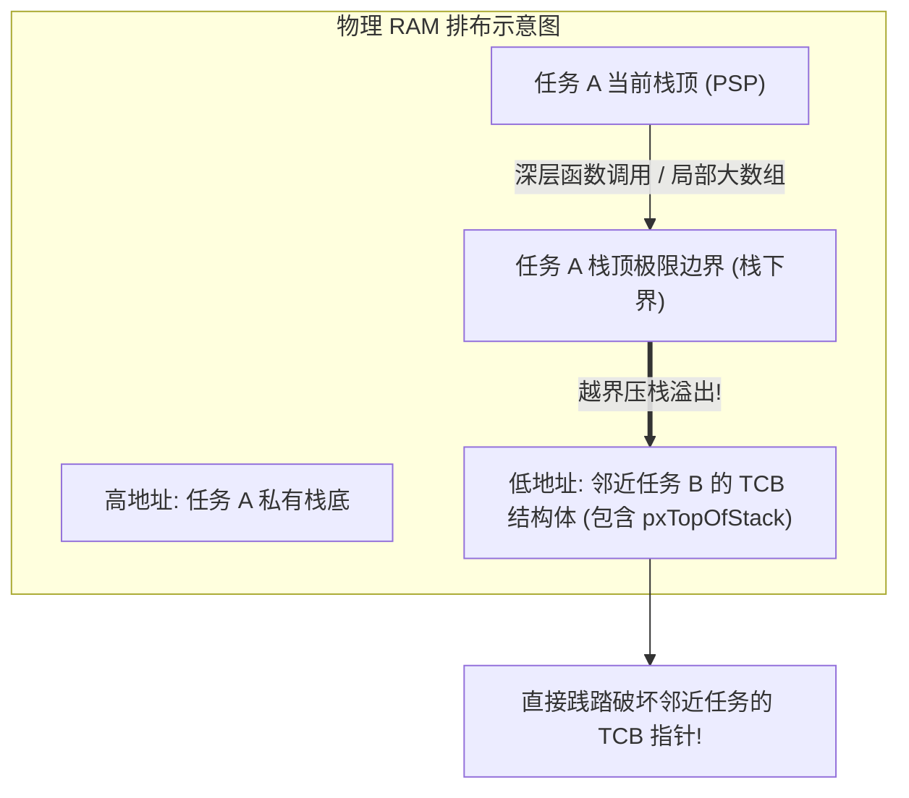

# 任务栈溢出与内存破坏分析

## 1. 静默破坏（Silent Corruption）现象

在嵌入式开发中，任务栈溢出往往不会在第一时间内引发崩溃，而是展现为极其诡异的“幽灵故障”：
* 某个全局变量在没有任何代码写它的情况下值被随机修改。
* 某个正在睡眠的任务莫名其妙醒来，或者在下一次切入时直接跳入 `0xFFFFFFFE`。
* 串口打印偶尔乱码，几个小时后触发随机 HardFault。

这是因为在没有内存保护的单片机中，任务私有栈是从高地址向低地址向下生长的：



---

## 2. 现场排查与捕获技术

### 2.1 方案一：Canary 水位线（Magic Watermark）
在初始化任务栈时，内核将整片栈空间填满魔数（如 `0xA5A5A5A5`）：

```c
/* 检查任务的历史最高水位线 */
UBaseType_t uxHighWaterMark = uxTaskGetStackHighWaterMark( xTaskHandle );
printf("Task remaining stack space: %lu words\n", uxHighWaterMark);
```
* 如果返回值趋近于 0，说明任务栈已濒临溢出，必须立即在创建时扩容。

### 2.2 方案二：MPU 硬件 Guard Region（零延迟就地捕获）
软件水印只能在任务切换或定时检查时后知后觉地发现。为了在溢出的**第一条指令发生瞬间**捕获现场，可以配置 ARM MPU：


### 2.3 方案三：内核自检钩子（`configCHECK_FOR_STACK_OVERFLOW`）

FreeRTOS 在每次上下文切换的 `vTaskSwitchContext` 尾部按配置等级检查任务栈边界：

| 模式 | 检查机理 | 捕获时机 | 漏报窗口 |
| :--- | :--- | :--- | :--- |
| **模式 1** | 比较当前栈指针是否越过 `pxStackLimit`（下界地址） | 每次任务切出时 | 溢出后又弹回、或切换前已破坏邻居——只看指针位置，不看内容 |
| **模式 2** | 额外校验栈末 16 字节是否仍等于创建时填充的魔数模式（`0xA5` 系） | 每次任务切出时 | 若栈指针跨过整个检查区而未写坏填充值，或破坏发生在检查前，可能漏报 |
| **钩子** | 命中后调用 `vApplicationStackOverflowHook( xTask, pcTaskName )` | 同上 | 钩子里只能记录/复位，不能「修复」继续跑 |

!!! warning
    **水位线的两个盲区**：`uxTaskGetStackHighWaterMark` 返回的是「历史最深水位以上的剩余字数」——(1) 若最坏执行路径（深层错误处理嵌套、`printf` 族、中断嵌套压栈）从未被走过，它会**系统性低估**风险；(2) 已写坏的填充值会保留历史痕迹，但只移动栈指针而未写入的空间可能漏计。正确用法：压力测试期持续采样取最小值，再叠加静态最坏路径核算（栈分析工具或调用树人工推演），两者取大后加安全余量（典型 25%~50%）。


---

## 3. HardFault 现场回溯手记

当系统因栈破坏落入 `HardFault_Handler` 时，通过调试器（如 GDB 或 Ozone）提取进入异常时硬件自动压入的栈帧：

```c
void prvGetRegistersFromStack( uint32_t *pulFaultStackAddress )
{
    volatile uint32_t r0  = pulFaultStackAddress[ 0 ];
    volatile uint32_t r1  = pulFaultStackAddress[ 1 ];
    volatile uint32_t r2  = pulFaultStackAddress[ 2 ];
    volatile uint32_t r3  = pulFaultStackAddress[ 3 ];
    volatile uint32_t r12 = pulFaultStackAddress[ 4 ];
    volatile uint32_t lr  = pulFaultStackAddress[ 5 ]; /* 发生 Fault 时的函数返回地址 */
    volatile uint32_t pc  = pulFaultStackAddress[ 6 ]; /* 发生 Fault 时的致命指令地址 */
    volatile uint32_t psr = pulFaultStackAddress[ 7 ];

    /* 读取 Cortex-M 系统控制块故障状态寄存器 (CFSR) */
    volatile uint32_t cfsr = SCB->CFSR;

    printf("[HardFault] PC = 0x%08lx, LR = 0x%08lx, CFSR = 0x%08lx\n", pc, lr, cfsr);
    while(1);
}
```

* **定位步骤**：
  1. 查看 `CFSR` 寄存器：若 `CFSR & (1 << 7)`（`MMARVALID`）置位，说明发生了 MPU 违规访问，其非法地址保存在 `SCB->MMFAR` 中。
  2. 使用 `arm-none-eabi-addr2line -e firmware.elf 0x<PC>` 即可精确定位是哪一行 C 代码引发了栈溢出。

### 3.1 CFSR/栈帧快速解码表

| 证据 | 解码结论 | 指向的下一步 |
| :--- | :--- | :--- |
| `CFSR.MMARVALID=1` + `MMFAR` ≈ 某任务栈下界 | MPU Guard 命中：精确的越界写入地址 | `addr2line` PC，查看该行是否大局部数组/深递归 |
| `CFSR.STKERR`/`UNSTKERR`（bit 12/11，总线fault） | 异常出入栈期间访问非法——多为**主栈（MSP/ISR 栈）**耗尽 | 核查中断嵌套深度与 `configISR_STACK_SIZE`（如使用） |
| `CFSR.IBUSERR`（CFSR bit 8 / BFSR bit 0） + PC 值异常（如 `0xFFFFFFFE`） | 跳转到非法地址执行——典型于**函数指针/返回地址被栈践踏后** `bx lr` 飞跳 | 检查 LR 来源函数的栈帧是否与被破坏区域相邻（map 文件比对地址归属） |
| `CFSR.INVSTATE=1`（CFSR bit 17 / UFSR bit 1） | 跳转目标非 Thumb 状态（xPSR 状态异常）——同样是控制流被改写的次生症状 | 同上，先找「谁写了栈」而非「谁跳的飞」 |
| `HFSR.FORCED=1` | 可配置异常升级为 HardFault：读 `CFSR` 找真凶 | 永远优先解码 CFSR 而非停在 HardFault 本身 |

### 3.2 从证据到源码的工具链闭环

```text
HardFault 钩子提取栈帧(PC/LR) ──► arm-none-eabi-addr2line -e fw.elf 0x<PC>  → 源文件:行号
                                        │
              map 文件比对 MMFAR 落在哪个 .bss/.data 符号 ──► 确认「谁被践踏」(邻近任务 TCB/队列)
                                        │
              反查受害者与凶手栈的地址相邻关系(链接脚本排布) ──► 锁定溢出任务,扩栈+加 Guard 复测
```

---

## 4. 症状二分：栈溢出 / 堆破坏 / 野指针

三类「幽灵故障」表象相似，按以下顺序二分可最快收敛：

1. **先看破坏对象的位置属性**：受害数据紧贴某任务栈下界 → 栈溢出；受害数据在 `.bss` 中离任何栈都远 → 野指针/DMA 误写；受害对象位于堆区（`heap_4` 空闲链表节点被改）→ 堆越界（`pvPortMalloc` 断言或链表环死为伴生症状）。
2. **栈溢出验证**：`uxTaskGetStackHighWaterMark` 全任务扫描 + 模式 2 钩子 + MPU Guard 复现（三者任一命中即定罪）。
3. **堆越界验证**：在 `pvPortMalloc/vPortFree` 加前哨字节检查（块头尾各埋魔数）；`heap_4` 的 `configASSERT( pxLink->xBlockSize & heapBLOCK_ALLOCATED_BITMASK )` 命中即为经典证据。
4. **野指针/DMA 验证**：将可疑缓冲区先 `memset` 魔数并 MPU 设只读观察触发点；核查 DMA 目的地址/长度寄存器配置（Cache 使能时还须 clean/invalidate——参见 [Case 03](03-amp-rpmsg-heterogeneous-multicore.md) 的一致性章节）。
5. **兜底手段**：DWT 数据观察点（watchpoint 对准受害地址，**写入即断**零侵入定罪；SEGGER Ozone 或 GDB `watch *(uint32_t*)0x...` 均可下）。
