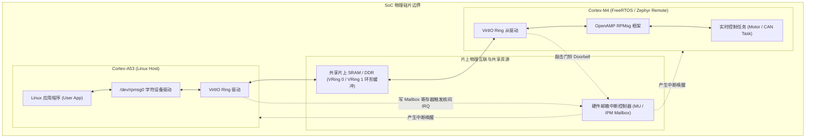
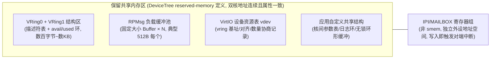
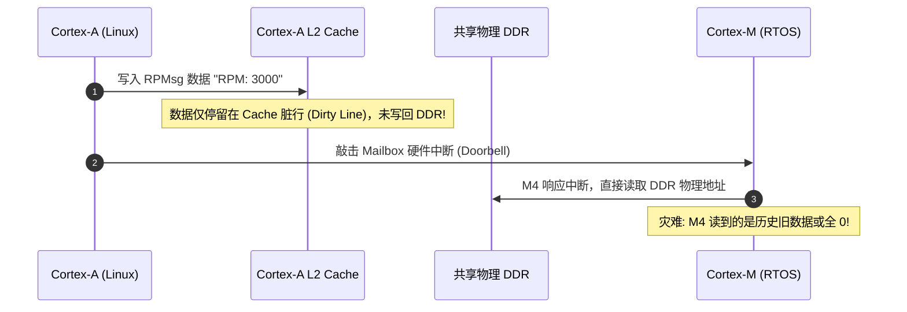
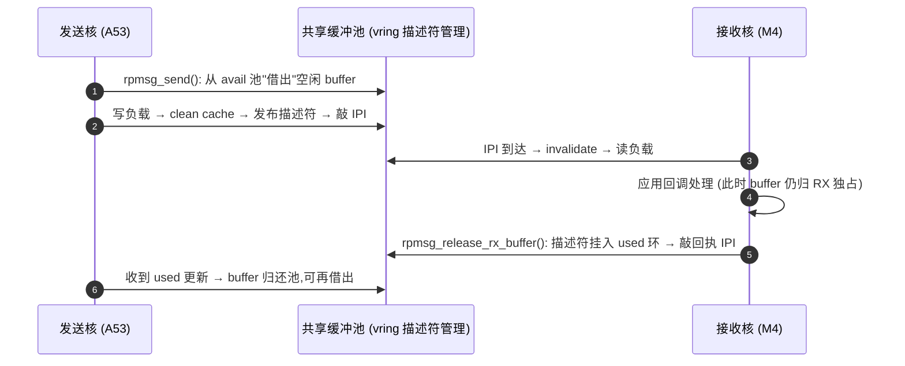
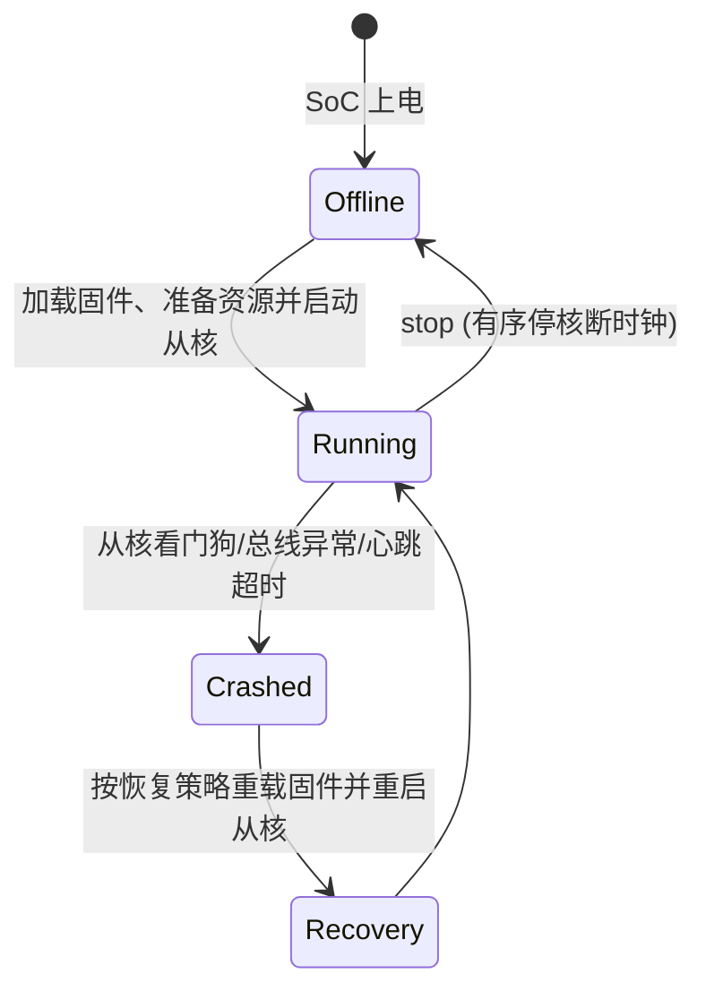

# 异构多核 AMP RPMsg 协同

## 1. 异构多核架构（Heterogeneous Multicore）工程背景

在车载仪表盘、工业人机界面（HMI）和扫地机器人中，单靠一颗芯片往往无法兼顾“图形界面的复杂性”与“电机/传感器控制的高实时性”：
* **应用核心（Linux on Cortex-A）**：运行 Ubuntu/Yocto、Qt UI、网络协议与 AI 视觉模型，具备大容量 DDR，但存在毫秒级调度不确定性。
* **实时核心（RTOS on Cortex-M）**：运行 FreeRTOS 或 Zephyr，负责纳秒/微秒级 CAN 总线收发、电机闭环控制与电源监控。

两者必须通过 **AMP（Asymmetric Multiprocessing）** 架构高效互联。



---

## 2. 共享内存与 VRing 拓扑

RPMsg 基于 Linux 的 VirtIO 虚拟化总线标准，两核通信使用两个双向的环形缓冲区（Virtqueue / VRing）：
* **VRing 0（TX for A53, RX for M4）**：主核发送队列
* **VRing 1（TX for M4, RX for A53）**：从核发送队列

每个 VRing 在物理内存上由三部分组成：
1. **描述符表（Descriptor Table）**：记录数据 Buffer 的物理基址、长度和标志位。
2. **有效环（Available Ring）**：发送方填充就绪的描述符索引，通知接收方取走。
3. **已用环（Used Ring）**：接收方处理完毕后释放描述符。

### 2.1 典型共享内存（CARVEOUT smem）物理布局



!!! note
    **布局权属**：vring 与缓冲池的基址由主核固件（Linux 的 `remoteproc` 或启动协商协议）在启动从核前写入 `vdev` 资源表；从核固件解析该表后挂载 vring——**双方对同一块物理地址的属性认知（Cacheable 与否）必须一致**，这是后文一致性事故的根源。


---

## 3. 致命的 Cache 一致性（Coherency）屏障

在多核异构通信中，最普遍的硬件 Bug 是**数据读取陈旧（Stale Data）**：
* Cortex-A 核心开启了 L1/L2 Cache（通常为 Write-Back 模式）。
* Cortex-M 核心可能没有 Cache，或者使用的是独立的 L1 Cache。



### 工程规范解决方案

1. **写方刷新（Clean）**：发送方在敲击 Mailbox 中断之前，**必须显式执行 Cache Clean 操作**，强制将 Cache 中的脏数据推送到物理内存。
2. **读方作废（Invalidate）**：接收方在收到中断、读取共享物理内存之前，**必须先执行 Cache Invalidate**，清空自身的本地 Cache 行，强制从总线物理 DDR 读取最新鲜的数据。
3. **或者使用无 Cache（Non-Cacheable / Strongly-Ordered）内存段**：通过 MPU/MMU 将共享 SRAM 区域直接配置为非缓存属性，彻底杜绝一致性隐患。

### 内存序与屏障的落点（比 Clean/Invalidate 更隐蔽的坑）

Clean/Invalidate 解决「数据可见性」，但**顺序性**还要靠屏障——即使共享区无缓存，弱内存序架构（如 Cortex-A 的乱序写合并）也可能让「写 payload → 写 vring 描述符 → 敲 IPI」被硬件重排：

```c
/* 发送方的正确屏障顺序（示意） */
memcpy( buf, payload, len );          /* ① 写负载缓冲 */
CleanDCache_by_Addr( buf, len );      /* ② 负载落物理内存 */
 __DMB();                             /* ③ 数据内存屏障: 保证 ② 先于 ④ 生效 */
 vring->avail->idx = new_idx;         /* ④ 发布描述符/环索引 */
 __DMB();                             /* ⑤ 保证 ④ 先于 ⑥ 生效 */
 writel( doorbell, IPI_REG );         /* ⑥ 最后才敲中断门铃 */
```

接收侧对偶：**先读 IPI 标志，`__DMB()` 后再读环索引与负载**。经验法则：**IPI 中断只应作为「数据已就绪」的提示，环索引（带屏障读取）才是真正的同步变量**——任何「中断到了就当数据有效」的代码都是内存序炸弹。

---

## 4. RPMsg 消息缓冲生命周期与 remoteproc 状态机

### 4.1 一个缓冲的三段旅程（所有权转移）



!!! warning
    **两个经典越权写事故**：① 接收方在回调返回后**继续持有** buffer 指针异步处理——发送核已将其重新借出，数据被双写踩踏；② 双方同时实现「零拷贝接收」却忘了 release，池迅速耗尽后 `rpmsg_send` 永久阻塞（表现为通信「跑几小时后卡死」）。


### 4.2 remoteproc 生命周期状态机（Linux 侧管理视角）



**工程含义**：① 从核固件镜像中的 `.resource_table` 段声明 vring 数量/对齐与 IPI 号，主核据此建 vdev——**固件升级后资源表变化而主核驱动未同步，是升级后通信失效的第一嫌疑**；② recovery 路径要求从核侧状态可完全重建（所有 rpmsg endpoint 名字与句柄需重新协商）。

---

## 5. 现场排查：核间通信的故障定位顺序

1. **先分层**：`rpmsg` 用户 API 挂死？还是 IPI 中断本身断了？——从核侧在 IPI ISR 里翻转 GPIO + 示波器，一小时内即可把「物理断」与「逻辑断」分开。
2. **endpoint 名字比对**：主从两侧的服务名（如 `"rpmsg-client-sample"`）逐字符 diff；固件升级后从核未更新或带版本后缀，`bind` 静默失败。
3. **脏数据三连查**（偶发错乱场景）：共享区属性是否两端一致（`/proc/iomem` 与从核 MPU 配置比对）→ 发送方 clean 位置是否在 IPI **之前** → 接收方 invalidate 是否覆盖**整个**负载长度（按 cache line 对齐边界，而非字节长度）。
4. **缓冲池耗尽查**：统计 used 环回收速率；零拷贝模式下确认每个接收路径最终都调用了 release。
5. **recovery 后失联查**：从核重启后是否重新广播 NS（name service）公告；主核 `rpmsg` 设备节点是否残留旧实例未销毁（`/sys/class/rpmsg` 下孤儿节点）。
6. **版本矩阵固化**：主从固件各自记录资源表哈希与协议版本号，启动握手时交换比对——把「升级后失联」从排查题变成开机自检题。
