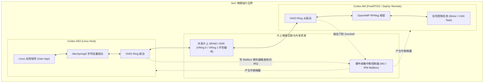
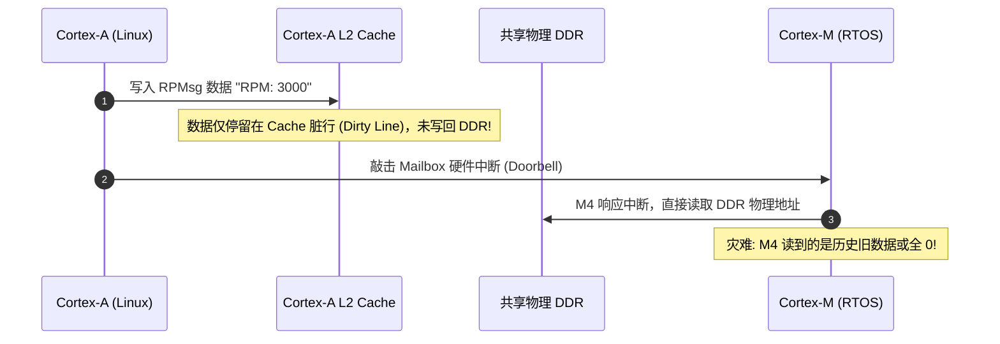

# 异构多核 AMP RPMsg 协同

## 1. 异构多核架构（Heterogeneous Multicore）工程背景

在车载仪表盘、工业人机界面（HMI）和扫地机器人中，单靠一颗芯片往往无法兼顾“图形界面的复杂性”与“电机/传感器控制的高实时性”：
* **应用核心（Linux on Cortex-A）**：运行 Ubuntu/Yocto、Qt UI、网络协议与 AI 视觉模型，具备大容量 DDR，但存在毫秒级调度不确定性。
* **实时核心（RTOS on Cortex-M）**：运行 FreeRTOS 或 Zephyr，负责纳秒/微秒级 CAN 总线收发、电机闭环控制与电源监控。

两者必须通过 **AMP（Asymmetric Multiprocessing）** 架构高效互联。

---

## 2. 共享内存与 VRing 拓扑

RPMsg 基于 Linux 的 VirtIO 虚拟化总线标准，两核通信使用两个双向的环形缓冲区（Virtqueue / VRing）：
* **VRing 0（TX for A53, RX for M4）**：主核发送队列
* **VRing 1（TX for M4, RX for A53）**：从核发送队列

每个 VRing 在物理内存上由三部分组成：
1. **描述符表（Descriptor Table）**：记录数据 Buffer 的物理基址、长度和标志位。
2. **有效环（Available Ring）**：发送方填充就绪的描述符索引，通知接收方取走。
3. **已用环（Used Ring）**：接收方处理完毕后释放描述符。

---

## 3. 致命的 Cache 一致性（Coherency）屏障

在多核异构通信中，最普遍的硬件 Bug 是**数据读取陈旧（Stale Data）**：
* Cortex-A 核心开启了 L1/L2 Cache（通常为 Write-Back 模式）。
* Cortex-M 核心可能没有 Cache，或者使用的是独立的 L1 Cache。

### 工程规范解决方案

1. **写方刷新（Clean）**：发送方在敲击 Mailbox 中断之前，**必须显式执行 Cache Clean 操作**，强制将 Cache 中的脏数据推送到物理内存。
2. **读方作废（Invalidate）**：接收方在收到中断、读取共享物理内存之前，**必须先执行 Cache Invalidate**，清空自身的本地 Cache 行，强制从总线物理 DDR 读取最新鲜的数据。
3. **或者使用无 Cache（Non-Cacheable / Strongly-Ordered）内存段**：通过 MPU/MMU 将共享 SRAM 区域直接配置为非缓存属性，避免该区域的 Cache 一致性问题。
