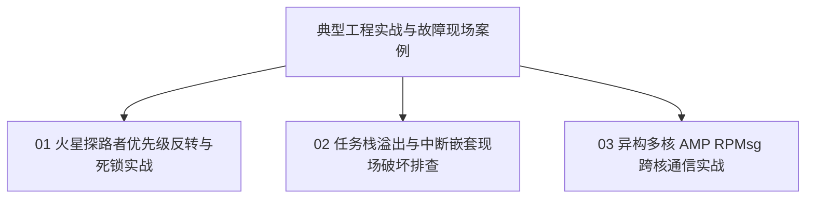

# 05 实战案例与现场排查

本篇章聚焦嵌入式工程一线最棘手、最典型的三类硬核实战故障与架构案例：

## 案例目录

1. [火星探路者优先级反转与死锁实战](01-priority-inversion-mars-pathfinder-case.md)
   - 1997 年火星探路者（Mars Pathfinder）复位故障分析
   - 互斥锁缺少优先级继承引发系统级看门狗超时的链路推演
   - 优先级继承（PIP）与天花板协议（PCP）的应用

2. [任务栈溢出与中断嵌套现场破坏排查](02-stack-overflow-isr-corruption-debug.md)
   - 内存无痕破坏（Silent Corruption）现象
   - MPU 硬件 Guard Region 零延迟捕获故障现场
   - 栈底水位线（Canary Watermark）探测与调试器 HardFault 现场回溯手记

3. [异构多核 AMP RPMsg 跨核通信实战](03-amp-rpmsg-heterogeneous-multicore.md)
   - 经典多核拓扑：Cortex-A (Linux) + Cortex-M (FreeRTOS / Zephyr)
   - 共享物理内存环形缓冲（VRing）与中断门铃（Mailbox Doorbell）
   - 零拷贝大数据传输时的数据一致性屏障（D-Cache Clean & Invalidate）
