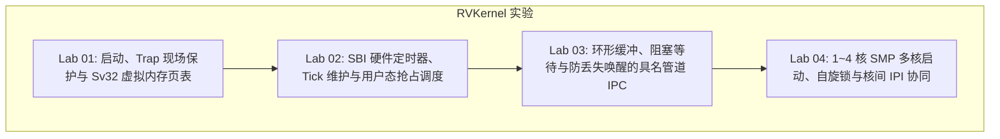

# RVKernel 动手实战实验

这四个实验使用 RISC-V 32 教学内核 **RVKernel**，在 QEMU 中观察启动、页表、用户态抢占、管道通信和多核调度。代码基于 *Operating System in 1,000 Lines* 扩展。



---

[查看 RVKernel 项目介绍、完整教程与实现边界](../Projects/rvkernel.md)。该项目用于内核机制实验，尚无硬实时保证。

## 实验代码来源与环境准备

RVKernel 基于 [Operating System in 1,000 Lines](https://operating-system-in-1000-lines.vercel.app/en/)（由 Seiya Nuta 编写）的代码，增加了四项功能：**PLIC 设备中断、SBI TIME 用户态抢占、具名管道 IPC、以及 1~4 核 SMP 与 IPI 协同**。

* **公开源码仓库**：[GitHub - YvainZhang/1000-lines-os-practice](https://github.com/YvainZhang/1000-lines-os-practice)
* **实验源码目录**：`RTOS/Labs/rvkernel/`（内含完整可编译运行源码，无需外部克隆）

### 环境依赖（macOS / Linux）

```bash
# macOS 环境一键安装 LLVM 工具链与 QEMU 仿真器
brew install llvm qemu

# Ubuntu / Debian 环境
# sudo apt-get install clang llvm lld qemu-system-misc
```

### 两种执行与验证方式

#### 方式 A：运行本地实验源码
```bash
# 进入知识库内置的实验目录
cd RTOS/Labs/rvkernel

# 编译并在 QEMU 中启动 (默认双核 SMP)
bash run.sh

# 可选运行指定核数 (1~4 核)
NCPU=4 bash run.sh
```

#### 方式 B：从公开 GitHub 仓库拉取最新源码
```bash
git clone https://github.com/YvainZhang/1000-lines-os-practice.git
cd 1000-lines-os-practice
bash run.sh
```

### 自动化回归与自测验证

进入 Shell 命令行后，可直接输入：
```text
$ help
$ irqstat
$ selftest
```
自测将依次验证：时钟中断 Tick 前进、PLIC 磁盘完成中断、文件系统容量边界与防篡改、3 KiB 具名管道连续收发与 EOF、同核抢占以及跨核 Affinity。全部通过后终端将输出 `SELFTEST PASS`。

亦可在宿主机终端通过纯 Python 脚本执行回归测试：
```bash
python3 scripts/smoke.py --cpus 2
```

---

## 实验目录清单

1. [Lab 01: 启动、Trap 现场保护与 Sv32 虚拟内存页表](lab01-rv32-boot-trap-paging.md)
   - RISC-V OpenSBI 固件跳转与内核入口
   - 硬件 `sscratch` 寄存器换栈与 144 字节 `trap_frame` 汇编现场保存
   - Sv32 二级分页硬件机制、物理页分配与用户态特权级隔离

2. [Lab 02: SBI 硬件定时器、Tick 维护与用户态抢占调度](lab02-rv32-timer-preemption-scheduler.md)
   - RISC-V SBI TIME 扩展与 10ms 周期时钟节拍
   - 时钟中断（Timer IRQ）分发与 `proc->state` 就绪流转
   - 内核 `switch_context` 协作式与用户态强制抢占的实现机理

3. [Lab 03: 环形缓冲、阻塞等待与防丢失唤醒的具名管道 IPC](lab03-rv32-bounded-pipe-ipc.md)
   - 8 个 256 字节定长环形缓冲具名管道
   - `sleep` 与 `wakeup` 的原子条件等待状态机
   - 解决并发死锁与多消费者防惊群设计

4. [Lab 04: 1~4 核 SMP 多核启动、自旋锁与核间 IPI 协同](lab04-rv32-smp-multicore-ipi.md)
   - 引导核（Boot Hart）与从核（Secondary Harts）的 SBI HSM 唤醒流程
   - 每核独立运行栈与每 PCB 粒度自旋锁（Spinlock）
   - 核间中断（IPI）跨核唤醒阻塞线程与负载流转
