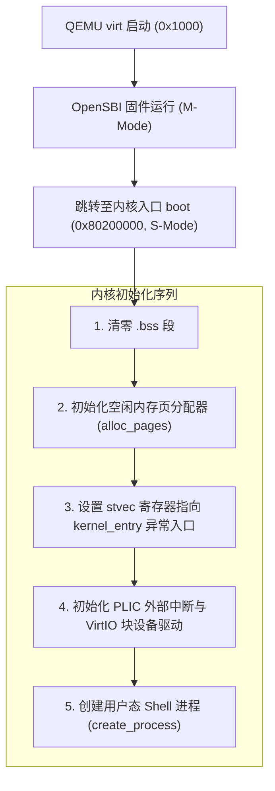
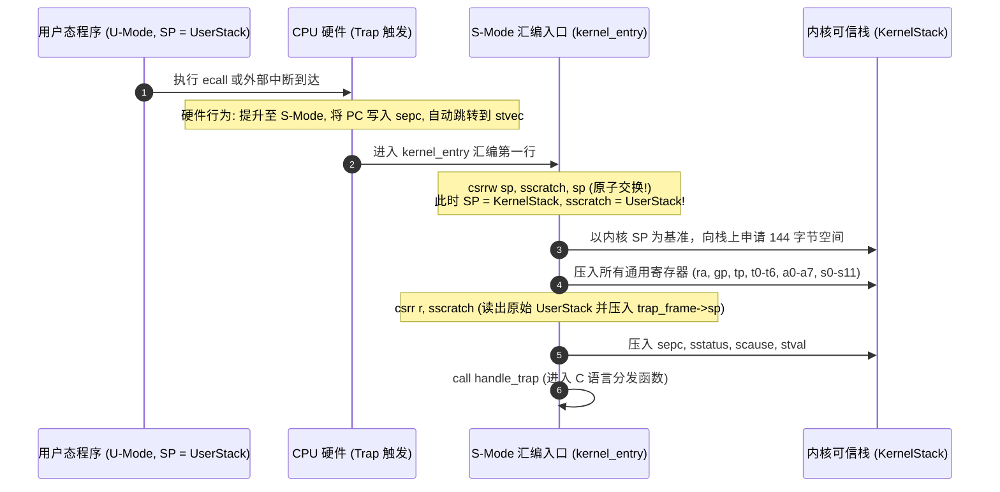
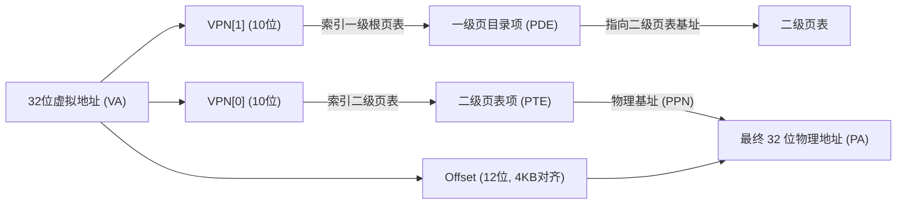

# Lab 01: 启动、Trap 现场保护与 Sv32 虚拟内存页表

## 1. 实验目标

* 理解 RISC-V 架构下 OpenSBI 引导固件与操作系统内核的交接协议。
* 掌握 RISC-V 独有的 `sscratch` 控制状态寄存器（CSR）在 Trap 发生时的原子换栈机制。
* 剖析 Sv32 二级页表（Two-Level Paging）的硬件地址翻译流程与用户态特权隔离。

---

## 2. 引导启动流程与内存布局



### 物理内存映射表

| 起始地址 | 长度 / 结束 | 属性 / 用途 |
| :--- | :--- | :--- |
| `0x10000000` | 4KB | UART0 串口 MMIO 寄存器 |
| `0x10001000` | 4KB | VirtIO-Block 磁盘控制器 MMIO |
| `0x0C000000` | 64MB | PLIC 平台级中断控制器 MMIO |
| `0x80000000` | 2MB | OpenSBI 固件常驻内存 |
| **`0x80200000`** | — | **内核代码与静态数据段 (`__kernel_base`)** |
| `__free_ram` | 64MB+ | 动态物理页分配池（按 4KB 页面切分） |

---

## 3. Trap 现场保护与 `sscratch` 换栈

当 CPU 运行在非特权用户态（U-Mode）时，其栈指针 `sp` 指向不可信的用户栈。如果此时发生硬件中断或 `ecall` 系统调用，处理器必须**在执行第一条 C 语言指令之前，安全切换到可信的内核栈**。

RISC-V 通过 `sscratch` 控制状态寄存器提供了一个原子交换指令：



### 144 字节 `struct trap_frame` 拓扑
```c
struct trap_frame {
    uint32_t ra, gp, tp, t0, t1, t2, t3, t4, t5, t6;
    uint32_t a0, a1, a2, a3, a4, a5, a6, a7;
    uint32_t s0, s1, s2, s3, s4, s5, s6, s7, s8, s9, s10, s11;
    uint32_t sp;      /* 发生 Trap 前原始的不可信栈指针 */
    uint32_t sepc;    /* 发生异常时的 PC 备份 */
    uint32_t sstatus; /* 异常发生前的特权与中断状态 */
    uint32_t scause;  /* 异常 / 中断原因编号 */
    uint32_t stval;   /* 故障虚拟地址 (如 PageFault 时) */
    uint32_t reserved;/* 满足 16 字节栈对齐要求 */
} __attribute__((packed));

_Static_assert(sizeof(struct trap_frame) == 144, "trap frame must be 144 bytes");
```

---

## 4. Sv32 二级分页与特权隔离

RVKernel 采用 32 位 RISC-V 标准的 **Sv32** 虚拟内存管理机制：



### 关键权限标志位（PTE Flags）
* `PAGE_V (1 << 0)`：页面有效标志位。
* `PAGE_R / PAGE_W / PAGE_X`：可读、可写、可执行保护属性。
* `PAGE_U (1 << 4)`：**用户权限位**。若未置位，则处于 U-Mode 的用户态进程触碰该页面时，硬件 MMU 会立刻抛出 **Load/Store Page Fault**，阻止用户态访问该页面。

---

## 5. 动手实操与实验验收

1. 启动内核进入 QEMU：
   ```bash
   bash run.sh
   ```
2. 在 Shell 命令行中测试特权隔离：输入 `hello`，观察用户态应用程序通过 `ecall` 软中断正确调用内核 `sys_putchar` 在终端完成打印。
3. 退出 QEMU 请按：`Ctrl-A`，再按 `X`。
