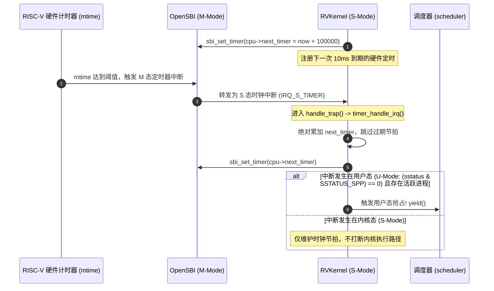

# Lab 02: SBI 硬件定时器、Tick 维护与用户态抢占调度

## 1. 实验目标

* 理解 RISC-V Supervisor Binary Interface (SBI) 的 TIME 计时器扩展工作机制。
* 掌握如何利用硬件时钟中断实现 **用户态周期性抢占（Preemptive Scheduling）**。
* 深入解剖 `switch_context(&prev->sp, &next->sp)` 极简汇编换栈核心。

---

## 2. 硬件定时器与 Tick 节拍推移

原版 *Operating System in 1,000 Lines* 仅具备纯协作式调度（必须由进程显式调用 `yield()` 放弃 CPU）。RVKernel 扩展了基于 SBI 的硬件周期定时器中断：



---

## 3. 定时器重填实现与防时钟累积漂移（Cumulative Drift）

在操作系统内核中，定时器的重填存在两种截然不同的设计策略。RVKernel 采用了标准操作系统的绝对截止时间推进设计（源码见 [`kernel.c`](rvkernel/kernel.c) 中的 `timer_handle_irq()`）：

```c
// kernel.c 真实源码: 时钟中断处理
static void timer_handle_irq(void) {
    struct cpu *cpu = mycpu();
    uint64_t now = timer_now();

    // 【核心设计】从上一次目标截止时间递增，并跳过已过期的节拍
    do {
        cpu->next_timer += TIMER_INTERVAL;
    } while (cpu->next_timer <= now);

    sbi_set_timer(cpu->next_timer);
    cpu->ticks++;
    __sync_fetch_and_add(&timer_irq_count, 1);
}
```

### 3.1 为什么不采用简写的 `sbi_set_timer(timer_now() + TIMER_INTERVAL)`？

| 定时器重填策略 | 核心逻辑 | 物理时基行为 | 极端过载时的表现 |
| :--- | :--- | :--- | :--- |
| **相对时间重填 (Naive)** | `sbi_set_timer(now + INTERVAL)` | **累积时钟漂移（Drift）**：每次中断响应延迟和执行耗时 $\delta t$ 都会被计入下个周期，长期运行导致系统时间越来越慢 | 中断处理延迟会累积到后续节拍 |
| **绝对时间累加 (RVKernel)** | `cpu->next_timer += INTERVAL` | **目标截止时间保持固定网格**：避免将每次处理延迟累加到下一目标；实际 ISR 执行仍可能迟到，也不消除硬件时钟误差 | 跳过采样时刻 `now` 之前的过期目标；若写入定时器前再次迟到，仍可能立即触发中断 |

`cpu->ticks` 每次进入此处理函数仅加一，即使循环跳过多个周期也不会补计。因此它统计已处理的定时器中断次数，不能在过载时直接乘以 10ms 当作经过时间；经过时间应由硬件时间计数差及平台时基频率换算。

---

## 4. 用户态抢占判定（Preemption Gate）

在 本地 [`kernel.c`](rvkernel/kernel.c) 的 `handle_trap()` 中，内核通过硬件状态寄存器 `sstatus` 严密判定抢占时机：

```c
// kernel.c 真实源码: handle_trap() 中断派发
if (f->scause & SCAUSE_INTERRUPT) {
    if (cause == IRQ_S_TIMER) {
        timer_handle_irq();

        // 仅当发生中断时 CPU 处于用户态 ((sstatus & SSTATUS_SPP) == 0)，才允许发起抢占
        if ((f->sstatus & SSTATUS_SPP) == 0 && myproc()) {
            yield(); // 强制让出 CPU，切入调度循环
        }
    }
    // ...
}
```

---

## 5. 上下文切换汇编：`switch_context`

本实验的 `switch_context` 是 C 调用边界上的内核上下文切换：保存 `s0~s11`、返回地址 `ra`，并通过 PCB 保存 `sp`。`ra` 在 RISC-V ABI 中属于 caller-saved，此处仍需保存它以恢复返回位置。用户态抢占所需的完整寄存器现场已由 Trap 入口另行保存，不能只靠这段换栈代码恢复任意中断点。

```assembly
.text
.align 2
.global switch_context
switch_context:
    # 1. 在当前任务栈上开辟 64 字节对齐栈帧，存放 ra 与 s0~s11 共 13 个寄存器；sp 另存 PCB
    addi sp, sp, -64
    sw ra,  0(sp)
    sw s0,  4(sp)
    sw s1,  8(sp)
    sw s2,  12(sp)
    sw s3,  16(sp)
    sw s4,  20(sp)
    sw s5,  24(sp)
    sw s6,  28(sp)
    sw s7,  32(sp)
    sw s8,  36(sp)
    sw s9,  40(sp)
    sw s10, 44(sp)
    sw s11, 48(sp)

    # 2. 保存当前栈顶到 prev->sp: a0 = &prev->sp
    sw sp, 0(a0)

    # 3. 从 next->sp 加载新任务的栈顶: a1 = &next->sp
    lw sp, 0(a1)

    # 4. 从新栈中恢复 ra 与 s0~s11
    lw ra,  0(sp)
    lw s0,  4(sp)
    lw s1,  8(sp)
    lw s2,  12(sp)
    lw s3,  16(sp)
    lw s4,  20(sp)
    lw s5,  24(sp)
    lw s6,  28(sp)
    lw s7,  32(sp)
    lw s8,  36(sp)
    lw s9,  40(sp)
    lw s10, 44(sp)
    lw s11, 48(sp)
    addi sp, sp, 64

    # 5. 返回指令: 此时 ra 已被替换为新任务的历史执行点，实现丝滑跳转!
    ret
```

---

## 6. 动手实操与实验验收

1. 启动内核：
   ```bash
   bash run.sh
   ```
2. 观察时钟滴答前进：在 Shell 中输入：
   ```text
   $ irqstat
   ```
   查看输出的 `timer ticks` 计数值是否稳定以 100Hz 频率持续递增。
3. 验证用户态抢占：运行 `selftest`，测试用例会拉起两个陷入死循环计算的工作线程，验证内核能否依靠 10ms 时钟中断在两个计算密集型任务之间自动强制抢占切换。
