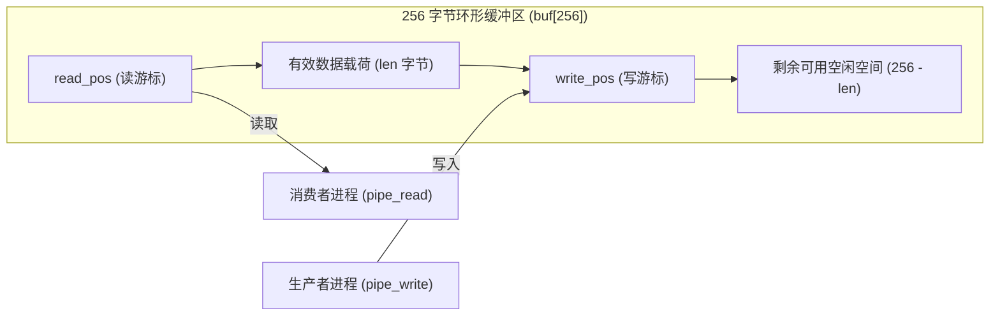
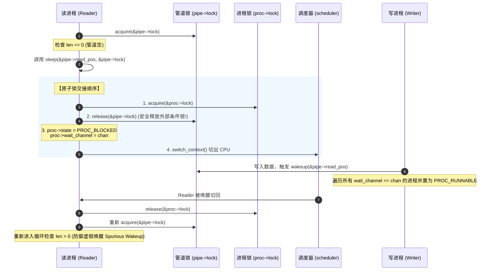

# Lab 03: 环形缓冲、阻塞等待与防丢失唤醒的具名管道 IPC

## 1. 实验目标

* 掌握线程安全定长环形缓冲区（Ring Buffer）的数学取模与空/满判断原理。
* 深刻理解操作系统中经典的 **“丢失唤醒（Lost Wakeup）”** 隐患及其在自旋锁与睡眠条件等待中的原子解法。
* 掌握进程间通信（IPC）中的 Short I/O、EOF 传递与断管（Broken Pipe）异常状态流转。

---

## 2. 环形缓冲管道拓扑与数据结构

RVKernel 支持最多 8 个独立具名管道，每个管道维护 256 字节的单向环形缓冲队列：



```c
struct pipe {
    struct spinlock lock;    /* 保护该管道内部字段的自旋锁 */
    bool in_use;             /* 管道分配标记 */
    int read_open_count;     /* 处于打开状态的读端文件描述符计数 */
    int write_open_count;    /* 处于打开状态的写端文件描述符计数 */
    size_t read_pos;         /* 读指针偏移量: (read_pos + 1) % 256 */
    size_t write_pos;        /* 写指针偏移量: (write_pos + 1) % 256 */
    size_t len;              /* 当前有效字节数 (0 ~ 256) */
    uint8_t buf[256];        /* 定长数据存储区 */
};
```

---

## 3. 阻塞睡眠与防“丢失唤醒”（Lost Wakeup）

如果一个进程在检查“管道是否为空”并决定“去睡眠”之间被中断或抢占，唤醒事件可能会在进程真正进入睡眠状态前夕到达并消失，导致进程**永久沉睡**。



!!! note
    **锁交接（Lock Handover）原则**：
    必须先持有目标进程本身的 `proc->lock`，然后才能释放外层的 `pipe->lock`。这一步保证了写进程在 `wakeup` 时如果看到了 `pipe->lock` 已释放，读进程必然已经完成了等待通道（wait_channel）的注册，避免唤醒事件发生在等待状态登记之前。


---

## 4. 动手实操与实验验收

1. 启动并运行自测：
   ```bash
   bash run.sh
   ```
2. 执行全量测试：
   ```text
   $ selftest
   ```
3. 查看测试报告输出：
   - 管道测试会自动拉起两个工作子进程，通过管道连续推送并校验 **3 KiB 随机数据（远超 256B 缓冲区单次容量）**；
   - 检验在经历多次环形回绕、阻塞暂停、短读取（Short I/O）与读写端关闭后，数据 CRC 与 EOF 标志严格无误。
