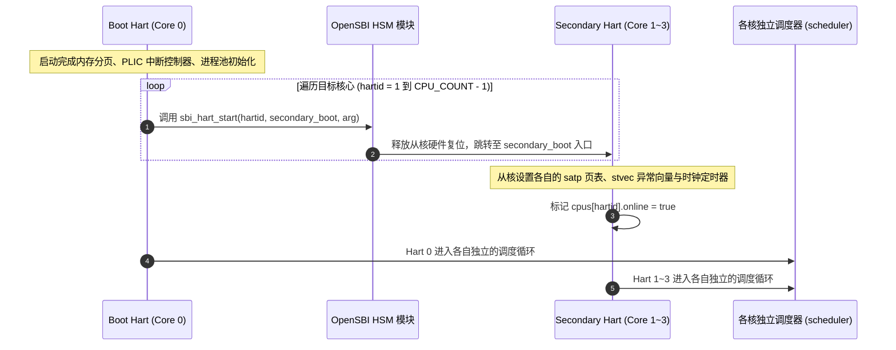
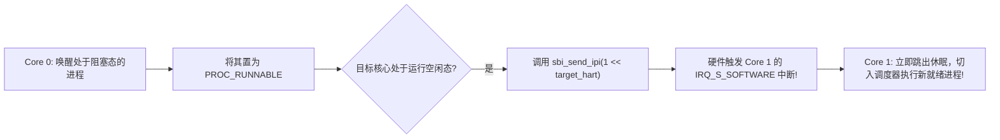

# Lab 04: 1~4 核 SMP 多核启动、自旋锁与核间 IPI 协同

## 1. 实验目标

* 掌握多核对称多处理（SMP）架构在 RISC-V 上的引导拉起流程（SBI HSM 协议）。
* 理解多核自旋锁（Spinlock）的硬件原子指令实现与中断保护嵌套计数（`noff`）。
* 掌握核间中断（IPI, Inter-Processor Interrupt）在跨核唤醒阻塞任务中的实际应用。

---

## 2. 引导核（Boot Hart）与从核（Secondary Harts）启动序列

在多核 SMP 系统中，上电时刻只有 0 号主核（Boot Hart）在全功能执行初始化代码，其余从核必须处于挂起等待状态，由主核在基础设施就绪后显式唤醒：



---

## 3. 自旋锁与关中断嵌套保护

在 SMP 架构中，单纯“关本地中断”无法阻挡另一个 CPU 核心并发修改同一片共享内存；单纯“自旋锁”如果被本地中断打断并尝试重入同一把锁，会导致单核自锁死机。

因此，**获取自旋锁必须同时关闭当前核心的本地中断，并严密维护嵌套深度计数（`noff`）**：

```c
struct spinlock {
    volatile uint32_t locked;
};

void acquire(struct spinlock *lk) {
    push_off(); // 关本地中断，并使当前 CPU 的 noff 计数递增

    // 基于硬件原子指令 __sync_lock_test_and_set (RISC-V amoswap) 忙等待
    while (__sync_lock_test_and_set(&lk->locked, 1) != 0) {
        __asm__ __volatile__("pause"); // 降低 CPU 流水线功耗
    }
    __sync_synchronize(); // 内存屏障: 确保后续读写绝不重排到锁之前
}

void release(struct spinlock *lk) {
    __sync_synchronize(); // 内存屏障
    __sync_lock_release(&lk->locked); // 清零释放锁
    pop_off(); // 递减 noff 计数，若归零则恢复之前的本地中断状态
}
```

---

## 4. 核间中断（IPI）跨核唤醒

当运行在 Core 0 上的写进程通过管道写入数据并调用 `wakeup(&chan)` 唤醒了原本绑定在 Core 1（或正在 Core 1 上休眠）的进程时，Core 1 可能正处于低功耗等待状态：



---

## 5. 动手实操与实验验收

1. 启动 4 核 SMP 虚拟机：
   ```bash
   NCPU=4 bash run.sh
   ```
2. 查看多核启动状态：在 Shell 输入：
   ```text
   $ irqstat
   ```
   终端将列出当前系统所有 4 个核心（Hart 0, Hart 1, Hart 2, Hart 3）各自独立的运行状态、定时器 Tick 计数与调度总次数：
   ```text
   CPU 0: ticks=145, schedules=89
   CPU 1: ticks=145, schedules=72
   CPU 2: ticks=145, schedules=68
   CPU 3: ticks=145, schedules=75
   ```
3. 执行自动化回归测试：
   ```bash
   python3 scripts/smoke.py --cpus 4
   ```
   脚本将全自动验证 4 核并发下的自测、管道吞吐与核间调度。
