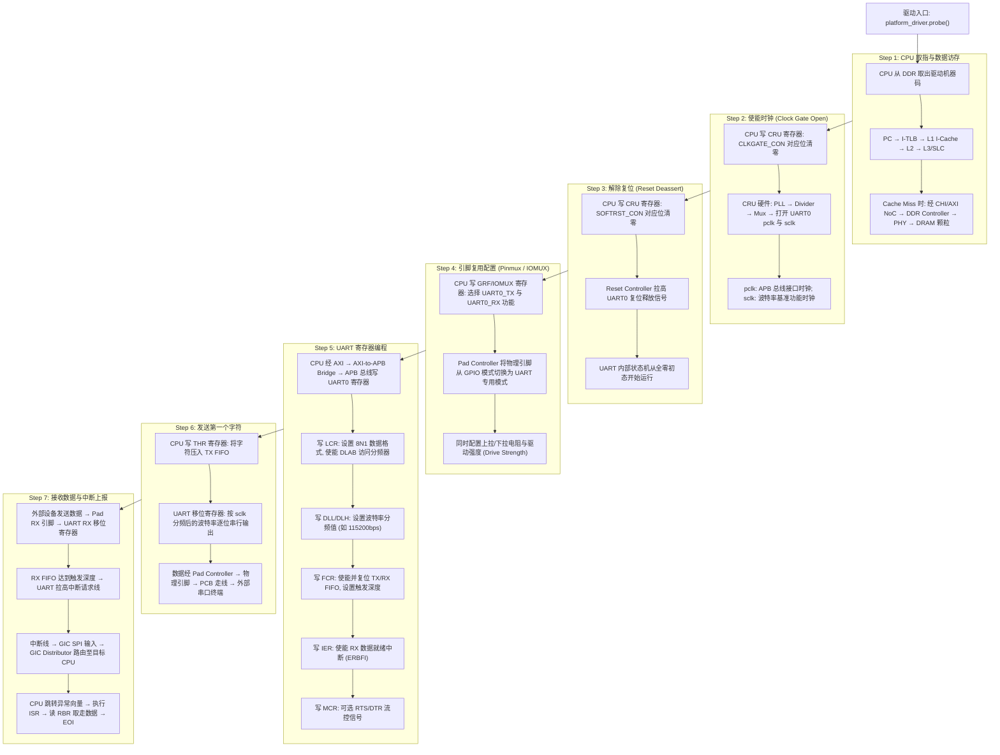
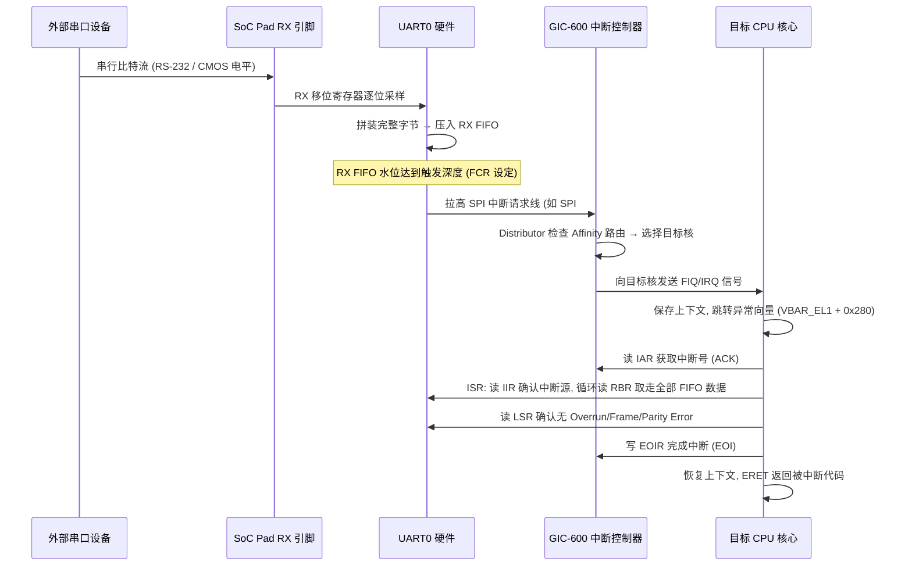

# Block Diagram 阅读与系统分解

## 1. Block Diagram 的用途与局限

Block Diagram 用有限的方框和连线表达复杂芯片的功能分区及主要关系。它适合回答“系统中有什么”和“主要模块怎样连接”，但通常不会完整表达：

- 每条连接的协议版本、数据宽度和频率。
- 地址窗口、访问权限和安全属性。
- Clock/Reset/Power 的全部依赖。
- 跨时钟域、Pipeline、Buffer 和协议转换细节。
- 多路复用连接在特定产品配置中是否真实启用。

因此，框图是调查入口，不是最终证据。结论还需要由 TRM、寄存器手册、集成规范、原理图、Device Tree 和 RTL/网表等资料交叉确认。

## 2. 第一遍：按功能给方框分类

拿到陌生框图时，先把模块归入以下类别：

| 类别 | 识别词 | 需要记录的信息 |
| --- | --- | --- |
| 计算 | CPU、GPU、NPU、DSP、Codec | 核数、Cache、一致性、主端口 |
| 存储 | ROM、SRAM、DDR、Flash | 容量、位宽、ECC、访问者 |
| 互联 | AXI、NoC、Crossbar、Bridge | 协议、端口、路由、QoS |
| 外设 | UART、SPI、USB、PCIe、MAC | MMIO、IRQ、DMA、PHY |
| 系统控制 | GIC、PLIC、PMU、CRU、Timer | 控制对象、所在电源域 |
| 安全 | TZC、Firewall、Crypto、OTP | 信任边界、过滤位置 |
| 调试 | JTAG、DAP、Trace、PMU | 可观测对象、认证限制 |

不要急着追每根线。先确认系统中有没有关键能力，例如 DDR Controller 是否单通道、DMA 是全局还是外设私有、多个 CPU Cluster 是否共享系统 Cache。

## 3. 第二遍：识别 Initiator 与 Target

能主动发起带地址事务的一方称为 Initiator 或 Master；被访问的一方称为 Target 或 Slave。术语会随协议更新，但核心含义相同。

常见 Initiator：

- CPU 的取指和数据访问端口。
- GPU/NPU/DSP 的内存访问端口。
- DMA Controller。
- PCIe Root Complex/Endpoint 的入站访问端口。
- USB/Ethernet/Storage Controller 内部 DMA。
- Debug Access Port。

常见 Target：

- SRAM、DDR Controller。
- BootROM。
- 外设 MMIO Register Bank。
- PCIe 出站窗口。
- 互联配置和监控寄存器。

同一 IP 可能同时是 Initiator 和 Target。例如 Ethernet MAC 的寄存器口是 CPU 访问的 Target，而其 DMA 口是访问 DDR 的 Initiator。

建议为每个具有主端口的模块建立访问矩阵：

| Initiator | BootROM | SRAM | DDR | APB 外设 | 安全区 |
| --- | --- | --- | --- | --- | --- |
| CPU-NS | 读 | 读写 | 读写 | 部分读写 | 禁止 |
| CPU-S | 读 | 读写 | 读写 | 读写 | 读写 |
| Ethernet DMA | 禁止 | 可选 | 读写 | 禁止 | 禁止 |
| Debug Port | 取决于认证 | 取决于认证 | 取决于认证 | 取决于认证 | 通常受限 |

矩阵中的权限必须由芯片资料确认，表格只是表达方法。

## 4. 第三遍：追踪六类连接

### 4.1 数据连接

数据连接承担取指、Load/Store、DMA 和高速流量。图中常标为 AXI、CHI、NoC、AHB 或 AXI-Stream。

需要记录：

- 协议与数据宽度。
- 工作频率和是否跨时钟域。
- 是否支持 Burst、Outstanding、乱序返回。
- 是否进入硬件一致性域。
- 是否经过 SMMU/Firewall。
- 最终通往 SRAM、DDR 还是另一个外部接口。

### 4.2 配置/控制连接

配置连接通常是低带宽 MMIO 通路，例如 CPU 经 AXI-to-APB Bridge 访问 UART 寄存器。数据通路和配置通路经常不同：CPU 通过 APB 配置网卡，而网卡数据通过独立 AXI DMA 端口进入 DDR。

### 4.3 中断连接

中断线由设备连接到 GIC/PLIC 或中断聚合器。需要关注：

- 中断号和触发类型。
- 中断是否共享或经过聚合。
- 是否可路由到多个 CPU/安全域。
- 设备状态清除与控制器 EOI 的先后关系。
- MSI 是否由写内存事务而非专用引脚产生。

### 4.4 时钟连接

框图可能只画 Clock Controller，而不画每个 Clock。应进一步查 Clock Tree：时钟源、PLL、Mux、Divider、Gate 和 Consumer。特别关注总线 Clock 与模块功能 Clock 是否独立。

### 4.5 复位连接

Reset Controller 可能向一个 IP 提供多个 Reset：总线接口、核心逻辑、PHY、配置寄存器等。复位顺序错误会造成寄存器可读但功能状态机不运行。

### 4.6 电源和隔离连接

Power Domain 之间通常存在 Isolation 和 Level Shifter。一个域掉电后，跨域输出必须被钳位，避免不确定电平传播到常开域。

## 5. 第四遍：标出边界

### 5.1 Clock Domain 边界

异步或不同时钟比的模块之间需要 CDC 处理：

- 单比特控制信号：同步器。
- 多比特数据：握手、异步 FIFO 或 Gray Code。
- 总线事务：专用异步 Bridge。

CDC 会增加延迟和背压，也可能限制吞吐率。

### 5.2 Reset Domain 边界

即使两个模块使用同一 Clock，也可能由不同 Reset 控制。若上游已发送事务而下游仍在 Reset，可能发生超时、错误响应或总线锁死。

### 5.3 Power Domain 边界

Power Domain 边界至少涉及执行责任、上下文、隔离、中断和事务五件事。可关断域不能自行完成上电，因此唤醒逻辑必须位于 Always-on Domain，由 RTC、GPIO 或协议唤醒事件通知 PMU。下电前，驱动或管理固件把非 Retention 寄存器保存到仍有供电的 SRAM/DDR；硬件随后锁存域内必要的唤醒状态。

Isolation 在源域电压失效之前 Assert，在电压恢复且输出信号已经处于确定状态后 Deassert。域内普通中断若不具备唤醒能力，应在下电前屏蔽；具备唤醒能力的事件则要转交 Always-on Wakeup Controller 锁存。最后，所有发往该域和由该域发出的事务都必须排空。若一个读请求已经进入 Target，而 Target 随即掉电，上游将永远等不到 Response，最终可能拖死共享互联。

### 5.4 Security Domain 边界

安全检查可能存在于 Initiator、NoC、Memory Controller 或 Target 前。一次访问可能携带 Secure/Non-secure、Privilege、VMID/PASID 等属性，任何一级过滤失败都可能返回总线错误。

### 5.5 Coherency Domain 边界

标出哪些 Initiator 参与硬件 Cache 一致性。非一致设备写 DDR 后，CPU Cache 中可能仍保留旧数据；一致设备虽然由硬件处理 Cache 一致性，但软件仍需解决并发所有权和内存顺序。

## 6. Block Diagram 的分层画法

一张图无法同时表达全部信息，推荐维护四张图。

### 6.1 顶层功能图

只画 Subsystem 和关键能力，适合架构沟通。

```text
CPU/GPU/NPU ── Coherent NoC ── System Cache ── DDR Controller/PHY
                      │
                      ├── High-speed I/O
                      ├── Peripheral Bridge
                      └── System Control/Security
```

### 6.2 数据互联图

突出 Initiator、Target、协议、位宽、频率和一致性属性，用于性能与可达性分析。

### 6.3 控制依赖图

突出 Clock、Reset、Power、Pinmux、IRQ 和 DMA 依赖，用于驱动初始化及低功耗分析。

### 6.4 启动与安全图

突出 BootROM、启动介质、可信固件、安全内存、生命周期控制及调试权限。

## 7. 一次典型 UART 初始化的框图推演

假设软件要使用 UART0 向串口终端打印第一条调试日志。下面这张流程图完整展现了 CPU 从取指到最终字符从 Pad 输出的全部硬件路径与依赖链：



---

### Step 1 详解：CPU 取指与数据访存路径

当内核加载 UART 驱动模块并调用 `probe()` 函数时，CPU 需要从内存中取出该函数的机器码指令：

- **取指路径**：`PC` → `I-TLB`（将虚拟地址翻译为物理地址）→ `L1 I-Cache`（32KB，命中则 1 周期返回）→ 若缺失则依次查 `L2 Cache` → `L3/SLC` → 最终经过 **CHI/AXI 片上互联** 到达 **DDR Controller**，由 PHY 驱动外部 DRAM 颗粒取回 64 字节的指令 Cacheline。
- **数据路径**：驱动代码中访问的全局变量、DTS 解析结果等数据也通过类似路径经 `D-TLB` → `L1 D-Cache` → `L2` → DDR 获取。

**可能遇到的问题**：
- 如果 DDR 尚未完成初始化（例如在极早期 Bootloader 阶段），CPU 只能从 BootROM 或片上 SRAM 执行，此时任何访问 DDR 地址的指令都会触发总线错误（DECERR）或直接挂死。
- L1 I-Cache 在冷启动时是空的，第一次执行驱动代码会产生大量强制缺失（Compulsory Miss），延迟比稳态运行时高得多。

---

### Step 2 详解：使能时钟（Clock Gate Open）

SoC 出厂默认状态下，绝大多数外设的时钟门控是**关闭的（Gate Off）**，目的是降低静态功耗。UART0 通常需要两路独立时钟：

| 时钟名称 | 功能 | 来源 | 典型频率 |
| :--- | :--- | :--- | :--- |
| **pclk_uart0**（总线接口时钟） | 驱动 APB 寄存器读写逻辑；CPU 对 UART 寄存器的 MMIO 访问依赖此时钟 | 系统 APB 时钟分频 | 100~200 MHz |
| **sclk_uart0**（功能/波特率基准时钟） | 驱动 UART 内部移位寄存器和波特率发生器 | 独立 PLL 或 24MHz 晶振直通 | 24 MHz 或 48 MHz |

**操作**：CPU 向时钟控制器（CRU / CCM / CMU）的 `CLKGATE_CON` 寄存器中对应的两个 bit 位写 0（解除门控）。

**可能遇到的问题**：
- **只开了 pclk 没开 sclk**：寄存器可以正常读写（CPU 误以为初始化成功），但 UART 移位寄存器不工作，TX 引脚永远没有波形输出。这是 UART 调试中最常见的"寄存器读写正常但不出字符"的首要原因。
- **时钟源 PLL 未锁定**：如果 sclk 依赖的 PLL 尚未完成频率锁定（Lock），分频器输出的时钟频率可能不准确，导致波特率偏差超过 ±3% 的容忍范围，接收端解码出乱码。
- **父时钟被意外关闭**：APB 总线的上游时钟（如 `hclk` 或 `aclk`）如果被其他驱动或电源管理框架关闭，会连带切断 pclk 供给，导致 UART 寄存器访问挂死（CPU 发出 APB 事务后永远收不到 PREADY 响应）。

---

### Step 3 详解：解除复位（Reset Deassert）

时钟使能后，必须释放 UART0 的硬件复位信号。复位释放前，UART 内部所有触发器被钳位在初始状态（通常为全零），状态机冻结。

**操作**：CPU 向复位控制器的 `SOFTRST_CON` 寄存器中 UART0 对应的 bit 位写 0（deassert reset）。

**可能遇到的问题**：
- **先解复位后开时钟（顺序颠倒）**：复位释放的瞬间，触发器需要时钟沿来采样复位释放信号。如果此时功能时钟尚未到达，复位释放信号可能被采样到亚稳态，导致 UART 内部状态机进入非法状态。**正确顺序永远是：先开时钟，再解复位**。
- **UART IP 具有多个独立复位域**：某些 UART IP（如 Synopsys DW APB UART）具有独立的 APB 接口复位和串行核心复位。只释放其中一个会导致寄存器可读但功能不正常，或者功能正常但寄存器访问返回全零。
- **复位后未等待稳定期**：某些 IP 要求复位释放后至少等待若干个时钟周期（通常 2~4 个 pclk 周期）才能进行首次寄存器访问。过早写入可能被 IP 忽略或产生未定义行为。

---

### Step 4 详解：引脚复用配置（Pinmux / IOMUX）

SoC 的物理引脚数量远少于内部外设信号数量，因此每个物理引脚在出厂时都支持多种功能复用（Mux）。默认情况下，引脚通常处于 GPIO 模式或高阻态。

**操作**：CPU 写入 GRF（General Register File）或 IOMUX 寄存器，将 UART0_TX 和 UART0_RX 对应的物理引脚切换为 UART 专用功能模式，并配置电气属性。

**可能遇到的问题**：
- **Pinmux 未切换**：引脚仍处于 GPIO 输入模式，UART TX 的串行数据根本无法驱动到 Pad 上。这是"UART 初始化全部正确但示波器上看不到任何波形"的第二大原因。
- **TX/RX 引脚搞反**：原理图上标注的引脚编号与芯片数据手册不一致（特别是在不同封装版本之间），导致 TX 连到了对端的 TX 而非 RX。
- **上拉/下拉配置错误**：UART 协议的空闲电平为高电平（Mark State）。如果 TX 引脚被错误地配置为下拉，空闲时会被拉低，对端将其误判为 Start Bit，产生持续乱码。RX 引脚缺少上拉时，悬空的输入引脚会因噪声随机触发接收中断。
- **驱动强度不足**：若 PCB 走线较长或负载电容较大（如连接了光耦隔离器），默认的 2mA 驱动强度可能不足以在波特率时钟周期内将信号摆幅建立到合法电平。需要在 IOMUX 寄存器中调高 Drive Strength。

---

### Step 5 详解：UART 寄存器编程

CPU 通过 **AXI 总线 → AXI-to-APB Bridge → APB 总线** 到达 UART0 的 MMIO 寄存器空间。以业界最广泛使用的 **Synopsys DW APB UART（兼容 16550A）** 为例，关键寄存器编程序列如下：

```c
/* 前提: base 为 UART0 寄存器基地址 (从 DTS 解析或 Address Map 查得) */

/* 1. 设置数据格式: 8 数据位, 无校验, 1 停止位 (8N1), 同时打开 DLAB 以访问分频器 */
writel(0x83, base + LCR);   /* LCR[7]=DLAB=1, LCR[1:0]=0b11=8bit */

/* 2. 设置波特率分频值 (Divisor Latch)
 *    Divisor = sclk_uart / (16 × BaudRate)
 *    例: sclk=24MHz, BaudRate=115200 → Divisor = 24000000/(16×115200) = 13.02 ≈ 13
 */
writel(13 & 0xFF, base + DLL);   /* 分频器低 8 位 */
writel(13 >> 8,   base + DLH);   /* 分频器高 8 位 */

/* 3. 关闭 DLAB, 恢复正常寄存器映射 */
writel(0x03, base + LCR);   /* LCR[7]=DLAB=0, 保持 8N1 */

/* 4. 使能并复位 FIFO */
writel(0x07, base + FCR);   /* FCR[0]=FIFO Enable, FCR[1]=RX FIFO Reset, FCR[2]=TX FIFO Reset */

/* 5. 使能接收中断 */
writel(0x01, base + IER);   /* IER[0]=ERBFI: 接收数据就绪中断使能 */
```

**可能遇到的问题**：
- **忘记设置 DLAB 就写 DLL/DLH**：当 `LCR[7] (DLAB) = 0` 时，偏移 0x00 映射的是 `THR`/`RBR`（发送/接收数据寄存器）而非 `DLL`。写入的分频值实际被当作发送数据推入了 TX FIFO，产生乱码输出且波特率保持默认值。
- **波特率分频计算误差**：整数除法截断导致实际波特率偏差。当偏差超过 ±2~3% 时，接收端的位采样窗口偏移到位边界附近，高位（Stop Bit 附近）解码错误，表现为"前几个字符正确，后面出现 Frame Error"。解决方法是使用带小数分频器（Fractional Divisor）的 UART IP，或选择能被 sclk 整除的波特率。
- **AXI-to-APB Bridge 的字节对齐陷阱**：CPU 以 64 位宽度发出 Store 指令，但 APB 总线仅 32 位宽。Bridge 硬件负责拆分，但某些 Bridge 实现不支持对 8 位宽寄存器的字节级写入（会将整个 32 位字写入），可能破坏相邻寄存器的值。驱动中应使用 `writeb()` / `readb()` 等字节宽度访问函数，并确认 Bridge 支持该粒度。

---

### Step 6 详解：发送第一个字符

CPU 向 `THR`（Transmit Holding Register）写入一个字节后：
1. 该字节进入 **TX FIFO**（通常 16~256 字节深度）。
2. UART 硬件状态机将 FIFO 头部字节移入**移位寄存器（Shift Register）**。
3. 移位寄存器按 sclk 分频后的波特率时钟逐位输出：`Start(0) → D0 → D1 → ... → D7 → [Parity] → Stop(1)`。
4. 串行比特流经 Pad Controller 驱动到物理引脚，通过 PCB 走线送达外部串口终端。

**可能遇到的问题**：
- **TX FIFO 满时继续写入**：`LSR[5] (THRE)` 为 0 时 FIFO 已满，此时写入 THR 的数据会被丢弃。正确做法是在写入前轮询 `LSR[5]` 或使用 TX Empty 中断。
- **物理层电平不匹配**：SoC UART Pad 输出的是 1.8V 或 3.3V CMOS 电平，而外部终端可能期望 RS-232（±12V）或 RS-485（差分）电平。需要外接电平转换芯片（如 MAX3232 / SP3485），否则对端无法正确识别逻辑电平。

---

### Step 7 详解：接收数据与中断上报

当外部设备向 UART0 发送数据时，完整的中断上报链路如下：



**可能遇到的问题**：
- **中断号配置错误**：DTS 中的中断号与芯片 TRM 中的 SPI 编号不一致（常见偏移错误：GIC SPI 编号通常从 32 开始，DTS 中写的是 SPI 偏移量，两者差 32）。结果是中断触发了，但被路由到错误的 ISR 或无人认领（Spurious IRQ）。
- **RX FIFO Overrun**：如果 CPU 响应中断太慢（中断延迟过高或被更高优先级中断长时间抢占），RX FIFO 写满后新到达的数据会被丢弃，`LSR[1] (OE)` 置位。高波特率（如 1.5Mbps）+ 小 FIFO（16 字节）+ 高中断延迟的组合尤其容易触发。解决方案是使用 DMA 模式替代中断驱动模式。
- **电平触发中断未正确清除**：UART 中断通常是电平触发。如果 ISR 没有读空 RX FIFO 就直接 EOI，中断线仍然保持高电平，GIC 会立即再次触发中断，CPU 陷入无限中断循环（Interrupt Storm），系统表现为完全卡死。

---

### 排查总结："UART 不出字符"的 8 级故障定位链

当 UART 没有任何输出时，**不要只盯着 UART 数据寄存器**。故障可能来自这条依赖链上的任何一环：

| 排查层级 | 检查点 | 快速验证方法 |
| :--- | :--- | :--- |
| ① CPU 取指 | 驱动代码是否被执行到 | 在 `probe()` 入口加 `printk` 或 JTAG 断点 |
| ② 时钟 | pclk 和 sclk 是否都已打开 | 读 CRU `CLKGATE_CON` 对应位；用示波器量 sclk 测试点 |
| ③ 复位 | 复位是否已释放 | 读 CRU `SOFTRST_CON` 对应位 |
| ④ Pinmux | 引脚是否已切换为 UART 功能 | 读 GRF/IOMUX 寄存器；用万用表量 TX 引脚空闲电平（应为高） |
| ⑤ 寄存器编程 | 波特率分频值是否正确 | 读回 DLL/DLH（需先设 DLAB=1）；计算实际波特率偏差 |
| ⑥ FIFO 与发送 | THR 写入后 LSR[6] (TEMT) 是否最终置位 | 读 LSR 寄存器 |
| ⑦ 电气层 | Pad 上是否有波形 | 示波器探头直接量 SoC TX 引脚 |
| ⑧ 外部连线 | TX 是否连到对端 RX、电平是否匹配 | 检查原理图、测量对端 RX 引脚电平 |

## 8. 读完框图后应形成哪些结论

读图的成果不应是一串模块名称，而应是一份可验证的系统描述。下面十项结论构成这份描述的骨架。

**第一项是 Initiator 清单。** 除 CPU 外，GPU、显示控制器、网卡、存储控制器、PCIe、中央 DMA 和调试端口都可能主动访问内存。遗漏任何一个 Initiator，都会使带宽预算、安全规则和 IOMMU 配置出现盲区。清单中应同时记录地址位宽和事务端口。例如，一个只能发出 32 位地址的旧 DMA，即使连接到 64 位 NoC，也无法直接寻址 4 GiB 以上的 DDR。

**第二项是可达矩阵。** “连接到同一 NoC”只说明物理上存在路径，不说明访问必然成功。CPU 可能能读 BootROM，网卡 DMA 却只能访问 DDR；安全核可以访问密钥 SRAM，非安全 CPU 则会被 Firewall 拦截。矩阵的每一个格子都应写成“读、写、禁止或有条件允许”，条件包括安全状态、特权级和芯片生命周期。

**第三项是 DDR 前的处理链。** 请求进入 DDR Controller 前，可能先后经过一致性节点、System Cache、SMMU、Firewall、QoS 调度器和地址交织器。这条链决定了故障观察顺序：SMMU 报错说明请求尚未到达 DDR；NoC 计数增长而 DDR 计数不变，则问题更可能位于 DDR 入口或地址路由，而不是发起设备。

**第四项是外设桥接层级。** UART、GPIO 等低速外设通常挂在 APB 下，CPU 访问时要经过 AXI-to-APB Bridge。Bridge 会改变数据宽度、时钟域和错误传播方式。一次 64 位 CPU Store 可能被拆分，也可能被硬件拒绝；APB 时钟关闭时，AXI 侧还可能一直等待响应。因此，Bridge 不是图上的装饰，而是 MMIO 故障的重要边界。

**第五项是 DMA 归属。** 有些控制器内部自带 DMA，如 Ethernet、USB 和 eMMC；另一些外设只产生 DMA Request，由中央 DMA 搬运数据。前者的地址能力、Burst 和一致性属性由外设端口决定；后者则由中央 DMA Channel 决定。驱动模型和故障寄存器的位置也完全不同。

**第六项是一致性边界。** 对每个 Initiator，应明确它发出的读写是否会探测 CPU Cache。位于一致性域中的设备可由硬件维护 Cache Line 状态；非一致设备直接访问内存，软件必须按 Buffer 所有权执行同步。框图若没有明确标出这一点，应继续查互联端口和 SoC 集成手册，不能根据设备 IP 自身能力推断。

**第七项是中断拓扑。** 需要从设备 Raw Status 一直追到 CPU Exception：中间是否经过聚合器，中断是边沿还是电平，能路由到哪些核，是否还连接 Always-on Wakeup Controller。若只记录最终 IRQ 编号，就无法解释“设备状态已置位但 CPU 没进入 ISR”发生在哪一级。

**第八项是常开资源。** Always-on Domain 至少要维持电源控制、复位原因、RTC 和唤醒逻辑，但具体芯片还可能把低功耗 MCU、Mailbox 或一小块 SRAM 放在其中。它决定深度休眠时还有谁能执行、日志可以保存在哪里，以及主 CPU 失效后谁能复位系统。

**第九项是 Controller/PHY 的电源关系。** 高速接口的数字控制器和模拟 PHY 经常使用不同电源与时钟。Controller 寄存器可读，仅能证明数字总线侧活着，不能证明 Reference Clock、PLL、SerDes 和外部链路正常。Bring-up 时应把两部分状态分开记录。

**第十项是调试可用边界。** CPU Halt 不一定会停止 NoC 和外设，深度休眠却可能关掉 Debug Domain；量产安全状态还可能永久关闭非认证 JTAG。事先弄清这些限制，才能正确解释“调试器突然断开”，也能避免把调试连接改变系统电源状态后得到的结果当成自然运行结果。

## 9. 常见读图错误

- 把逻辑连线误认为物理上单独的总线。
- 看到箭头方向就断定只支持单向数据；有些箭头只表示事务发起关系。
- 认为同一 NoC 上的模块天然互相可达，忽略地址和安全过滤。
- 认为框图未画 Clock/Reset 就表示模块没有依赖。
- 忽略 Controller 与 PHY 的边界。
- 忽略产品裁剪、Fuse 配置和封装差异。
