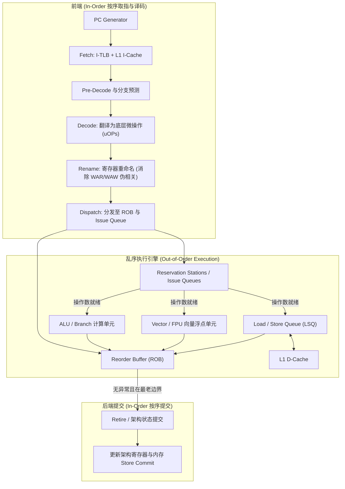
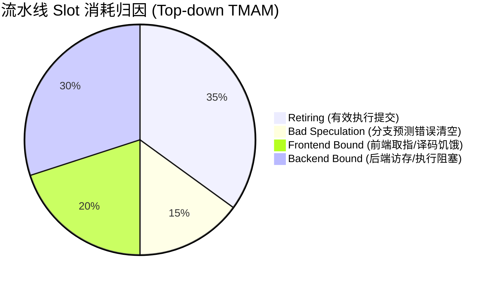

# ISA、寄存器与流水线

## 1. 概念本质：ISA 契约与微架构实现

指令集体系结构（ISA, Instruction Set Architecture）是硬件向软件承诺的抽象边界与规范契约。它严格规定了：
- **指令编码与操作码（Opcode）**：指令的二进制格式、寻址模式。
- **软件可见架构寄存器**：通用寄存器、程序计数器（PC）、栈指针（SP）、条件标志位与系统控制寄存器（如 ARMv8 PSTATE/系统寄存器，RISC-V CSR）。
- **内存模型与顺序约束**：单核/多核下的内存一致性契约（如 Weak Memory Ordering）。
- **异常与特权级模型**：中断响应、系统调用入口、特权状态切换机制。

**微架构（Microarchitecture）**则是芯片工程师在硅片上对该 ISA 契约的具体硬件实现方式。
- 两个完全遵循 ARMv8-A 或 RISC-V RV64GC 契约的处理器，其微架构可以天差地别：
  - **顺序单发射（In-Order Single-Issue）**：如 Cortex-A53 / Rocket Core，流水线简单（8~9级），无指令重排，功耗极低。
  - **乱序多发射（Out-of-Order Multi-Issue）**：如 Cortex-X4 / Neoverse-V2 / XiangShan，拥有 15~20+ 级深流水线、重命名（Rename）物理寄存器堆（PRF）、重排序缓冲区（ROB）、保留站（Reservation Station）与多级投机执行。

> **核心认知**：编译器只需遵守 ISA 即可生成功能正确的机器码；但软件性能调优、死锁排查与安全防护，则必须深刻理解微架构流水线的吞吐、停顿、依赖与投机行为。

---

## 2. 深入微架构：一条指令在现代超标量流水线中的全生命周期

现代乱序执行（Out-of-Order, OoO）处理器通常将指令执行划分为 **前端（Frontend）**、**执行引擎（Execution Engine）** 与 **后端提交（Backend Retire）** 三大阶段：

### 各级流水线核心机制与硬件开销
1. **取指（Fetch）**：
   - 依赖 PC 从 L1 I-Cache 和 I-TLB 取出连续指令块（通常每周期 32 或 64 字节）。
   - 硬件分支预测器（Branch Predictor）必须在极短时间内（1~2 周期内）预测下一周期的 Fetch PC，否则深流水线将面临严重的气泡（Bubbles）。
2. **译码（Decode）与微操作拆分（$\mu$OPs）**：
   - 将变长或复杂的 ISA 架构指令切分为精简、定长的硬件底层微操作（$\mu$OPs）。
3. **寄存器重命名（Register Renaming）**：
   - 将数量有限的架构寄存器（如 AArch64 的 31 个通用寄存器）映射到数量庞大的物理寄存器堆（Physical Register File, PRF，通常 128~256+ 项）。
   - **作用**：消除由寄存器重命名（Register Renaming）解决的 **WAW（写后写）** 和 **WAR（读后写）** 伪数据相关，只保留真正的数据流动依赖（RAW）。
4. **分发（Dispatch）与保留站发射（Issue）**：
   - 将 $\mu$OP 按顺序写入 ROB（记录原始程序顺序）和对应的 Issue Queue（保留站）。
   - 保留站持续监听前序指令的完成广播（Bypass/Forwarding 旁路网络）。一旦源操作数全部就绪，立即唤醒（Wakeup）并向空闲的 Execution Port 发射（Issue）。
5. **执行（Execute）与数据旁路（Forwarding Network）**：
   - 包含 ALU、浮点乘加（FMA）、跳转计算以及访存单元（Load/Store Units, LSU）。
   - **Load-to-Use 延迟**：即使 L1 D-Cache 命中，Load 操作也需要 3~4 个周期才能返回数据，后续依赖该数据的 ALU 指令必须停顿对应的周期数。
6. **重排序提交（Retire / Commit）**：
   - 乱序执行完毕的结果暂存在 ROB 中，只有当该指令成为 ROB 中最老（Oldest）的有效指令，且确认未发生任何 Exception/Interrupt 时，其结果才真正更新到架构寄存器或通过 Store Buffer 刷入 L1 D-Cache。

---

## 3. 流水线冲突（Hazards）深度解析与硬件解法

| 冲突类别 | 产生根因 | 典型硬件解决机制 | 软件/编译层优化策略 |
| :--- | :--- | :--- | :--- |
| **RAW 真实数据相关** | 指令需要上一条指令尚未计算完成的输出 | 数据旁路网络（Bypass/Forwarding）、动态乱序调度等待 | 指令重排、循环展开、引入多累加器打断依赖链 |
| **WAR / WAW 伪相关** | 架构寄存器名称有限，不同计算复用了同一寄存器名 | 物理寄存器重命名（Register Renaming / RAT / PRF） | 编译器分配更多不同寄存器，减少复用 |
| **结构冲突（Structural）** | 多条指令同时争用唯一的硬件资源（如同一 FPU/Divider 端口或 Cache 端口） | 复制执行单元、加深 Issue 队列缓冲、流水化除法器 | 混合交替排布不同类型指令（如 ALU 与 FPU 穿插） |
| **控制相关（Control）** | 分支跳转目标未决，前端无法确定后续正确的取指地址 | 分支方向预测（PHT/TAGE）、分支目标缓冲（BTB）、返回地址栈（RAS） | 减少不可预测分支、使用条件选通指令（如 ARM `CSEL`/`CSET`） |

---

## 4. 常见工程问题、性能断崖与关键陷阱与风险

### 问题 1：紧凑循环中的“假高负荷”——CPU 100% 但 IPC 极低
- **现象**：`top` 或监控工具显示 CPU 占用率接近 100%，但业务吞吐极差。
- **微架构根因**：
  1. **Spinlock 忙等待或紧凑循环**：处理器不断执行无意义的循环测试，大量消耗流水线 Issue Slot。
  2. **严重依赖链阻塞（Dependency Chain Stall）**：例如链表深度遍历 `p = p->next`，每次迭代都必须等待 L1/L2 Cache 乃至 DDR 响应，后端 Execution Unit 大部分时间处于等待数据的 Stall 状态。
- **排查与避免方案**：
  - 使用 Linux `perf stat` 测量 `instructions` 与 `cycles`，计算核心 **IPC（Instructions Per Cycle）**。
  - 若 IPC < 0.5 且 CPU 使用率高，说明遭遇了严重的内存停顿或自旋锁定；在自旋等待循环中必须插入 CPU 提示指令（ARM `YIELD` 或 x86 `PAUSE`），降低核内能耗并让出多线程资源。

### 问题 2：分支预测击穿与“性能断崖”
- **现象**：代码结构微小变动（如调整了 if-else 顺序或引入了额外日志打印）导致吞吐量下降 30% 以上。
- **微架构根因**：
  - **预测器 Alias 冲突**：TAGE 分支预测器使用指令 PC 的 Hash 值索引全局历史表，当关键分支与另一个高频分支产生 Hash 碰撞时，历史状态被污染。
  - **深流水线清空惩罚（Pipeline Flush Penalty）**：预测错误会导致前端清空已取指、译码的 15~20 级流水线内所有微操作，造成数十个周期的完全气泡。
- **规避与解决方案**：
  - 使用数据驱动逻辑替代分支判断（如用位运算或查找表消除分支）。
  - 在 C 语言中使用 `__builtin_expect()` 提示编译器偏向冷/热路径。
  - 针对高频数据选择，使用架构层无分支指令（如 AArch64 `csel x0, x1, x2, eq`，RISC-V `czero.eqz`）。

### 问题 3：推测执行（Speculative Execution）带来的侧信道安全漏洞（Spectre）
- **现象**：攻击者利用分支预测错误路径上的投机加载，泄露内核或跨进程敏感内存。
- **微架构根因**：
  - 即使投机指令最终在 ROB 阶段被清空（不提交架构寄存器），但其在推测执行期间访问内存的行为**已经改变了 L1 D-Cache 的缓存状态（微架构状态）**。攻击者通过测量 Flush+Reload 访问时间即可反推被盗数据。
- **规避与解决方案**：
  - 在敏感权限边界或数组越界检查后插入**投机屏障（Speculation Barrier）**（如 ARM `SB` 指令，或 `DSB NSH + ISB`）。
  - 内核开启 KPTI（Kernel Page Table Isolation），彻底隔离用户态与内核态页表。

---

## 5. 调试与性能分析实战：Top-down（TMAM）诊断法

现代高性能 SoC（如 ARM Cortex-A7x/Neoverse）均支持硬件性能监控单元（PMU）。定位 CPU 性能瓶颈时，严禁单看 Cycle 计数，应采用 **Top-down 微架构分析模型** 将流水线可用 Pipeline Slots 拆解：

### 四大瓶颈分类定位与处理法则
1. **Frontend Bound（前端受限）**：
   - *指标*：`FETCH_BUBBLE` / `L1I_CACHE_REFILL` 高。
   - *对策*：优化代码体积，减小指令工作集，启用编译器 `-fprofile-generate`/`-fprofile-use`（PGO）优化代码布局。
2. **Bad Speculation（投机错误）**：
   - *指标*：`BR_MIS_PRED` 极高。
   - *对策*：消除不可预测分支，重构为查表法或条件指令。
3. **Backend Bound（后端受限 - 绝大多数系统级瓶颈）**：
   - *Memory Bound*：`L1D_REFILL`, `LLC_MISS`, `MEMORY_ERROR` 飙升 $\to$ 优化数据局部性，使用 Cacheline 对齐，减少指针追逐。
   - *Core Bound*：长除法、复杂浮点运算阻塞执行端口 $\to$ 算法降阶，启用 SIMD/NEON 向量指令。
4. **Retiring（健康提交）**：
   - 若 Retiring 占比 > 50%，说明流水线工作饱满，若性能仍未达标，需从系统架构或并发算法本身进行优化。
