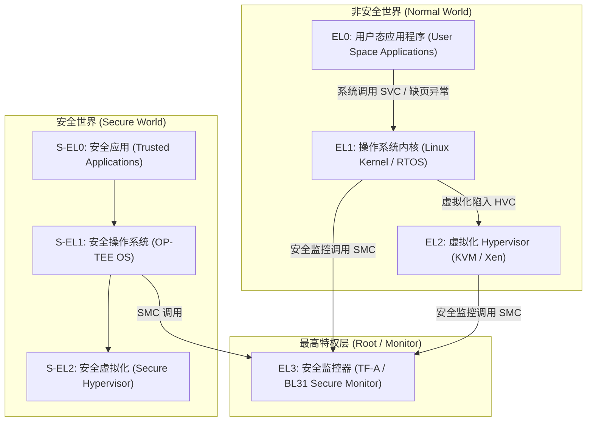
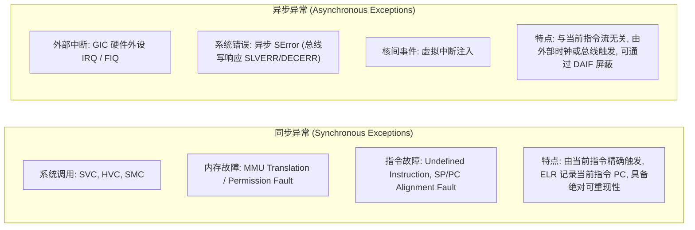
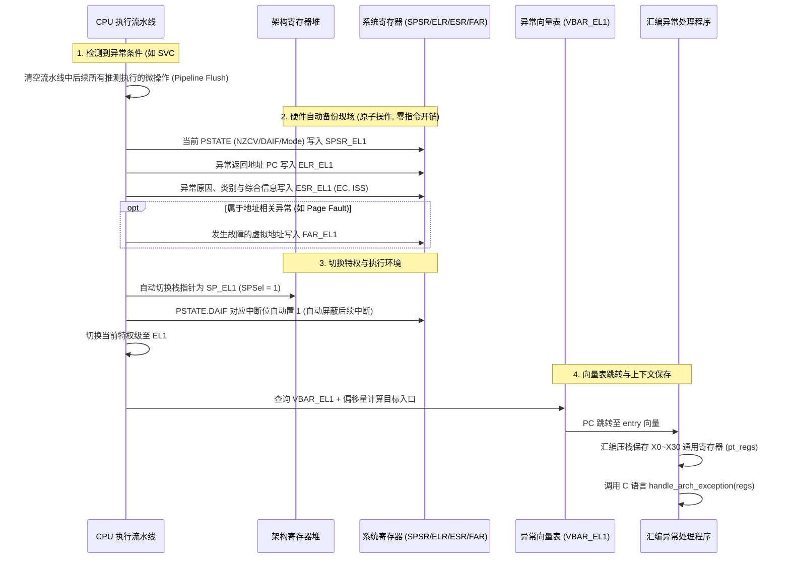

# 特权级架构、异常陷入机制与硬件上下文流转深度解析

## 1. 特权分级与执行模型（ARM64 vs RISC-V）

为了保证操作系统内核与系统级固件的安全与稳定性，现代处理器在硬件层面强制实施**特权分级隔离**：



### 特权级核心对比表
| 架构体系 | 特权级别 | 硬件责任与软件载体 | 核心系统控制寄存器与功能 |
| :--- | :--- | :--- | :--- |
| **ARMv8/v9-A** | **EL0** | 非特权级，运行用户态应用程序 | 无法直接访问 `SCTLR`, `TTBR`, `TCR` 等系统寄存器 |
| | **EL1** | 操作系统内核态（Linux OS） | 管理进程页表（`TTBR0/1_EL1`）、异常入口（`VBAR_EL1`） |
| | **EL2** | 虚拟化管理层（Hypervisor / KVM） | Stage-2 虚拟化地址翻译（`VTTBR_EL2`）、陷入控制（`HCR_EL2`） |
| | **EL3** | 安全监控层（TF-A Secure Monitor） | 世界切换（Secure / Non-secure 状态）、安全中断路由（`SCR_EL3`） |
| **RISC-V** | **U-mode** | 用户模式（User Mode） | 受限模式，内存访问受 PMP 硬件限制 |
| | **S-mode** | 监督者模式（Supervisor Mode） | 运行 Linux 内核，配置 `satp` 页表与 `stvec` 异常向量 |
| | **M-mode** | 机器模式（Machine Mode） | 最高物理特权，运行 OpenSBI 固件，全权控制 `mstatus`, `pmpcfg` |

---

## 2. 同步异常 vs 异步异常：微架构行为的本质差异

处理器面临的异常并非同质，微架构在处理这两类事件时逻辑截然不同：



### 关键区别深度对照
- **精确异常（Precise Exception）**：同步异常均为精确异常。在进入异常瞬间，微架构保证**发生异常之前的指令全部已提交（Retire），发生异常之后的指令全部被丢弃（Flush），`ELR_ELx` 严格指向引发异常的指令或其下一条指令**。
- **不精确异常（Imprecise Exception - 如 SError）**：当 CPU 通过异步 Write Buffer 写入外部不可达的 MMIO 地址时，总线错误在数十个周期后才返回。此时 CPU 已经执行并提交了后续数十条指令，`ELR_ELx` 记录的 PC 已经**偏离了真正的案发现场**。

---

## 3. 异常陷入全生命周期：硬件自动动作与流水线时序

当一条指令触发异常（例如用户态执行 `SVC #0` 或发生 Page Fault）时，硬件逻辑会在单周期内原子执行以下 **6 大硬件动作**：



---

## 4. 异常向量表（VBAR_ELn）16 槽位精准布局

ARM64 架构为每个异常级别（EL1, EL2, EL3）定义了一个容量为 **2048 字节**的异常向量表。基地址存放在 `VBAR_ELn`（必须按 2048 字节对齐）。

该表严格划分为 **4 组执行上下文，每组包含 4 类异常源，共计 16 个独立入口槽位（每个槽位固定分配 128 字节，即 32 条指令）**：

| 组别 | 异常发生时的上下文与源特权级 | 异常类型 | 表内相对偏移 | 典型触发场景 |
| :--- | :--- | :--- | :--- | :--- |
| **Group 1** | **当前 EL 级别，使用 SP_EL0** | Synchronous | `+0x000` | 内核态自身运行，但临时切到 `SP_EL0`（极罕见） |
| *(Current EL with SP0)* | *(通常不使用)* | IRQ / vIRQ | `+0x080` | 内核态中断 |
| | | FIQ / vFIQ | `+0x100` | 内核态快速中断 |
| | | SError / vSError | `+0x180` | 内核态总线系统错误 |
| **Group 2** | **当前 EL 级别，使用 SP_ELx** | Synchronous | `+0x200` | **内核态自身发生 Page Fault / 空指针 / BUG_ON** |
| *(Current EL with SPx)* | *(内核自身运行态)* | IRQ / vIRQ | `+0x280` | **内核态执行时被外部硬件中断打断** |
| | | FIQ / vFIQ | `+0x300` | 内核态高优先级快速中断 |
| | | SError / vSError | `+0x380` | 内核态访问外设 MMIO 触发总线错误 |
| **Group 3** | **低 EL 级别（AArch64 模式）** | Synchronous | `+0x400` | **用户态系统调用（`SVC`）或用户态 Page Fault** |
| *(Lower EL using AArch64)*| *(64 位应用陷入内核)* | IRQ / vIRQ | `+0x480` | **用户态执行时被外部硬件中断打断** |
| | | FIQ / vFIQ | `+0x500` | 用户态被 FIQ 打断 |
| | | SError / vSError | `+0x580` | 用户态非法外设访问 |
| **Group 4** | **低 EL 级别（AArch32 模式）** | Synchronous | `+0x600` | 32 位兼容应用系统调用 |
| *(Lower EL using AArch32)*| *(兼容旧 32 位应用)* | IRQ / vIRQ | `+0x680` | 32 位应用运行时中断 |
| | | FIQ / vFIQ | `+0x700` | 32 位应用运行时 FIQ |
| | | SError / vSError | `+0x780` | 32 位应用运行时 SError |

---

## 5. 汇编级上下文保存、分发与 `ERET` 返回实战

由于硬件只自动备份了 `PSTATE`, `PC`, `ESR`, `FAR`，**所有通用寄存器（X0~X30）的保存必须由入口汇编代码在安全栈上完成**：

```asm
/* Linux 内核标准 entry-header.S 风格通用寄存器压栈宏 */
.macro kernel_entry, el
    sub     sp, sp, #256                 /* 在内核栈上预留 pt_regs 结构体空间 */
    stp     x0,  x1,  [sp, #16 * 0]      /* 成对快速压栈保存通用寄存器 */
    stp     x2,  x3,  [sp, #16 * 1]
    stp     x4,  x5,  [sp, #16 * 2]
    stp     x6,  x7,  [sp, #16 * 3]
    stp     x8,  x9,  [sp, #16 * 4]
    stp     x10, x11, [sp, #16 * 5]
    stp     x12, x13, [sp, #16 * 6]
    stp     x14, x15, [sp, #16 * 7]
    stp     x16, x17, [sp, #16 * 8]
    stp     x18, x19, [sp, #16 * 9]
    stp     x20, x21, [sp, #16 * 10]
    stp     x22, x23, [sp, #16 * 11]
    stp     x24, x25, [sp, #16 * 12]
    stp     x26, x27, [sp, #16 * 13]
    stp     x28, x29, [sp, #16 * 14]     /* x29 为 Frame Pointer */
    str     x30,      [sp, #16 * 15]     /* x30 为 Link Register (LR) */

    /* 读取硬件自动保存的关键系统寄存器并存入 pt_regs */
    mrs     x22, elr_el1
    mrs     x23, spsr_el1
    stp     x22, x23, [sp, #240]         /* 保存 ELR 与 SPSR */
.endm

/* 异常处理完成后的原子恢复宏 */
.macro kernel_exit, el
    ldp     x22, x23, [sp, #240]
    msr     elr_el1, x22                 /* 恢复返回地址 PC */
    msr     spsr_el1, x23                /* 恢复目标 PSTATE */

    ldp     x0,  x1,  [sp, #16 * 0]
    /* ... 依次恢复 x2~x29 ... */
    ldr     x30,      [sp, #16 * 15]
    add     sp, sp, #256                 /* 平衡栈指针 */

    eret                                 /* 原子返回: 将 SPSR 恢复至 PSTATE, PC 跳转至 ELR */
.endm
```

---

## 6. 常见关键陷阱与风险与现场排查手册

### 陷阱 1：内核栈溢出引发的系统死锁（Double Fault / Stack Corruption）
- **故障现象**：系统在高并发深层递归或复杂中断嵌套时瞬间死机，JTAG 抓取 PC 发现其卡在 `VBAR_EL1 + 0x200`（Current EL Synchronous 入口）死循环。
- **微架构根因**：
  - 内核线程栈（通常 16KB）发生溢出，`SP_EL1` 已经触碰到底部非法地址；
  - 触发了 Data Abort，硬件陷入 `+0x200` 入口；
  - 汇编代码执行 `sub sp, sp, #256; stp x0, x1, [sp]` 试图压栈，但在非法栈地址写入时**再次触发 Data Abort**！
  - CPU 陷入无休止的异常自激死循环（Double Fault 级联崩溃）。
- **现代内核防护手段（Shadow Call Stack / VMAP_STACK）**：
  - Linux 内核引入 `CONFIG_VMAP_STACK`，在内核栈底设置一个无物理页映射的 Guard Page。
  - 发生溢出时，专用的 `Overflow Stack`（独立于常规内核栈）负责捕获并打印 Oops，防止硬件死锁。

### 陷阱 2：`ESR_EL1` 异常综合症解码错误
- **排错要点**：当内核发生 Crash 打印 `Internal error: Oops: 96000004 [#1] SMP` 时，数字 `0x96000004` 即为 `ESR_EL1` 的十六进制值：
  - `Bit[31:26]` (**EC, Exception Class**)：`0b100101` (`0x25`) 代表来自当前特权级的 Data Abort。
  - `Bit[25]` (**IL, Instruction Length**)：`1` 代表 32 位指令长度。
  - `Bit[5:0]` (**DFSC, Data Fault Status Code**)：`0b000100` 代表 **Level 0 Translation Fault（0 级页表缺失）**。
- **诊断结论**：无需猜测，直接确诊为**空指针解引用**或**访问了尚未建立页表映射的非法虚拟地址**。
