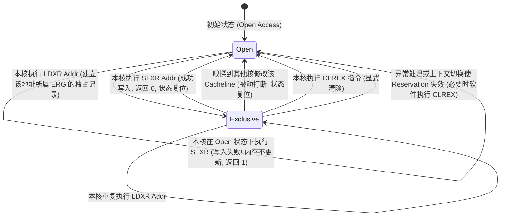
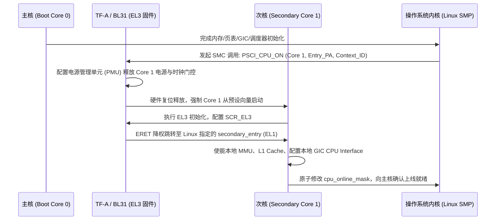

# 多核体系、独占原子监视器与弱内存序深度解析

## 1. 弱内存序（Weak Memory Ordering）的微架构根因

在单核执行中，CPU 遵循“程序顺序（Program Order）表象一致”原则；但在多核对称多处理（SMP）系统中，ARM 与 RISC-V 均采用 **弱内存序模型（Weak Memory Ordering, WMO）**。

```mermaid
flowchart LR
    subgraph Core0 ["Core 0 执行引擎"]
        E0["执行引擎 (OoO Engine)"] --> SB0["Store Buffer (写缓冲)"]
        SB0 --> L1_0["L1 D-Cache"]
    end

    subgraph Core1 ["Core 1 执行引擎"]
        E1["执行引擎 (OoO Engine)"] --> SB1["Store Buffer (写缓冲)"]
        SB1 --> L1_1["L1 D-Cache"]
    end

    L1_0 <==>|一致性互联 (CHI / NoC)| L1_1
    L1_0 & L1_1 --> DDR["物理 DDR 内存"]
```

### 为什么硬件必须重排？——性能与物理延迟的妥协
1. **Store Buffer 导致的 Store-Load 乱序**：
   - 当 CPU 执行 Store 时，为了不让流水线停顿等待 L1 Cache 命中或总线 RFO 响应，硬件直接将数据写入 **Store Buffer**，指令立即提交。
   - 如果紧随其后有一条读取另一地址的 Load 指令，Load 可以先从 L1 Cache 完成读取，而 Store 仍滞留在 Store Buffer 中未刷入 Cache。
   - **观察者效应**：外部其他 CPU 核心先观察到了 Load 的完成，后观察到 Store 的生效！
2. **典型 Litmus 验证模型（Store Buffering, SB）**：
   - 初始状态：`x = 0, y = 0`
   - Core 0 执行：`x = 1; r1 = y;`
   - Core 1 执行：`y = 1; r2 = x;`
   - **在弱内存序硬件上，完全可能出现 `r1 == 0 && r2 == 0` 的反直觉结果！**

---

## 2. 独占监视器（Exclusive Monitor）硬件状态机与原子操作

在 ARM 架构中，AArch64 使用 `LDXR/STXR`，AArch32 使用 `LDREX/STREX`。独占加载/存储指令对依赖硬件**排他监视器（Exclusive Monitor）**实现无锁原子 Read-Modify-Write。以下微架构状态机以 AArch64 为例：

排他监视器在体系结构概念模型上分为两级：
- **Local Monitor（本地监视器）**：位于各 Core 内部，监控该 Core 本地对独占地址的加载与存储状态。
- **Global Monitor（全局监视器）**：从体系结构概念模型看，负责协调 Shareable Memory 的全局独占状态；具体实现可能分布在 Cache 一致性目录、互联 Home Node（如 HN-F）或其他一致性逻辑中，不保证物理上存在独立、集中式的硬件模块。



### 原子循环汇编与活锁（Live-lock）消除
```asm
/* AArch64 标准独占自旋原子加法循环 (Atomic Add) */
1:  ldxr    w1, [x0]        /* 独占加载 *x0 到 w1, 建立对目标地址所属 ERG 的独占保留记录 */
    add     w1, w1, #1      /* 寄存器本地递加 */
    stxr    w2, w1, [x0]    /* 尝试条件写入: 若独占状态有效则写入成功并返回 w2=0; 否则写入未发生且返回 w2=1 */
    cbnz    w2, 1b          /* 若 w2 != 0 (操作未成功), 跳转回标号 1 重试 */
```

### 关键陷阱与风险：高争用下的活锁风暴（Live-lock Storm）与 LSE 优化
- **活锁与高争用场景**：当 64 个 CPU 核心同时争用同一个原子计数器时，Core 0 刚执行 `ldxr`，Core 1 发出的总线写事务就将 Core 0 的监视器清零；多个核心可能长时间处于高频失败和重试状态，产生大量一致性事务；系统整体吞吐显著下降，个别核心还可能出现饥饿或活锁风险。
- **ARMv8.1 LSE（Large System Extensions）单指令原子扩展**：
  - 引入硬件单指令原子：`LDADD`, `SWP`, `CAS` 等，消除了软件显式维护 `LDXR/STXR` 自旋重试循环的开销；
  - **互联侧 Far Atomic 可选优化**：若 SoC 的片上互联（如 CHI / AXI5）与目标节点（如 SLC 或内存控制器）支持并启用了远端原子事务（Far Atomic Transactions），CPU 能够将原子操作直接作为报文下发到互联端执行，从而在支持的硬件平台上大幅减少跨核 Cacheline 频繁迁移（RFO 颠簸）的开销。

---

## 3. 单向栅栏（Acquire-Release） vs 双向屏障（Full Barrier）

现代高性能并发编程普遍采用轻量级的 **单向栅栏（One-way Barriers）**：

```mermaid
flowchart TD
    subgraph Producer ["生产者 (Core 0)"]
        W1["普通写: Payload 写入 buf(0..N) = data"]
        W2["Store-Release: 释放写发布标志 (atomic_store_explicit)"]
        W1 -->|Release 屏障禁止前面的写重排到后面| W2
    end

    subgraph Consumer ["消费者 (Core 1)"]
        R1["Load-Acquire: 观察标志 (atomic_load_explicit)"]
        R2["普通读: Payload 读取 process(buf)"]
        R1 -->|Acquire 屏障禁止后面的读重排到前面| R2
    end

    W2 -.->|同步依赖边 (Synchronizes-With)| R1
```

### 语义法则
- **Load-Acquire（`LDAR`）**：单向屏障，**阻止其后的任何 Load/Store 重排到该指令之前**（允许其前面的访问排到后面）。
- **Store-Release（`STLR`）**：单向屏障，**阻止其前的任何 Load/Store 重排到该指令之后**（允许其后面的访问排到前面）。
- **收益**：相比全局粗暴挂起流水线的 `DMB/DSB`，Acquire-Release 在编译后直接生成硬件级单向原子指令（如 ARM64 `LDAR/STLR`），**流水线停顿开销降低 70% 以上**。

---

## 4. 内存屏障指令微架构行为深度拆解（DMB vs DSB vs ISB）

| 指令 | 全称与硬件动作 | 微架构底层行为 | 典型应用场景 |
| :--- | :--- | :--- | :--- |
| **`DMB`** | **Data Memory Barrier**（数据内存屏障） | 仅约束 LSU 中的内存访问顺序，**不阻塞 CPU 流水线对后续独立算术指令的译码与发射** | 多线程无锁队列、环形缓冲区指针更新 |
| **`DSB`** | **Data Synchronization Barrier**（数据同步屏障） | **完全挂起流水线后续一切指令的执行**，直到在此之前发出的所有访存和 Cache/TLB/分支预测维护操作在总线上获得最终确认（Acknowledge） | DMA 启动前刷 Cache、修改页表后等待 TLB 失效完成、写 MMIO 触发中断 |
| **`ISB`** | **Instruction Synchronization Barrier**（指令同步屏障） | **彻底清空流水线前端的预取缓冲区（Prefetch Buffer）与译码队列**，强制 CPU 从当前 PC 重新取指 | 修改系统控制寄存器（如切换 `SCTLR_EL1` MMU 使能）、JIT 代码写入执行 |

### 屏障作用域（Shareability Domain）
指令后可附加作用域后缀，精确控制开销范围：
- `DMB ISH`（Inner Shareable）：作用于同一 SoC 内共享 Cache 的多核 CPU 集群（最常用）。
- `DMB OSH`（Outer Shareable）：作用于包含 GPU、外设 DMA 的系统级大一致性域。
- `DMB SY`（Full System）：作用于整个系统（包括外部设备和内存）。

---

## 5. 多核启动流程（PSCI / Secondary CPU Bringup）

在多核 SoC 上电复位后，硬件通常只释放主核（Boot CPU），次核（Secondary CPUs）处于静默待机状态：



---

## 6. 常见关键并发陷阱与排查手册

### 陷阱 1：单核中断处理中获取 Spinlock 导致的自我死锁（Self-Deadlock）
- **故障现象**：进程持有自旋锁期间突然被硬件中断打断，系统瞬间卡死（Watchdog 随后触发 Hard Lockup Panic）。
- **微架构根因**：
  - 线程 A 在 CPU 0 上执行 `spin_lock(&my_lock)` 成功持锁；
  - 此时外部硬件中断到来，CPU 0 陷入执行该中断的 ISR；
  - ISR 内部也尝试调用 `spin_lock(&my_lock)`；
  - 由于锁已被线程 A 持有，ISR 在 CPU 0 上无限自旋等待；但线程 A 只有在 ISR 退出后才有机会继续运行以释放锁！**同一个核心自己把自己锁死**。
- **工业级规避法则**：在锁可能被当前核心的中断处理程序抢占时，进程上下文**必须使用 `spin_lock_irqsave()`**，在持锁瞬间显式关闭本地中断（`PSTATE.I = 1`）以防重入死锁。

### 陷阱 2：DMA 缓冲区同步遗漏 `dma_wmb()`
- **故障现象**：网络发送数据包时，网卡偶尔发送出一段全零或随机垃圾数据，但驱动日志显示成功。
- **微架构根因**：
  - CPU 向 Payload 缓冲区写入数据，然后立即修改网卡 TX 描述符的 `OWN` 标志位。
  - 由于 Store Buffer 乱序，`OWN` 标志位的写入先于 Payload 数据刷出到了 DDR。
  - 网卡检测到 `OWN=1`，立即启动 DMA 搬运，从 DDR 搬走了尚未更新完毕的旧内存！
- **规避代码**：在翻转所有权标志位之前，必须强制插入 `dma_wmb()`（对应 ARM `DMB OSHST`）。
