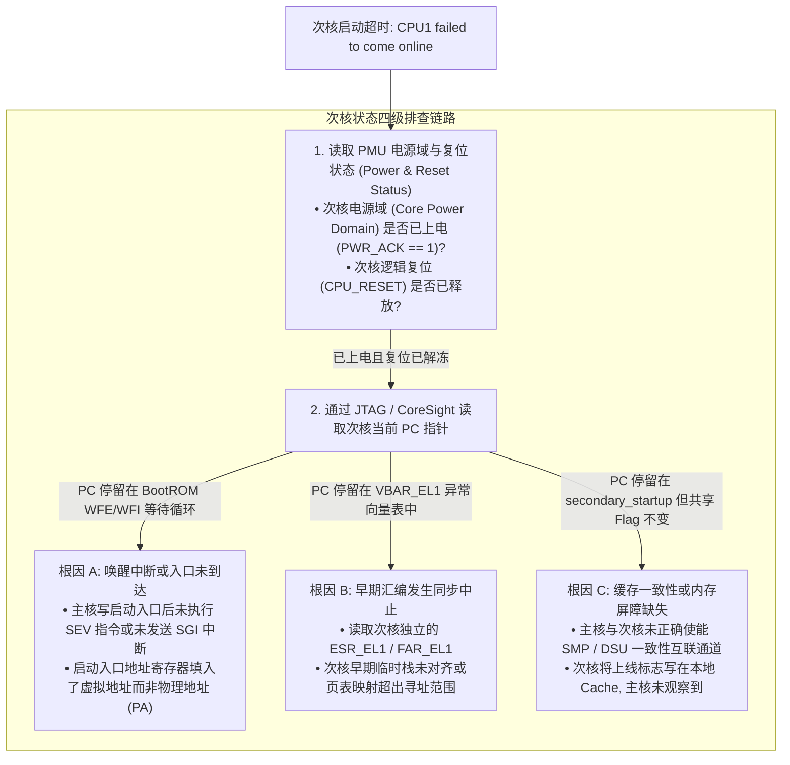
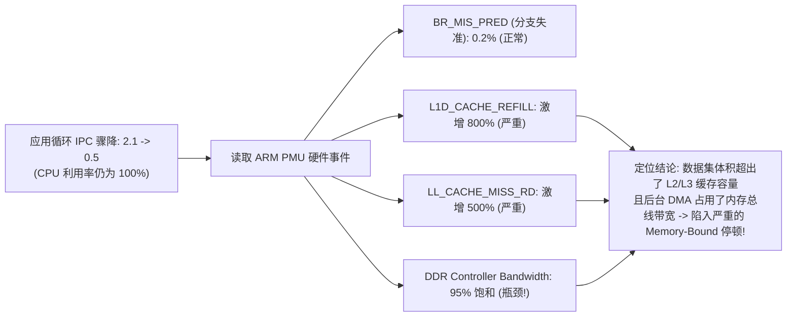

# 多核启动超时、同步异常定位与 IPC 骤降诊断完全指南

## 1. 多核启动（SMP Secondary Boot）超时诊断决策树

在 Linux 多核启动阶段，若主核（CPU 0）打印 `CPU1: failed to come online` 并触发 5 秒超时：

---

## 2. MMIO 同步异常（Data Abort）结合 NoC 错误日志定位

- **现象**：驱动执行 `readl(uart_base)` 时，CPU 触发 `Data Abort`（`ESR = 0x96000010: Synchronous External Abort`）。
- **定位推演**：
  1. 检查页表：虚拟地址已正确建立映射，属性为 `Device-nGnRE`，排除 Translation Fault；
  2. 查阅 NoC 互联错误记录器（Fault Logger）：发现目标地址落在 UART 控制器窗口，但响应为 **`Target Timeout`**；
  3. 查阅时钟控制器（CCU）：发现外设的 APB 总线时钟（PCLK）被电源管理系统（Runtime PM）意外关闭（Gate Off）；
  4. **结论**：外部总线无时钟响应导致事务挂死，桥接器超时向 CPU 回复 External Abort。

---

## 3. 循环 IPC 从 2.1 跌至 0.5 的微架构归因案例

- **针对性优化策略**：
  - 实施数据分块（Cache Blocking / Tiling），限制单次遍历的数据量在 L1/L2 缓存容量以内；
  - 调整结构体成员布局，提高 Spatial Locality（空间局部性）。
