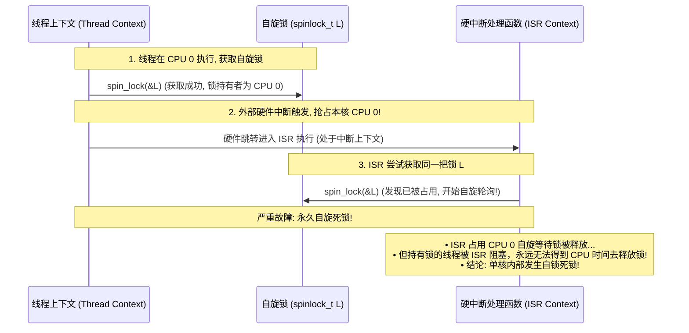

# 指令级执行推演、异常返回与自旋锁重入死锁深度剖析

## 1. 从 C 语言到硬件流水线周期级推演（`sum += a(i)`）

考虑简单的数组求和循环体：
```c
for (int i = 0; i < N; i++) {
    sum += a(i);
}
```

```mermaid
flowchart TD
    subgraph Pipeline_Flow ["乱序执行流水线中的指令依赖链"]
        I1["1. 取指与译码: LDR W1, (X0, W2, UXTW #2) (加载 a(i))"]
        I2["2. 执行与依赖: ADD W3, W3, W1 (sum = sum + W1)"]

        I1 -->|数据依赖边 (RAW Hazard)| I2
        I2 -->|反向自依赖: 下一次循环的 sum 必须等待本次 ADD 完成!| I2
    end
```

### 微架构瓶颈分析与循环展开消除依赖
1. **单累加器串行瓶颈**：尽管现代 CPU 具备多发射和乱序执行能力，但由于 `sum` 的数据依赖链（Loop-carried Dependency），后续所有 `ADD` 操作被严格串行化，**受限于 ALU 的单周期延迟（Latency-bound）**。
2. **多累加器优化（Multi-accumulator）**：
   ```c
   /* 展开为 4 个独立累加器，打断依赖链 */
   sum0 += a(i);
   sum1 += a[i+1];
   sum2 += a[i+2];
   sum3 += a[i+3];
   ```
   微架构可以同时发射 4 个独立的 `LDR` 与 4 个并行的 `ADD` 指令，充分跑满执行流水线与内存级并行度（MLP）。

---

## 2. 异常返回地址（`ELR_EL1`）为何有时指向当前指令、有时指向下一条？

ARM 架构对不同类型的异常定义了严格的 `ELR_EL1` 保存规则：

| 异常大类 | `ELR_EL1` 记录的 PC | 微架构意图与处理逻辑 |
| :--- | :--- | :--- |
| **同步故障 (Fault)**<br>（如缺页、权限违规） | **触发异常的当前指令 PC** | 异常处理程序（如 `do_page_fault`）修复页表映射后，执行 `ERET` 返回并**重新执行刚才失败的指令** |
| **同步陷阱 (Trap / Syscall)**<br>（如 `SVC` 系统调用） | **紧随其后的下一条指令 PC** | 系统调用已由内核完成服务，执行 `ERET` 返回时直接继续推进业务控制流 |
| **异步中断 (IRQ / FIQ)** | **被中断打断的下一条待执行指令 PC** | 恢复被打断的正常控制流 |

---

## 3. 单核中断自旋锁死锁（Spinlock Re-entrancy Deadlock）时序推演



- **解决准则**：当共享自旋锁可能被本地核心的中断处理程序抢占获取时，线程上下文必须使用 **`spin_lock_irqsave(&lock, flags)`**（在获取锁的同时关闭当前 CPU 的本地中断，防止同核死锁）；若锁仅用于跨 CPU 线程同步且不在 ISR 中被引用，使用常规 `spin_lock` 即可。
