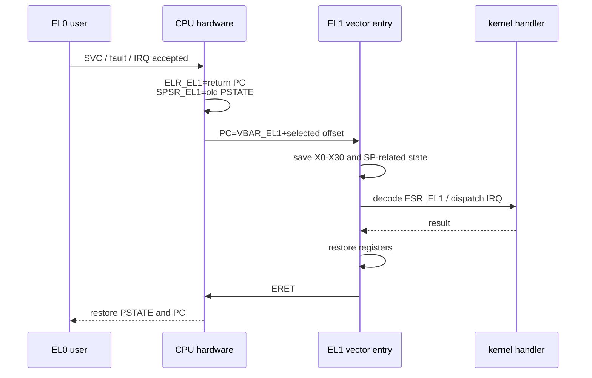

# ARM/RISC-V 异常向量与上下文保存

## AArch64 Vector Table 的真实布局

AArch64 的 `VBAR_ELx` 指向一个 2 KiB 对齐的向量表。表中有 16 个入口，每个入口固定占 128 Byte。硬件根据异常来自当前异常级还是更低异常级、原来使用 `SP_EL0` 还是 `SP_ELx`、低异常级执行 AArch64 还是 AArch32，以及异常类型，选择入口。

| 偏移 | 来源 | `+0x00` | `+0x80` | `+0x100` | `+0x180` |
| ---: | --- | --- | --- | --- | --- |
| `0x000` | 当前 EL，使用 SP0 | Sync | IRQ | FIQ | SError |
| `0x200` | 当前 EL，使用 SPx | Sync | IRQ | FIQ | SError |
| `0x400` | 更低 EL，AArch64 | Sync | IRQ | FIQ | SError |
| `0x600` | 更低 EL，AArch32 | Sync | IRQ | FIQ | SError |

例如用户态 EL0 执行 `svc #0` 进入 EL1 时，CPU 跳到 `VBAR_EL1 + 0x400`；来自 EL0 的普通 IRQ 跳到 `VBAR_EL1 + 0x480`。硬件把返回地址写入 `ELR_EL1`，把旧 PSTATE 写入 `SPSR_EL1`，更新中断屏蔽和异常级，但不会自动保存 `X0`～`X30`。



一个最小入口骨架如下。它只展示栈布局，不是可直接替换 Linux 的完整入口：

```asm
.align 11                       // vector table needs 2 KiB alignment
vectors:
    b current_sp0_sync
    .balign 128
    b current_sp0_irq
    .balign 128
    // ... 14 more entries

lower_a64_sync:
    sub     sp, sp, #(34 * 8)
    stp     x0,  x1,  [sp, #(0 * 16)]
    stp     x2,  x3,  [sp, #(1 * 16)]
    // save remaining caller and callee registers
    mrs     x0, elr_el1
    mrs     x1, spsr_el1
    stp     x0, x1, [sp, #(31 * 8)]
    mrs     x0, esr_el1
    mrs     x1, far_el1
    bl      do_sync_exception
    // restore in exact reverse order
    add     sp, sp, #(34 * 8)
    eret
```

真正实现还要处理栈溢出、异常嵌套、Pointer Authentication、SVE/SME/FP 延迟保存、调试寄存器和从 compat AArch32 进入等情况。FP/SIMD 状态很大，内核通常按需保存，而不是每次异常都无条件压栈。

## ESR、FAR 与重试

`ESR_ELx.EC` 表示异常类别，`ISS` 给出该类别的细节。Data Abort 还会给出读写方向、Translation/Permission/External Abort 和失败级别；`FAR_ELx` 保存相关 VA。处理 Page Fault 后可以保持 `ELR_EL1` 指向故障指令并重试；系统调用正常返回则从约定的下一条指令继续。

## RISC-V Trap 入口

RISC-V 用 `mtvec/stvec` 保存 Trap Base。Direct 模式下所有异常和中断进入 BASE；Vectored 模式下同步异常仍进入 BASE，中断进入 `BASE + 4 × cause`。硬件保存 `mepc/sepc`、`mcause/scause` 和 `mtval/stval`，并更新 `mstatus/sstatus` 中的中断使能和前一特权级字段，同样不自动保存通用寄存器。

```asm
trap_entry:
    csrrw   sp, sscratch, sp    // swap user SP with kernel scratch
    addi    sp, sp, -PT_SIZE
    sd      ra, PT_RA(sp)
    sd      t0, PT_T0(sp)
    // save x-registers required by the ABI/OS
    csrr    a0, scause
    csrr    a1, sepc
    csrr    a2, stval
    call    riscv_trap_handler
    // restore registers
    csrrw   sp, sscratch, sp
    sret
```

`stval` 对 Page Fault 通常包含 Fault Address，对 Illegal Instruction 可能包含指令位，具体可用信息依实现。中断 Cause 最高位为 1，同步异常为 0。

## 上下文保存的边界

线程切换只需保存 ABI 规定的 Callee-saved 状态和调度所需寄存器；异常入口必须保存会被处理程序破坏的完整架构现场；虚拟机切换还要保存虚拟化系统寄存器、虚拟中断和 Stage-2 上下文。把三者混为一谈，会造成不必要开销或隐藏状态丢失。
