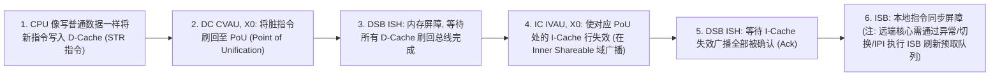
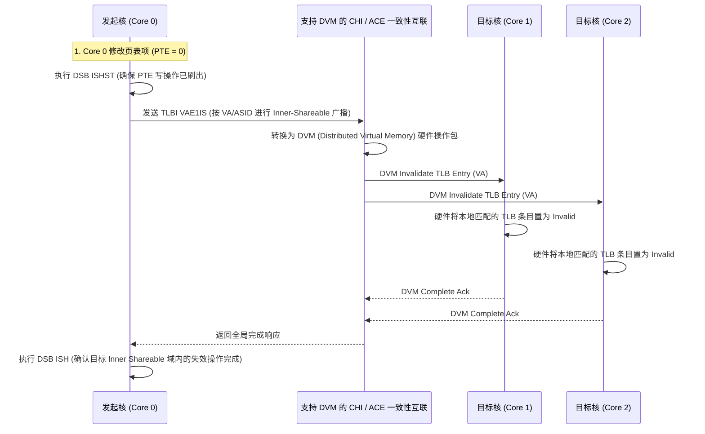
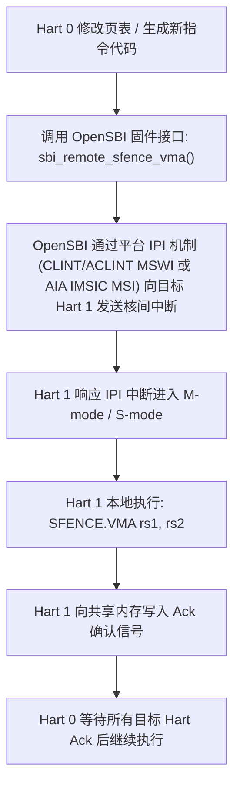

# 原子指令底层硬件机制、Cache 与 TLB 架构级维护完全指南

## 1. Exclusive Reservation（独占保留区）的硬件实现原理

AArch64 的 `LDXR / STXR` 与 RISC-V 的 `LR / SC` 在微架构层面依赖于**独占保留颗粒度（Exclusive Reservation Granule, ERG）**。

```mermaid
flowchart TD
    subgraph Core_Internal ["CPU 核心内部"]
        LDXR_Inst["CPU 执行 LDXR W1, &#91;X0&#93;"] --> Check_Local["Local Monitor 记录当前虚拟/物理地址与 Valid 标记"]
        Check_Local --> ERG_Block["Local Monitor 建立针对目标地址所属 ERG 的独占保留记录"]
    end

    subgraph Coherent_Interconnect ["片上一致性总线 (CHI / ACE)"]
        ERG_Block --> Global_Mon["Global Monitor (概念模型: 追踪 Core_ID 与 Address_Tag)"]
    end

    STXR_Inst["CPU 执行 STXR W2, W1, &#91;X0&#93;"] --> Check_Global{"Global Monitor 状态是否仍为 Exclusive?"}
    Check_Global -->|是 (期间无嗅探写事件)| Success["写入成功: 更新内存, W2 寄存器置 0"]
    Check_Global -->|否 (发生过总线写/上下文切换)| Fail["写入失败: 丢弃写入, W2 寄存器置 1, 状态复位"]
```

### 独占监视器的关键工程陷阱：独占保留粒度冲突与活锁风险
- **现象**：线程 0 频繁修改原子变量 `A`，线程 1 频繁修改邻近变量 `B`。尽管 `A` 和 `B` 在逻辑上无关联，但线程 0 的 `LDXR/STXR` 独占循环重试率极高，性能发生断崖式下跌。
- **微架构机制与约束分层**：
  - **正确性要求（Natural Alignment）**：`LDXR/STXR` 指令在体系结构层面的硬性约束是**必须满足操作宽度的自然对齐**（例如 32 位原子变量需 4 字节自然对齐，64 位需 8 字节对齐）；非对齐的独占访问会直接触发硬件 Alignment Fault。
  - **独占保留粒度（ERG）与干扰机制**：硬件独占监视器（Local/Global Exclusive Monitor）以**独占保留颗粒度（Exclusive Reservation Granule, ERG，大小记录于 `CTR_EL0.ERG`）** 为单位标记地址范围。当变量 `B` 与原子变量 `A` 共享同一个 ERG 时，其他核心对 `B` 的普通写入会触发总线失效探测广播，清除当前核心对该 ERG 的独占监视器状态，导致随后的 `STXR` 写入失败并返回状态码 1（写入未发生）。同 Cache Line 的高频并发写入会大幅增加 STXR 失败概率，在极高争用下容易诱发活锁。
  - **性能隔离建议**：对于高争用的热点原子变量，建议根据运行平台的 Cache Line 大小或破坏性干扰尺寸（如 C++17 `std::hardware_destructive_interference_size`）进行独立行隔离对齐，以消除伪冲突开销（注意：不要在跨平台代码中硬编码 64B）。
  - **算法重试与退避策略**：`LDXR/STXR` 是构建并发原语的底层指令，重试是预期的正常协议行为。高争用场景下可在循环中插入 `YIELD` 指令提示微架构调度器；若设计有限重试机制，必须提供完备的降级兜底方案（如回退至互斥锁或系统调用），不能盲目中断原子语义；使用 `WFE` 则需严格匹配硬件事件流（`SEV`/`SEVL`）。

---

## 2. 单指令原子（LSE / AMO）与可选的互联侧 Far Atomic 优化

为了改善高并发场景下 `LDXR/STXR` 自旋循环的代码膨胀与重试开销，ARMv8.1-A 引入了 **LSE（Large System Extensions）**，RISC-V 提供了 **A 扩展（AMO 指令集）**：

| 操作语义 | ARMv8.0 独占自旋循环 | ARMv8.1 LSE 单指令原子 | RISC-V A 扩展单指令原子 |
| :--- | :--- | :--- | :--- |
| **原子加** | `1: LDXR; ADD; STXR; CBNZ 1b` | `LDADD  X1, X2, [X0]` | `amoadd.d  x2, x1, (x0)` |
| **原子交换** | `1: LDXR; STXR; CBNZ 1b` | `SWP    X1, X2, [X0]` | `amoswap.d x2, x1, (x0)` |
| **比较并交换 (CAS)** | `1: LDXR; CMP; B.NE; STXR; CBNZ 1b` | `CAS    X1, X2, [X0]` | 基础 A 扩展使用 LR/SC 循环；实现 Zacas 扩展时支持 `amocas.w/d/q` |

### 架构分层解析：ISA 语义、微架构实现与互联协议
理解单指令原子机制，必须将其严格划分为三个相互独立的技术层级：
1. **ISA 语义层（Instruction Set Architecture）**：
   - `LDADD`、`CAS` 与 RISC-V `amoadd` 等指令在体系结构层面仅规范了原子读-改-写（RMW）的数学逻辑、访问宽度以及内存屏障序（Acquire / Release / Relaxed）；
   - 其核心价值是提供**单指令原子抽象**，消除了软件显式维护 `LDXR/STXR` 循环的指令条数与分支预测压力。
2. **CPU 微架构实现层（Microarchitecture）**：
   - 处理器微架构如何执行这些指令是实现相关的：核心完全可以在本地 L1/L2 Cache 中通过传统的缓存一致性协议（拉取 Cacheline 至 Exclusive/Modified 状态后在本地 ALU 计算）完成操作；
   - RISC-V 规范亦明确指出，简单微架构在硬件底层完全可以直接用内部 `LR/SC` 状态机实现 AMO；
   - **因此，单指令原子本身并不等同于近内存计算，也不保证数据一定不进入 CPU 私有 Cache**。
3. **互联协议与系统优化层（Interconnect & Far Atomic Transactions）**：
   - 只有当 CPU 核心、片上互联（如 AMBA 5 CHI 的 Atomic Transactions: `AtomicStore`, `AtomicLoad`, `AtomicSwap`, `AtomicCompare`，或 AXI5 / ACE5-Lite / ACE5-LiteDVM 协议；注意 AMBA 规范不支持由完整 ACE5 Master 直接发起 Atomic Transactions）以及目标端（如 Home Node / HN-F、System-Level Cache SLC 或 DDR 控制器中的原子运算单元）**全部支持并启用了远端原子事务**时，处理器在判定本地未命中或高争用时，才可能将原子操作打包为远端请求报文（Far Atomic Request）发送给内存侧就地执行；
   - Far Atomic 是系统级互联与拓扑的可选优化能力，不能直接由汇编层面的 `LDADD` 指令简单等同。

---

## 3. AArch64 Cache 动态参数解算与自修改代码同步

在编写底层 BSP 时，**绝对禁止硬编码 Cacheline 大小为 64 字节**。必须通过系统寄存器动态计算：

```c
/* 动态获取系统 L1 数据缓存与指令缓存的最小对齐粒度 */
static inline void get_cache_geometry(uint32_t *dcache_line, uint32_t *icache_line)
{
    uint64_t ctr_el0;
    asm volatile("mrs %0, ctr_el0" : "=r"(ctr_el0));

    /* CTR_EL0.DminLine (Bit[19:16]): 以 4 字节为单位的 log2 结果 */
    uint32_t dmin_words = (ctr_el0 >> 16) & 0xF;
    *dcache_line = 4U << dmin_words;

    /* CTR_EL0.IminLine (Bit[3:0]): 以 4 字节为单位的 log2 结果 */
    uint32_t imin_words = ctr_el0 & 0xF;
    *icache_line = 4U << imin_words;
}
```

### JIT 编译器 / 自修改代码动态同步序列


---

## 4. TLB 维护与多核 DVM（Distributed Virtual Memory）硬件广播

当操作系统修改或解除了一个页表映射后，**必须执行作用域正确的 TLB Invalidation（TLBI）**；其作用范围可能是本地 PE、Inner Shareable 或 Outer Shareable 域，取决于该映射可能被哪些观察者（PE）缓存：



---

## 5. RISC-V 跨 Hart 同步：SBI IPI 与 `SFENCE.VMA`

在 RISC-V 架构中，基础 ISA 不支持类似 ARM 的硬件自动 DVM 广播，**跨 Hart（CPU 核心）的 TLB 与指令同步必须由软件显式发送 IPI（核间中断）**：



---

## 6. 常见关键架构陷阱与排查手册

### 陷阱 1：`LDXR/STXR` 独占序列过长或夹杂额外访存
- **现象**：无锁队列偶发性陷入高频重试，在多核高负载压测下吞吐量极低。
- **微架构根因与规范准则**：
  - **保持独占序列简短**：ARM 架构规范建议，在 `LDXR` 和 `STXR` 之间应保持指令序列尽可能简短紧凑；应避免在独占序列中插入函数调用、系统调用、复杂分支以及额外的普通内存访问；
  - **Monitor 失效触发源**：额外的访存、中断处理、异常发生、上下文切换以及其他核心对同一 ERG 粒度范围的写入，都可能清除当前核心的 Exclusive Monitor 状态，从而显著增加 `STXR` 失败返回 1 的概率（并非所有 Cache 访问都无条件清空，而是取决于具体事件与微架构规则）；
  - **状态检查与重试契约**：`STXR` 返回 1（失败）是正常的体系结构协议结果，软件代码必须包含对状态寄存器的检查与循环重试逻辑。

### 陷阱 2：单核 `TLBI` 遗漏 `IS` 后缀导致内核随机踩内存
- **现象**：驱动在 Core 0 释放并 `vfree()` 了一段内存，随后分配给了新的设备驱动；但 Core 1 上的线程仍然在向旧地址写入数据，导致新分配的数据被随机破坏。
- **微架构根因**：
  - 开发者使用了非广播指令 `TLBI VAE1, X0`（仅失效当前 Core 本地的 TLB），而没有使用 `TLBI VAE1IS, X0`（Inner-Shareable 跨核广播）。
  - Core 1 的 TLB 仍保留着旧的物理页映射，持续向已被回收重新分配的物理内存写入数据。
- **规避规范**：操作系统应根据映射的 Shareability、可能缓存该映射的 PE 集合以及页表生命周期，选择本地、Inner Shareable 或 Outer Shareable 范围的 TLBI 指令（如 `TLBI VAE1IS`）；在 SMP 多核内核页表回收中，必须确保失效操作覆盖所有可能持有该旧 TLB 条目的核心。
