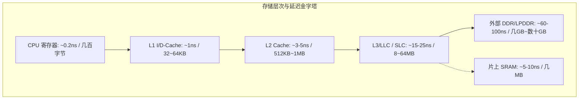
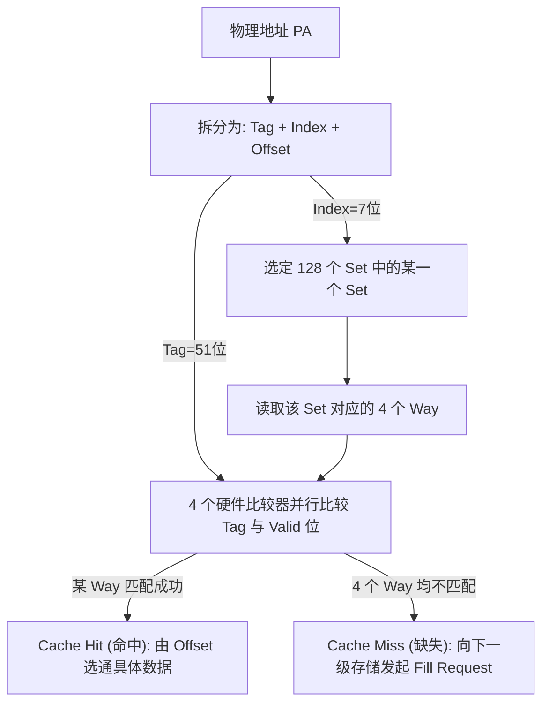

# Cache 组织、寻址机制与工程深度解析

## 1. 为什么需要内存层次：存储墙（Memory Wall）与局部性原理

现代 CPU 核心频率已突破数 GHz，单个时钟周期仅数百皮秒（ps），而外部动态内存（DDR SDRAM）的物理访问延迟高达 50~100 纳秒（相当于 200~400 个 CPU 周期）。



### 时间局部性与空间局部性
- **时间局部性（Temporal Locality）**：最近访问过的数据，极可能在短时间内再次被访问（如循环计数器、栈帧）。
- **空间局部性（Spatial Locality）**：如果某个地址被访问，其相邻的内存单元很快也会被访问（如数组顺序遍历、连续指令流）。
- **传输基本单位——Cache Line**：Cache 与内存之间的数据交换**不是按字节进行的**，而是以固定大小的 Cache Line（现代通用架构绝大多数固定为 **64 字节**）为最小粒度。

---

## 2. 寻址模型：Tag、Set Index 与 Line Offset 的硬件解算

当 CPU 发起一次内存访问请求时，地址被硬件逻辑切分为三段：

```text
63                                  k+m   k+m-1         m   m-1         0
+----------------------------------------+---------------+---------------+
|               Tag (标签)               |  Index (组索引)| Offset (行内偏移)|
+----------------------------------------+---------------+---------------+
```

### 数学关系与硬件寻址流程（以 32KB 4-way Set-Associative, 64B Line 为例）
- **Line Offset（$m$ 位）**：$\log_2(64) = 6$ 位（决定 64 字节内的具体偏移）。
- **总 Line 数**：$32\text{ KB} / 64\text{ B} = 512$ 条 Cacheline。
- **Set 总数**：每 Set 包含 4 条 Line（4-way），故共有 $512 / 4 = 128$ 个 Set。
- **Set Index（$k$ 位）**：$\log_2(128) = 7$ 位（用于从 SRAM Array 中选中具体的组）。
- **Tag 位数**：剩余高位（64 位架构下为 $64 - 7 - 6 = 51$ 位）。



---

## 3. VIPT、PIPT 与 VIVT：重名与别名硬件陷阱（Aliasing & Homonym）

根据 Cache 查询时使用的地址类型（虚拟地址 VA 还是物理地址 PA），Cache 架构分为三类：

| 架构类别 | Index 来源 | Tag 来源 | 优势 | 硬件缺陷与软件代价 |
| :--- | :--- | :--- | :--- | :--- |
| **VIVT (Virtually Indexed, Virtually Tagged)** | VA | VA | 速度极快，无需等 MMU 翻译 | **重名（Homonym）与别名（Aliasing）** 严重；进程切换必须完全 Flush Cache |
| **VIPT (Virtually Indexed, Physically Tagged)** | VA | PA | **现代 L1 Cache 主流选择**；MMU TLB 翻译与 L1 Cache SRAM 索引**完全并行**，无额外延迟 | 当 Cache 容量过大时可能产生别名；需要架构约束 |
| **PIPT (Physically Indexed, Physically Tagged)** | PA | PA | **绝对无别名问题**，常用于 L2、L3/LLC | 必须等待 MMU 完成 VA $\to$ PA 转换后才能开始查 Cache，延迟较高 |

### VIPT 别名问题（Aliasing）产生的数学条件与规避
- 在 4KB 页大小（Page Offset 占 12 位）的系统中，如果 $\text{Way Size} = \text{Cache 容量} / \text{相联度} \le 4\text{KB}$，则 Index 所需的位全部落在 12 位 Page Offset 之内（虚拟地址和物理地址在低 12 位完全一致），此时 **VIPT 等价于 PIPT，天然杜绝别名！**
- 若 Way Size 超过 4KB，操作系统必须强制实行 **Page Coloring（页着色）** 算法，确保共享同一物理页的多个虚拟映射其虚拟地址的颜色位相同。

---

## 4. 常见关键陷阱与风险、性能断崖与排查手册

### 陷阱 1：2 的幂次方跨步遍历引发的 Cache 组冲突严重问题（Conflict Thrashing）
- **现象**：矩阵乘法或 2D 图像处理中，按列遍历大图像的耗时比按行遍历慢 **10~30 倍**，且 CPU 利用率 100%。
- **微架构根因**：
  - 假设图像每行宽度为 4096 字节（刚好是 64 字节 Cacheline 的整数倍，也是 Cache Set 容量的倍数）。
  - 当代码按列访问 `img[row][0]` 时，由于地址跨步刚好等于 Set 的倍数，不同行的同一列元素其 **Index 完全相同**！
  - 无论 Cache 容量有多大（即使是 16MB L3），所有数据全被映射到同一个 Set 中。4-way 或 8-way Cache 在几次访问后立即饱和，每次读取都相互挤出对方，产生 **100% Conflict Miss**！
- **规避与优化法则**：
  - **二维数组填充（Padding）**：在行末尾填充少量无用字节（例如每行分配 4096 + 64 字节），打破 Index 强相关。
  - **分块算法（Tiling / Blocking）**：将大矩阵切分为 $32 \times 32$ 或 $64 \times 64$ 的小块，确保子块工作集完整驻留 L1 Cache。

### 陷阱 2：自修改代码（JIT / Dynamic Loader）的 I/D Cache 不一致死锁
- **现象**：JIT 编译器（如 Java/V8/WebAssembly）或动态加载器将新生成的机器码写入内存并跳转执行，CPU 发生非法指令异常（Undefined Instruction）或执行了过期的旧代码。
- **根因**：
  - CPU 内部 **L1 I-Cache（指令缓存）与 L1 D-Cache（数据缓存）是完全分离的（Harvard Architecture）**。
  - JIT 写入代码是作为“数据”写入了 D-Cache（此时 DDR 中可能还是旧指令）；而 CPU 取指只从 I-Cache 取。I-Cache 根本不知道 D-Cache 发生了变化！
- **标准规避代码（ARM64 规范同步序列）**：
```c
void flush_icache_range(uintptr_t start, uintptr_t end)
{
    uintptr_t addr;
    /* 1. 将数据缓存行刷回至 PoU (Point of Unification) */
    for (addr = start & ~(64UL - 1); addr < end; addr += 64)
        asm volatile("dc cvau, %0" : : "r"(addr) : "memory");
    asm volatile("dsb ish" : : : "memory"); /* 等待数据写回完成 */

    /* 2. 使指令缓存行失效 */
    for (addr = start & ~(64UL - 1); addr < end; addr += 64)
        asm volatile("ic ivau, %0" : : "r"(addr) : "memory");
    asm volatile("dsb ish" : : : "memory"); /* 等待失效完成 */

    /* 3. 同步屏障：清空流水线前端已预取的旧指令 */
    asm volatile("isb" : : : "memory");
}
```
