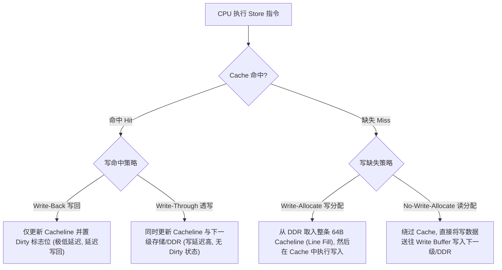
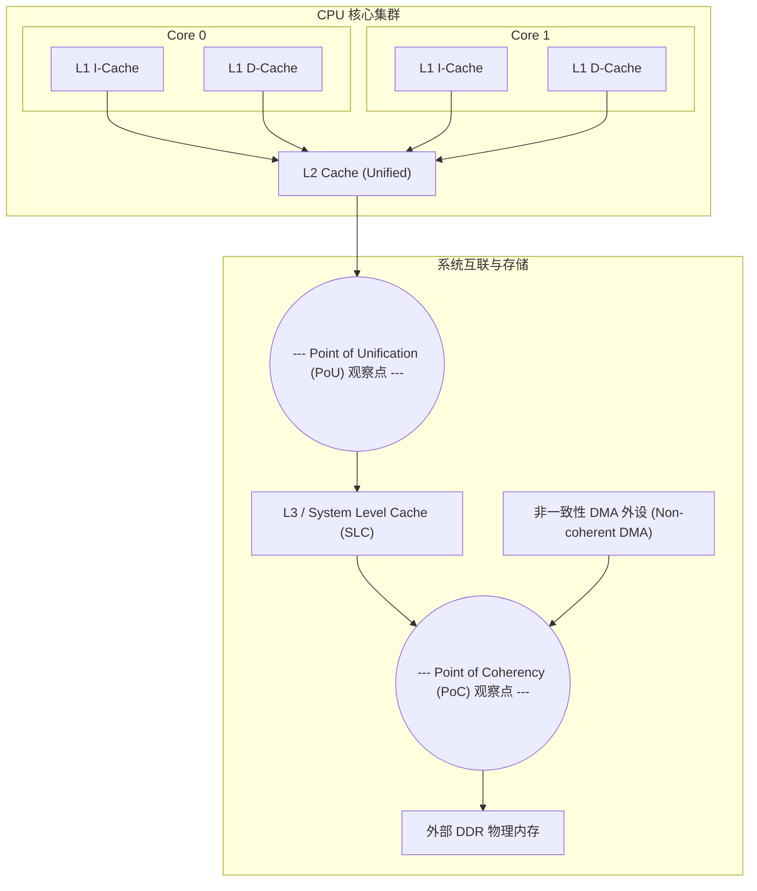

# 写策略、一致性与 Cache 维护机制深度解析

## 1. 四大写策略与微架构数据流

当 CPU 执行一条 Store 指令时，依据 Cache 命中状态与内存属性，硬件存在四种经典写策略组合：



### 四种写策略对比与应用场景
| 写命中/写缺失组合 | 典型应用场景 | 优势 | 硬件代价与劣势 |
| :--- | :--- | :--- | :--- |
| **Write-Back + Write-Allocate (WB/WA)** | **现代通用操作系统常规内存默认策略**（Normal Memory） | 极大降低 DDR 写带宽消耗；多次连续写入同一行仅消耗 L1 周期 | 逐出（Eviction）时产生脏行写回延迟；多核间需要复杂的一致性协议（MESI） |
| **Write-Through + No-Write-Allocate (WT/NWA)** | 关键帧缓冲、简单 MCU 片上缓存、安全关键只读系统 | Cache 与 DDR 物理内容始终保持一致；掉电或软复位时数据不易丢失 | 每次写操作都必须占用外部总线，严重受制于内存写延迟 |
| **Write-Combining (WC)** | 显卡显存（VRAM）、PCIe 映射区域 | 将多个离散字节写入在 **Write-Combining Buffer** 中拼装为完整 64B Burst 突发，大幅减少 PCIe 事务头开销 | 属于弱序非缓存内存（Normal Non-cacheable），不支持常规 Cache 命中 |

---

## 2. Point of Coherency (PoC) 与 Point of Unification (PoU)

在包含 CPU Core、GPU、非一致性 DMA 外设与 JIT 引擎的现代 SoC 中，内存层次划分了不同的“一致性观察点”：



### 关键观察点定义与维护责任
1. **Point of Unification (PoU)**：
   - **定义**：同一个 CPU 核心的 **I-Cache（指令缓存）**、**D-Cache（数据缓存）** 与 **MMU Table Walker（页表走表器）** 能够观察到同一份内存最新内容的物理点（通常是该 Core 的私有 L2 Cache 或 Cluster 共享 L2）。
   - **适用场景**：**JIT 编译器、动态链接器（`dlopen`）、自修改代码**。当通过 D-Cache 写入新代码后，只需将数据 Clean 到 **PoU**，并使 I-Cache 失效，即可安全执行。
2. **Point of Coherency (PoC)**：
   - **定义**：系统中**所有可能访问内存的参与者**（包括所有 CPU 核、DSP、GPU 以及不带硬件一致性桥的非一致性 DMA 外设）能够看到完全一致内存内容的物理点（通常是主内存 DDR 或系统级 SLC 之后）。
   - **适用场景**：**非一致性 DMA 驱动开发**。CPU 准备发送给网卡的数据，必须显式 Clean 到 **PoC**，确保 DMA 从 DDR 读取到的是最新数据。

---

## 3. Cache 维护指令：Clean、Invalidate 与 Flush

不同体系结构对缓存操作的定义非常严密，**严禁混淆 Clean 与 Invalidate**：

| 操作名称 | 硬件底层动作 | 对 Dirty 行的影响 | 典型应用场景 |
| :--- | :--- | :--- | :--- |
| **Clean (清理/写回)** | 若 Cacheline 为 Dirty，将其数据写回下一级存储；将该行标记为 Clean（状态变为 Shared/Exclusive），**保留副本** | 脏数据被安全持久化 | CPU 准备将数据通过 DMA 发送给外设（`DMA_TO_DEVICE`） |
| **Invalidate (失效/作废)** | 直接将 Cacheline 的 Valid 标志位置 0，**丢弃缓存副本** | **关键警告**：若该行为 Dirty，脏数据将被**无条件丢弃**！ | 外设 DMA 接收完毕后，CPU 读取数据前（`DMA_FROM_DEVICE`） |
| **Clean & Invalidate** | 先将 Dirty 数据写回下一级存储，随后将该 Cacheline 置为无效 | 脏数据写回后再作废 | 内存区域重新分配、CPU 核心下电休眠前清空私有缓存 |

### ARMv8/v9 与 RISC-V 维护指令对照表
```asm
/* ARMv8-A AArch64 缓存维护指令 (按虚拟地址 VA 逐行操作) */
dc cvac,  x0    /* Clean 数据缓存到 PoC (用于 DMA 发送) */
dc cvau,  x0    /* Clean 数据缓存到 PoU (用于 JIT 代码生成) */
dc ivac,  x0    /* Invalidate 数据缓存到 PoC (用于 DMA 接收前清空) */
dc civac, x0    /* Clean and Invalidate 数据缓存到 PoC (安全清理) */
dc zva,   x0    /* 将整个 Cacheline 快速填零 (无需从 DDR 读取，性能极高) */

/* RISC-V (Zicbom 扩展 / CBO 架构指令) */
cbo.clean (a0)  /* Clean 数据缓存到一致点 */
cbo.inval (a0)  /* Invalidate 数据缓存 */
cbo.flush (a0)  /* Clean + Invalidate */
cbo.zero  (a0)  /* 整个 Cacheline 快速填零 */
```

---

## 4. 常见关键陷阱与风险、踩内存事故与排查手册

### 陷阱 1：对 Dirty Cacheline 误执行 Invalidate 导致的静默数据丢失与滥用 CIVAC 风险
- **现象**：系统在高并发写文件或处理网络数据时，偶发性发生数据内容静默损坏（Silent Data Corruption），但没有触发任何 MMU Fault。
- **微架构根因**：
  - 软件试图通过 `DC IVAC` 使某段缓冲区失效；但在该缓冲区中，CPU 之前写入的数据由于 Write-Back 策略仍停留在 Cache 中（处于 Modified 状态）；`DC IVAC` 强制将 Valid 位置 0，硬件直接丢弃了修改过的脏字节，导致这些数据永远没有机会写回 DDR。
  - **反向风险警示（`DC CIVAC` 并非通用安全兜底）**：若设备已经通过 DMA 将新数据写入内存（`DMA_FROM_DEVICE`），而此时 CPU Cache 中尚存有旧的脏行，如果盲目执行 Clean + Invalidate（`DC CIVAC`），CPU 会把陈旧脏数据重新写回内存，**覆盖破坏设备刚写入的新数据**！
- **基于 DMA 方向与所有权迁移的规范准则**：
  - **CPU $\to$ Device (`DMA_TO_DEVICE`)**：在提交给设备前，必须执行 **Clean**（如 `DC CVAC`），确保 CPU 写入的内容对设备可见；
  - **Device $\to$ CPU (`DMA_FROM_DEVICE`)**：在 CPU 读取设备新数据前，必须执行 **Invalidate**（如 `DC IVAC`），丢弃可能陈旧的 Cache 内容；
  - **双向交互 (`DMA_BIDIRECTIONAL`)**：严格由标准 DMA API 按平台规则分阶段处理，**绝不能用“更强的 Cache 指令（如盲目使用 CIVAC）”替代规范的所有权移交协议**。

### 陷阱 2：`DC ZVA` 块大小误判与整块清零越界破坏邻接对象
- **现象**：使用 `DC ZVA` 优化内存清零（如底层 `memset` 汇编实现）时，目标缓冲区两端邻接的局部变量或结构体字段被意外清零篡改，造成隐蔽的数据损坏。
- **微架构根因与架构规则**：
  - **整块清零语义**：ARM 架构规范规定，`DC ZVA, <Xt>` 并不要求传入的虚拟地址在指令级对齐到整个 ZVA 块（不会因为传入非对齐地址而直接触发 Alignment Fault），但**硬件必定清零包含该指定地址的、自然对齐的整个 ZVA 块**（Block Size 由 `DCZID_EL0.BS` 决定，通常为 64B 或 128B）。
  - **越界清零风险**：若目标缓冲区起始地址未对齐到 ZVA 块边界，或者总长度不是 ZVA 块的整数倍，直接执行 `DC ZVA` 会将起始地址所在块的前半部分、或结束地址所在块的后半部分邻接数据全部清零破坏！
  - **权限与属性约束**：在配置为 Device 属性的内存上执行 `DC ZVA` 会触发 Alignment Fault；`DCZID_EL0.DZP` 反映当前 EL0 环境是否允许使用 `DC ZVA`。具体执行权限由当前执行环境、`SCTLR_EL1.DZE`（控制 EL0 访问许可）以及更高异常级的 Trap 配置（如 `HCR_EL2.TDZ`、`SCR_EL3.TDZ`）共同决定，高特权级本身的执行权限不能简单套用 `SCTLR_ELx.DZE` 的一一对应关系。
- **规范实践**：软件标准库（如 Glibc）在利用 `DC ZVA` 优化 `memset` 时，首先使用普通标量 Store 指令逐字节/双字填零填充头部未对齐区域，使地址对齐至 ZVA Block 边界；中间大块连续区域循环调用 `DC ZVA` 批量清零；尾部不足一个 ZVA Block 的剩余字节再次回退为标量 Store 填零，防止整块清零越过目标对象边界。
