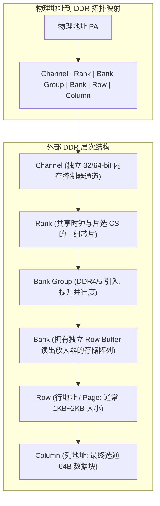
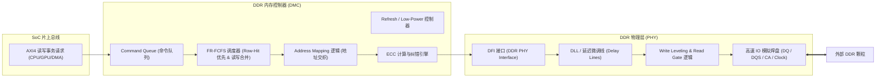

# SRAM、DRAM 与 DDR 内存子系统深度解析

## 1. 片上 SRAM 与紧耦合内存（TCM）

在 SoC 芯片内部，**SRAM（静态随机存取存储器）** 是构建 Cache、片上共享内存（On-chip SRAM）与紧耦合内存（TCM）的核心基础。

| 存储类别 | 硬件结构与连接位置 | 访问延迟 | 一致性与特征 | 典型应用场景 |
| :--- | :--- | :--- | :--- | :--- |
| **片上共享 SRAM** | 挂载在系统 NoC/AXI 总线上 | 5~10 ns（受总线仲裁影响） | 参与系统统一编址，可被 CPU 与 DMA 共同访问 | BootROM 引导缓冲、跨异构核共享通信（IPC）、低功耗保持区 |
| **TCM (ITCM / DTCM)** | 绕过总线，通过专用私有端口直接连接 CPU 核 | **1 个周期绝对确定延迟（Deterministic）** | 通常**不参与**多核 Cache 一致性协议，不支持推测乱序 | 实时控制核心（Cortex-R/M）、硬实时中断向量表（ISR）、电机控制环路 |

---

## 2. DRAM 物理本质与六级分层寻址架构

与 SRAM 依靠 6 个晶体管（6T）维持双稳态不同，**DRAM（动态 RAM）使用极微小的 1T1C（1 晶体管 1 电容）存储单元**。
- **电荷泄漏与刷新（Refresh）**：电容中的电荷会随时间自然流失（毫秒级），必须由内存控制器周期性执行 **Refresh 操作（$t_{REFI}$ 约 3.9$\mu$s ~ 7.8$\mu$s / $t_{RFC}$ 达 200~400ns）** 重新充电。
- **破坏性读取（Destructive Read）**：读取电容电荷会导致数据丢失，必须由 Sense Amplifier（读出放大器）将数据放电放大后重新写回（Precharge）。

### DDR 物理层次拓扑与寻址拆分

### 三种访存状态与延迟悬殊
1. **Row Hit（行命中 / Page Hit）**：目标 Row 已经处于被打开（Active）状态且驻留在 Sense Amplifier 中，直接发送 Read 命令与列地址即可取回数据（**最低延迟：$t_{CL} \approx 14\text{ns}$**）。
2. **Row Empty（行空闲）**：当前 Bank 无打开的行，先发 `ACTIVATE` 激活行，再发 `READ`（**中等延迟：$t_{RCD} + t_{CL} \approx 28\text{ns}$**）。
3. **Row Conflict（行冲突 / Page Conflict - 性能杀手）**：当前 Bank 已打开了另一行，必须先发 `PRECHARGE` 关闭旧行，再发 `ACTIVATE` 打开新行，最后发 `READ`（**最高延迟：$t_{RP} + t_{RCD} + t_{CL} \approx 45\text{ns} \sim 70\text{ns}$**）。

---

## 3. DDR 内存控制器（DMC）与 PHY 的分工与协作

### 控制器与 PHY 的核心职责分工
- **DMC 核心职责**：
  - **FR-FCFS（First-Ready First-Come-First-Served）动态调度**：将排队请求中能够命中已打开 Row 的命令优先发射，大幅提升 Bank 命中率。
  - **读写折返消除（Read-Write Turnaround Optimization）**：由于数据总线从写转读需要等待 $t_{WTR}$ 物理时延，DMC 会将多个写请求批量连续处理，再将多个读请求批量连续处理。
  - **地址交织（Interleaving）**：将连续物理地址分散映射到不同的 Bank 和 Channel，使连续突发访问能够最大化并发执行。
- **PHY 核心职责**：
  - **电气信号训练（Training）**：在系统启动时对数百条 PCB 走线进行 **Write Leveling（时钟飞线时延补偿）**、**Read DQS Gate 选通对齐**、**Vref 参考电压校准** 与 **数据眼图居中（Eye Centering）**。

---

## 4. 常见关键陷阱与风险、时钟抖动与排查手册

### 陷阱 1：Row Conflict 导致的带宽雪崩（Bandwidth Collapse）
- **现象**：理论 DDR 带宽高达 $25.6\text{ GB/s}$，但在多线程并发或大步长跨步随机读写时，实测有效带宽断崖式下跌至不到 $3\text{ GB/s}$。
- **微架构根因**：
  - 多个线程以特定步长（例如每个线程偏移 $64\text{ KB}$）同时访问同一 Bank 中的不同 Row。
  - 控制器被迫对该 Bank 频繁执行“Precharge $\to$ Activate $\to$ Read”循环，每个事务都遭受最大的行冲突惩罚，DDR 数据总线处于严重饥饿等待状态。
- **规避方案**：
  - 调整控制器地址映射方案，启用 **Bank Hash / XOR Interleaving**（对物理地址的高位和低位做异或运算后再选择 Bank），打碎线性对齐模式。

### 陷阱 2：$t_{RFC}$ 刷新停顿造成的音频爆音与长尾延迟（Tail Latency Spike）
- **现象**：高吞吐低延迟系统（如实时音视频、工业伺服控制）中，绝大多数访存延迟仅 30ns，但每隔几毫秒就会周期性出现一次高达 **300~500ns 的延迟尖刺**，导致实时音频硬件 FIFO 欠载（Underflow）爆音。
- **根因**：
  - 高密度 DDR4/DDR5 芯片内部包含数十亿电容，必须执行全 Rank 刷新（$t_{RFC}$ 随着芯片容量增大从 110ns 攀升至 350ns+）。
  - 在 $t_{RFC}$ 周期内，内存控制器必须对目标 Rank 冻结一切正常读写操作。
- **规避方案**：
  - 实时数据流必须绑定并运行在 **片上 SRAM / TCM** 中，绝对不能直接依赖外部大容量 DDR。
  - 开启内存控制器的 **Per-Bank Refresh（单 Bank 逐轮刷新）** 模式，替代全 Rank 集中刷新。

### 陷阱 3：未做 Memory Scrubbing 直接开启 ECC 导致随机崩溃
- **现象**：在 Bootloader 初始化 DDR 并使能 ECC 功能后，系统在首次读取某些未写过的内存区域时，立刻触发关键 SError（ARM）或 Machine Check Exception（x86/RISC-V）。
- **根因**：
  - 上电复位后，DRAM 存储阵列和校验位（Check Bits）处于未定义的随机电荷状态。
  - ECC 控制器读取该区域时，校验码计算必定不匹配，硬件直接判定为“多比特不可纠正严重错误（Uncorrectable Error）”。
- **规避规范**：在使能 ECC 检测中断之前，必须使用 DMA 或 CPU 硬件写循环对全部物理内存空间执行 **全量填零写（Memory Scrubbing）**，建立合法初始校验码。
