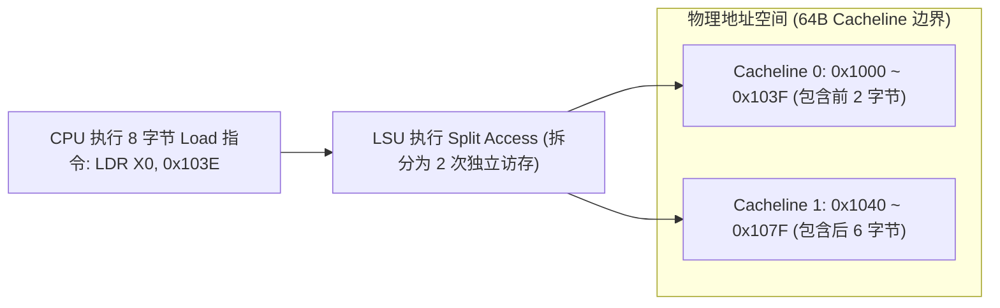

# Cache 性能建模、诊断工具与故障排查实战

## 1. 平均访存延迟（AMAT）数学模型与延迟放大效应

在现代多级存储层次中，处理器的 **平均内存访问时间（AMAT, Average Memory Access Time）** 计算公式如下：

$$\text{AMAT} = T_{L1} + \text{MR}_{L1} \times \left( T_{L2} + \text{MR}_{L2} \times \left( T_{L3} + \text{MR}_{L3} \times T_{DDR} \right) \right)$$

其中 $T$ 为各级访问延迟，$\text{MR}$ 为局部缺失率（Local Miss Rate）。

### 为什么 1% 的 LLC Miss 会导致系统性能断崖？
- 假设典型芯片参数：
  - $T_{L1} = 1\text{ ns}$ (约 4 周期), $\text{MR}_{L1} = 10\%$
  - $T_{L2} = 4\text{ ns}$ (约 15 周期), $\text{MR}_{L2} = 20\%$
  - $T_{L3} = 20\text{ ns}$ (约 70 周期), $\text{MR}_{L3} = 5\%$
  - $T_{DDR} = 80\text{ ns}$ (约 300 周期)
- 计算基准 AMAT：
  $$\text{AMAT} = 1 + 0.1 \times (4 + 0.2 \times (20 + 0.05 \times 80)) = 1 + 0.1 \times (4 + 0.2 \times 24) = 1 + 0.88 = 1.88\text{ ns}$$
- **缺失率轻微波动的放大效应**：若由于数据未对齐或频繁冲突导致 $\text{MR}_{L3}$ 上升至 $25\%$：
  $$\text{AMAT} = 1 + 0.1 \times (4 + 0.2 \times (20 + 0.25 \times 80)) = 1 + 0.1 \times (4 + 8) = 2.2\text{ ns}$$
- 若全局数据完全不具备局部性（随机指针追逐），每次都击穿至 DDR，则有效延迟将从 $1.88\text{ ns}$ 暴增至 $80\text{ ns}$，**性能暴跌超 40 倍！**

---

## 2. 非对齐跨行访存（Misaligned Split Access）的微架构惩罚

当结构体或数据未做内存对齐，跨越了 64 字节 Cacheline 边界时（例如一个 8 字节 `uint64_t` 变量存放在 `0x103E` 地址，跨越 `0x103E~0x1045`）：



### 跨行访存的四大微架构代价
1. **占用双倍硬件队列**：单条指令强行占用 Load/Store Queue 中的两个项，阻碍后续独立指令发射。
2. **双倍 Cache 冲突与 Miss 风险**：可能同时触发两个不同的 Cache Miss，或者其中一行命中另一行缺失。
3. **跨页异常与双重翻译开销**：若访问跨越 4KB 页边界，处理器可能需要分别完成两个页面的地址翻译、权限检查和 Cache/TLB 查询。若第二页无有效映射或权限不足，会在访问该页时产生相应的 Translation Fault、Permission Fault，并由操作系统进一步处理为 Page Fault。对于 Store，异常发生前是否存在部分可观察更新不能凭“指令被拆分”直接推断，必须依据具体指令和体系结构异常语义判断。
4. **原子访问的对齐约束**：ARM Exclusive 和原子读改写指令通常要求操作数满足访问宽度的自然对齐；违反该约束会触发 Alignment Fault。自然对齐且访问宽度不超过 Cacheline 的常规原子操作通常不会跨行。Exclusive Monitor 建立的是地址保留记录，并不会锁定一条或多条 Cacheline，因此不能把 Alignment Fault 归因于“监视器无法锁住两条 Cacheline”。

---

## 3. 硬件性能监控单元（PMU）与 Linux 调优工具链

### ARM64 关键 PMU 事件速查
| PMU 事件编号 | 事件名称 | 诊断含义与关注阈值 |
| :--- | :--- | :--- |
| `0x0004` | `L1D_CACHE_REFILL` | L1 数据缓存缺失并向 L2 发起填充的次数 |
| `0x0017` | `L2D_CACHE_REFILL` | L2 数据缓存缺失次数 |
| `0x002A` | `LLC_MISS_RD` | 末级缓存读缺失（直接产生 DDR 读流量） |
| `0x0019` | `BUS_ACCESS` | 总线事务总数（反映片上互联压力） |
| `0x0036` | `UNALIGNED_LDST_RETIRED` | 产生拆分惩罚的非对齐访存指令数（应尽量接近 0） |

### Linux 实战诊断命令组合
```bash
# 1. 测量全局 Cache 命中率与 IPC
perf stat -e cycles,instructions,L1-dcache-loads,L1-dcache-load-misses,LLC-loads,LLC-load-misses ./my_app

# 2. 定位产生 LLC Miss 的精准代码行（内存采样）
perf mem record -a -- sleep 10
perf mem report --stdio

# 3. 捕获多核 Cache 一致性伪共享与跨核数据反弹（HITM）
perf c2c record -F 60000 -- ./multi_thread_app
perf c2c report --stdio
```

---

## 4. 常见关键故障案例与排查手册

### 案例 1：Write Allocate 引发的“读放大”吞吐陷阱
- **现象**：向 DDR 连续写入 1GB 数据（如视频帧编码保存），使用监控工具测量 DDR 物理带宽，发现写带宽为 $1\text{ GB/s}$，但**同时凭空产生了 $1\text{ GB/s}$ 的读带宽**，总线带宽被占满。
- **微架构根因**：
  - 内存属性配置为标准的 `Write-Back + Write-Allocate`。
  - CPU 首次写入这些内存时发生 Write Miss，硬件根据 Write-Allocate 规则，**先从 DDR 将旧数据整行读入 L1 Cache（Line Fill: 产生 1GB 读流量）**，然后覆盖修改，最后再写回 DDR（产生 1GB 写流量）。
- **规避方案**：
  - 对于大规模一次性流式数据写入，可评估使用 **Non-temporal Store 提示（如 ARM64 `STNP` / x86 `MOVNT*`）** 或配置 Write-Combining / Non-Cacheable 内存属性。需要注意：**`STNP` 提供非临时访问提示（Non-temporal Hint），实际是否分配 Cache Line、是否降低 Line Fill，取决于具体微架构实现、内存属性和缓存控制策略，不能把它当作绝对有保证的 Cache bypass 指令**。

### 案例 2：DDR 高温时随机比特翻转（Single-bit Flips）
- **现象**：系统在常温拷机 24 小时正常，放入 $70^\circ\text{C}$ 高温箱后每隔几小时随机出现一次单比特 ECC 告警或内核 Oops。
- **排查与根因链**：
  1. 读取 ECC Syndrome 寄存器，反解出发生翻转的物理地址（PA）。
  2. 观察翻转是固定在某个 Byte Lane（指向 PCB 某根走线阻抗不匹配或焊点虚焊），还是随机分布在整个物理地址空间。
  3. **高温物理根因**：DRAM 单元电容在高温下的漏电速率成倍加快，原先在常温下合法的 $t_{REFI} = 7.8\mu\text{s}$ 刷新周期在高温下已无法维持电荷，导致电容电压跌落被误判为 0。
- **规避对策**：在温度传感器检测到芯片结温（Junction Temperature）超过 $85^\circ\text{C}$ 时，触发热管理中断，动态将 DDR 刷新率切换为 **2x Refresh（刷新周期缩短为 $3.9\mu\text{s}$）** 并提升 Vref 参考电压。
