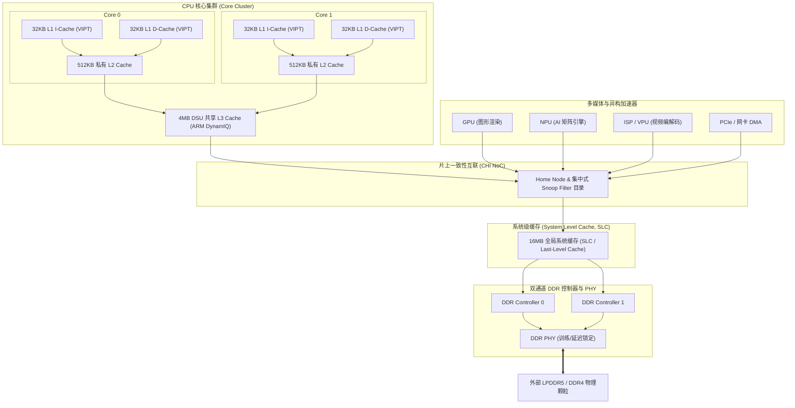

# 存储子系统端到端链路推演与工程分析

## 1. 现代高性能 SoC 完整内存层次链路全景

在包含多核 CPU、GPU、NPU、ISP 与高速 DMA 外设的高性能 SoC 中，一次内存读写在芯片内部穿过的完整硬件层次如下：



---

## 2. 系统级缓存（SLC）的核心价值与 Cache Partitioning

### 为什么高端 SoC 普遍引入 8MB~32MB 的 SLC？
1. **能效与功耗杀手锏**：访问外部 DDR 每次 64B 传输需要驱动 PCB 走线电容，功耗约为 $15\sim 25\text{ pJ/bit}$；而访问片上 SLC 功耗仅为 $1\sim 2\text{ pJ/bit}$（**功耗降低超 90%**）。
2. **多媒体与 GPU 带宽卸载**：4K/8K 摄像头数据由 ISP 写入 SLC，GPU 直接从 SLC 读取做后处理渲染，最后由 Display 控制器直接从 SLC 刷屏输出，**整个过程完全不经过外部 DDR**，释放极宝贵的外部物理总线带宽。

### 关键陷阱与风险：异构流量冲刷导致 CPU 性能骤降与 Cache 隔离（QoS Partitioning）
- **故障现象**：当 GPU 开启 3D 渲染或 NPU 进行大模型推理时，CPU 上的关键控制线程延迟增加 300%，出现严重卡顿。
- **微架构根因**：GPU/NPU 的流式大张量数据瞬间占满全部 SLC/L3 Cache，将 CPU 核心的热点指令与栈数据完全逐出（Eviction）。
- **硬件解决方案——MPAM / Cache Way Partitioning**：
  - ARM 引入 **MPAM（Memory System Resource Partitioning and Monitoring）** 架构。
  - 硬件将 16-way SLC 划分为不同分区：Way 0~7 绑定给 CPU Core 专用；Way 8~13 分配给 GPU；Way 14~15 留给实时 ISP。各主设备只能逐出自身分区内的 Cacheline，实现硬件级强隔离。

---

## 3. 地址交织（Address Interleaving）数学解算与负载均衡

为了让连续的物理地址访问能均匀分摊到不同的物理 Channel 和 Bank 中，内存控制器采用交织算法：

### 经典双通道 64 字节低位交织模型
```text
物理地址 PA 划分：
[最高位 .................... 7] [Bit 6: Channel 选通位] [Bit 5~0: 64B Cacheline 偏移]
```
- 当 CPU 顺序读取 `0x0000` 时，Bit 6 为 0，命中 Channel 0。
- 当 CPU 读取下一行 `0x0040` 时，Bit 6 为 1，命中 Channel 1。
- 当 CPU 读取下一行 `0x0080` 时，Bit 6 为 0，再次命中 Channel 0。
- **收益**：连续大块 `memcpy` 或 DMA 搬运以 128 字节为周期交替并行打在两个完全独立的物理 DDR 控制器上，**瞬间跑满 2 倍物理总线理论带宽**！

---

## 4. 生产级排查案例：跨 NUMA 内存访问与一致性总线拥塞

- **故障场景**：在多 Cluster / 多 Die（Chiplet）大型服务器 SoC 上，原本耗时 10ms 的数据处理任务在启用多线程后反而上升至 35ms。
- **排查与诊断流程**：
  1. 使用 `perf c2c` 抓取跨核访问，发现大量 **Remote LLC HITM（命中远端 Die 的 Modified 缓存行）** 事件。
  2. **根因**：线程 0 运行在 Die 0 上分配了内存并在私有 L2 写入修改；线程 1 运行在 Die 1 上频繁读取该变量。每次读取都必须跨越 Die-to-Die 互联发起 Snoop，并等待远端 Die 将数据通过芯片间总线搬运过来（跨 Die 延迟达 120ns+），严重阻塞了芯片间总线带宽。
- **架构级解决方案**：
  - 应用层使用 `numactl --cpunodebind=0 --membind=0` 将线程与物理内存强制绑定在同一 Die 内；
  - 共享数据改用 Per-CPU 副本，在本地处理完成后最终执行归约（Reduction）合并。
