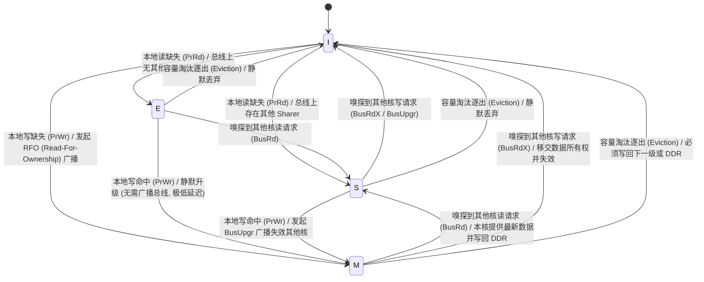
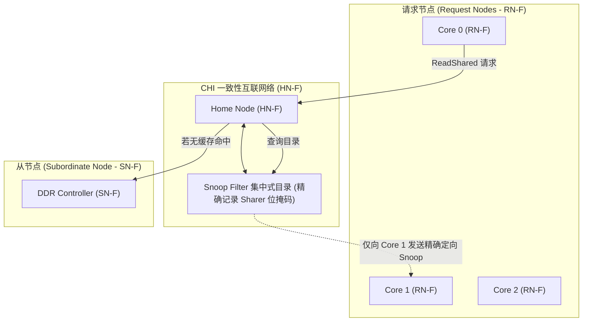

# MESI、MOESI 与一致性总线协议深度解析

## 1. 一致性的数学本质：单写者多读者（SWMR）不变量

Cache Coherency（缓存一致性）解决的核心问题是：**当多个处理器核心持有同一物理地址在各自 L1/L2 Cache 中的私有副本时，如何保证所有观察者看到的数据视图是合法、一致且确定的。**

现代硬件一致性协议建立在两条核心数学不变量之上：
1. **单写者多读者不变量（Single-Writer, Multiple-Readers, SWMR）**：对于任意物理地址，在任意给定时间点，要么**最多只有一个核心**拥有写权限（并持有唯一有效副本），要么**有任意多个核心**拥有只读共享权限。
2. **数据传播性（Data Value Invariant）**：某次写操作提交后，后续对该地址的任何读操作，必须能够获取到该最新值（或更晚的写入值）。

---

## 2. MESI 四状态迁移矩阵与微架构动作

MESI 协议为每个 Cacheline 分配 2 个状态位（State Bits），维护 4 种稳定状态：

### MESI 状态转移全要素对照表
| 当前状态 | 本地读 (PrRd) | 本地写 (PrWr) | 嗅探到读 (BusRd) | 嗅探到写/独占 (BusRdX) | 嗅探到升级 (BusUpgr) | 淘汰逐出 (Evict) |
| :--- | :--- | :--- | :--- | :--- | :--- | :--- |
| **Invalid (I)** | 缺失 $\to$ 发 BusRd；若有 Sharer $\to$ **S**，若无 $\to$ **E** | 缺失 $\to$ 发 BusRdX (RFO) $\to$ **M** | 忽略 (无动作) | 忽略 (无动作) | 忽略 (无动作) | 无动作 |
| **Shared (S)** | 命中 $\to$ 保持 **S** | 命中 $\to$ 发 BusUpgr 广播 $\to$ **M** | 保持 **S** | 被动失效 $\to$ **I** | 被动失效 $\to$ **I** | 静默丢弃 $\to$ **I** |
| **Exclusive (E)** | 命中 $\to$ 保持 **E** | 命中 $\to$ **静默升级为 M** (零总线开销) | 响应数据 $\to$ 转为 **S** | 被动失效 $\to$ **I** | 不可能发生 | 静默丢弃 $\to$ **I** |
| **Modified (M)** | 命中 $\to$ 保持 **M** | 命中 $\to$ 保持 **M** | 本核供数并写回 $\to$ **S** | 本核供数并失效 $\to$ **I** | 不可能发生 | **写回内存** $\to$ **I** |

---

## 3. MOESI 的核心进化：Owned 状态与 Cache-to-Cache 直传

在标准 MESI 协议中，当 Core 0 持有处于 **Modified（脏）** 状态的 Cacheline 时，若 Core 1 发起读请求：
- Core 0 必须先将脏数据写回外部 DDR，然后 Core 1 再从 DDR 读取，**带来两次高延迟的外部总线访问**。

**MOESI 协议引入了 Owned（O 状态）**：
- Core 0 将状态从 M 转为 **O（Owned）**，并通过片上互联**直接将数据转发（Cache-to-Cache Transfer）给 Core 1**（Core 1 进入 S 状态）。
- 此时 DDR 中的数据仍是旧的，**由 Owner（Core 0）全权负责该 Cacheline 未来的写回责任**。
- **收益**：避免了慢速 DDR 写回，跨核读取延迟由 80ns 骤降至 10~15ns！

---

## 4. 现代多核 SoC 的一致性扩展：ARM CHI 与 Snoop Filter

当核心数量从 4 核增长至 16、64 乃至 128 核时，全广播嗅探（Broadcast Snooping）会导致总线流量呈 $O(N^2)$ 爆炸式激增。

### ARM CHI（Coherent Hub Interface）四大物理通道
1. **REQ（Request Channel）**：RN 向 HN 发起读写、独占（ReadUnique）、升级（MakeUnique）请求。
2. **SNP（Snoop Channel）**：HN 根据 Snoop Filter 目录，仅向持有该 Cacheline 副本的 RN 发送精确嗅探探针。
3. **DAT（Data Channel）**：传输 64B 数据载荷（支持 Direct Data Transfer，直接从从设备或 Owner 转发至请求方）。
4. **RSP（Response Channel）**：传输完成确认（Comp）、写响应（RespSepData）等握手信号。

---

## 5. 常见关键工程陷阱与排查手册

### 陷阱 1：Snoop Filter 目录容量溢出引发的反向失效风暴（Back-Invalidation Storm）
- **现象**：当芯片运行超大工作集的多线程任务时，CPU 的 L2 Cache 命中率毫无征兆地暴跌，系统 IPC 下降 50%。
- **微架构根因**：
  - 片上一致性互联中的 Snoop Filter（目录）容量是有限的（通常为所有核 L2 容量之和的 1.5~2 倍）。
  - 当所有核访问的活跃地址总和超出 Snoop Filter 容量时，Snoop Filter 必须淘汰一条目录项。
  - 为了维持 SWMR 不变量，Snoop Filter 被迫向持有该条目的核心广播 **Back-Invalidation（反向强制失效）** 命令，强行将 CPU 本地原本命中的 L2 Cacheline 作废！
- **规避与诊断**：通过 NoC PMU 监控 `SF_EVICTION` 与 `BACK_INVAL_SENT` 事件；在软件层面优化线程绑核与工作集内存分配，减少跨核稀疏分散访问。

### 陷阱 2：跨核竞争导致的 Cacheline 乒乓颠簸（Cacheline Bouncing）
- **现象**：多个线程频繁对同一个全局变量执行原子操作（如原子累加或自旋锁争用），CPU 利用率 100% 但吞吐极低。
- **微架构根因**：
  - Core 0 执行写操作，向总线发 RFO，将 Core 1~3 的缓存行失效，Core 0 进入 M 状态。
  - 下一周期 Core 1 执行写操作，再次发 RFO，强行抢夺所有权并将 Core 0 失效。
  - 该 Cacheline 在多核私有 L1/L2 之间以纳秒级频率反复横跳（Bouncing），CHI 一致性总线被 RFO 和 Snoop 广播彻底占满。
- **规避方案**：采用 Per-CPU 变量分布技术，消除跨核全局热点变量竞争。
