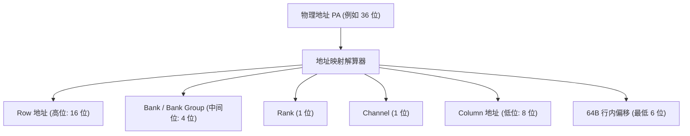

# DDR 时序参数、调度算法与交织深度解析

## 1. JEDEC DDR 核心时序参数与物理波形时序

DDR SDRAM 的每一次物理访存都必须遵循 JEDEC 规范严格定义的时钟周期约束。

```mermaid
sequenceDiagram
    participant MC as 内存控制器 (DMC)
    participant CMD as 命令总线 (CA Bus)
    participant DQ as 数据总线 (DQ/DQS)

    Note over MC,DQ: 1. 激活行 (Row Empty 或 Conflict 后)
    MC->>CMD: PRECHARGE (关闭旧行, 等待 tRP)
    MC->>CMD: ACTIVATE (打开新行, 等待 tRCD)

    Note over MC,DQ: 2. 读取列数据
    MC->>CMD: READ (发送列地址, 等待 tCL / CAS Latency)
    CMD-->>DQ: 数据在 DQS 选通下连续传输 (Burst of 8 / 16)

    Note over MC,DQ: 3. 行周期维持与写转读
    Note over MC,DQ: 维持打开状态满足 tRAS; 两次 ACT 间隔满足 tRC
```

### JEDEC 十大关键时序参数速查与微架构含义
| 时序参数 | 全称与物理含义 | 典型值 (DDR4-3200) | 违例后果与影响 |
| :--- | :--- | :--- | :--- |
| **$t_{CL}$ (CAS Latency)** | 发送 `READ` 命令到数据总线输出第一拍数据的时钟周期数 | 22 周期 ($\approx 13.75\text{ns}$) | 直接决定 Row Hit 状态下的纯读取延迟 |
| **$t_{RCD}$ (RAS to CAS Delay)** | 发送 `ACTIVATE` 激活行到允许发送 `READ/WRITE` 列命令的最小间隔 | 22 周期 ($\approx 13.75\text{ns}$) | 决定 Sense Amplifier 读出电荷并建立电压所需时间 |
| **$t_{RP}$ (Row Precharge)** | 发送 `PRECHARGE` 关闭行到允许发送下一个 `ACTIVATE` 的最小间隔 | 22 周期 ($\approx 13.75\text{ns}$) | 决定将位线（Bitlines）重新预充电恢复至 $V_{DD}/2$ 的时间 |
| **$t_{RAS}$ (Row Active Time)** | 激活行后，该行必须保持打开状态的最短时间 | 42 周期 ($\approx 26.25\text{ns}$) | 过早 Precharge 会导致读出放大器尚未将数据完全写回电容而丢失数据 |
| **$t_{RC}$ (Row Cycle Time)** | 同一 Bank 内两次连续 `ACTIVATE` 的最小间隔 ($t_{RC} = t_{RAS} + t_{RP}$) | 64 周期 ($\approx 40\text{ns}$) | 决定同一个 Bank 的极限访存频率上限 |
| **$t_{FAW}$ (Four Activate Window)** | 在任意滑动时间窗口内，允许在同一 Rank 发起 `ACTIVATE` 的最大次数（最多 4 次） | 34 周期 ($\approx 21.25\text{ns}$) | **芯片供电瞬态保护**：限制同时给 4 个 Bank 读出放大器供电的峰值瞬态电流（di/dt） |
| **$t_{WTR}$ (Write to Read Delay)** | 写数据结束到允许发送 `READ` 列命令的物理死区间隔 | 12 周期 ($\approx 7.5\text{ns}$) | 读写总线电气转向（Bus Turnaround）延迟 |
| **$t_{RFC}$ (Refresh Cycle Time)** | 发送 `REFRESH` 命令到 Rank 恢复可用状态的恢复时间 | 350 周期 ($\approx 350\text{ns}$) | 刷新期间整个 Rank 处于冻结状态，造成显著尾延迟 |

---

## 2. 内存控制器行策略与 FR-FCFS 调度算法

### Open-Page vs Close-Page 策略对比
- **Open-Page（开页策略）**：数据读写完毕后，**保持当前 Row 处于 Active 状态**。
  - *优点*：若后续请求命中同一 Row（Row Hit），延迟极低（仅需 $t_{CL}$）。
  - *缺点*：若下一次访问发生 Row Conflict，必须先承受 $t_{RP}$ 预充电惩罚。
  - *适用场景*：具有高局部性的通用桌面、移动终端与服务器 CPU 工作负载。
- **Close-Page（关页策略）**：每次读写完毕后立即附带 Auto-Precharge 将行关闭。
  - *适用场景*：多 Master 高度随机散布访问（如 GPU/网络路由交换机）。

### FR-FCFS 动态调度与防饿死（Aging）
现代 DDR 控制器维护深层命令队列，采用 **FR-FCFS（First-Ready First-Come-First-Served）** 调度算法：
1. **优先级 1（Row-Hit First）**：能够直接命中当前已打开行的命令优先发射（消除 $t_{RP} + t_{RCD}$ 延迟）。
2. **优先级 2（Oldest First）**：当无行命中时，按照 FIFO 请求先后顺序发射。
3. **防饿死老化计数器（Anti-Starvation Aging Counter）**：若某个 Row Conflict 请求被连续抢占超过 $N$ 个周期，强制提升其优先级，打断连续 Row-Hit 流。

---

## 3. 物理地址交织（Address Interleaving）与 XOR Hash

为了最大化利用 Bank-Level Parallelism（BLP，多 Bank 并行处理），物理地址被按位切分并映射到不同的物理维度：



### 为什么必须引入 XOR Bank Hashing？
- **传统线性映射缺陷**：若某程序以固定步长（如每步 $64\text{ KB}$）循环读取数据，地址的中间 Bank 位可能恒为 `0000`，导致所有请求全部砸向同一个物理 Bank，造成 100% 行冲突。
- **XOR Hash 解冲突**：将物理地址的高位 Row 地址与低位 Bank 地址进行**异或（$\text{Bank}_{\text{final}} = \text{PA}[15:12] \oplus \text{PA}[19:16]$）**。这样即使低位地址相同，高位地址的变化也会将请求均匀散列到不同的 Bank 中，有效打散连续对齐访问引发的 Bank 冲突瓶颈。

---

## 4. 常见关键时序陷阱与排查手册

### 陷阱 1：DVFS 动态变频时时序换算少算 1 个周期（Ceil 向上取整 Bug）
- **现象**：系统从高频（DDR-3200）降频到低频（DDR-1600）以节省功耗时，随机发生数据校验错误或死机。
- **微架构根因**：
  - 规范要求 $t_{RCD} = 13.75\text{ ns}$。在 1600 MT/s（时钟周期 $1.25\text{ ns}$）下：
    $$\text{Cycles} = \lceil 13.75 / 1.25 \rceil = 11\text{ 周期}$$
  - 驱动代码若使用整数除法截断（Floor）而非向上取整（Ceil），计算出 $13.75 / 1.25 = 10$，导致控制器实际只等待了 10 个周期（$12.5\text{ ns} < 13.75\text{ ns}$），在读出放大器尚未完全建立电压时就提前读取，引发电平误判！
- **规避准则**：在 BSP 时序配置宏中使用标准安全公式：`#define NS_TO_CYCLES(ns, tCK) (((ns) * 1000 + (tCK) - 1) / (tCK))`。

### 陷阱 2：频繁读写折返（Turnaround Thrashing）吃空总线
- **现象**：代码中交替执行 `*addr_a = val; dummy = *addr_b;`（写一次立即读一次），总线吞吐下降 80%。
- **根因**：每次写转读都必须强制插入 $t_{WTR}$ 物理气泡周期。
- **优化**：在软件上将写操作批量聚合，读操作批量聚合，由控制器批量连续发射。
