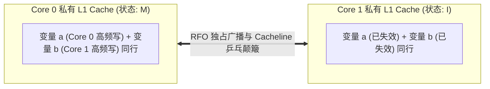

# 伪共享（False Sharing）机理、全功能基准测试与规避

## 1. 伪共享的微架构本质与 RFO 风暴

在多核对称多处理（SMP）系统中，缓存一致性协议（MESI/MOESI）以 **64 字节 Cacheline 为最小追踪与失效单位**。



### 伪共享产生过程
1. 开发者在代码中定义了两个完全独立、互不相干的变量 `a` 和 `b`。
2. 编译器将它们紧挨着分配在同一个 64 字节 Cacheline 中。
3. Core 0 上的线程 0 修改 `a`，硬件必须向总线广播 **RFO（Read-For-Ownership）**，将 Core 1 上的整条 Cacheline 强制置为 **Invalid（I 状态）**。
4. 下一时刻 Core 1 上的线程 1 修改 `b`，发生 Cache Miss，同样向总线广播 RFO，强行将 Core 0 的 Cacheline 置为 Invalid。
5. **严重后果**：原本旨在多核并行加速的程序，由于 Cacheline 在两个核心之间以纳秒级频率反复“乒乓反弹（Bouncing）”，**多核性能甚至远低于单核串行执行！**

---

## 2. 完整可编译的基准测试源码（`false_sharing_bench.c`）

```c
#define _GNU_SOURCE
#include <pthread.h>
#include <sched.h>
#include <stdint.h>
#include <stdio.h>
#include <stdlib.h>
#include <time.h>

#define ITERATIONS 500000000ULL

/* 产生严重伪共享的紧凑结构体 (两个变量塞在同一个 64B Cacheline 中) */
struct packed_data {
    volatile uint64_t counter_a;
    volatile uint64_t counter_b;
};

/* 消除跨核伪共享的对齐填充结构体 (通过 Cacheline 硬件对齐隔开) */
struct padded_data {
    _Alignas(64) volatile uint64_t counter_a;
    char padding[64 - sizeof(uint64_t)];
    _Alignas(64) volatile uint64_t counter_b;
};

static struct packed_data g_packed;
static struct padded_data g_padded;
static int g_use_padded = 0;

static void bind_to_core(int core_id)
{
    cpu_set_t cpuset;
    CPU_ZERO(&cpuset);
    CPU_SET(core_id, &cpuset);
    pthread_setaffinity_np(pthread_self(), sizeof(cpu_set_t), &cpuset);
}

static void *thread_worker_a(void *arg)
{
    (void)arg;
    bind_to_core(0); /* 绑定到 Core 0 */

    if (g_use_padded) {
        for (uint64_t i = 0; i < ITERATIONS; i++)
            g_padded.counter_a++;
    } else {
        for (uint64_t i = 0; i < ITERATIONS; i++)
            g_packed.counter_a++;
    }
    return NULL;
}

static void *thread_worker_b(void *arg)
{
    (void)arg;
    bind_to_core(1); /* 绑定到 Core 1 */

    if (g_use_padded) {
        for (uint64_t i = 0; i < ITERATIONS; i++)
            g_padded.counter_b++;
    } else {
        for (uint64_t i = 0; i < ITERATIONS; i++)
            g_packed.counter_b++;
    }
    return NULL;
}

static double get_time_sec(void)
{
    struct timespec ts;
    clock_gettime(CLOCK_MONOTONIC, &ts);
    return ts.tv_sec + ts.tv_nsec * 1e-9;
}

int main(int argc, char **argv)
{
    pthread_t t1, t2;
    if (argc > 1 && argv[1][0] == 'p')
        g_use_padded = 1;

    printf("Running test mode: %s\n", g_use_padded ? "PADDED (No False Sharing)" : "PACKED (Severe False Sharing)");

    double start = get_time_sec();
    pthread_create(&t1, NULL, thread_worker_a, NULL);
    pthread_create(&t2, NULL, thread_worker_b, NULL);

    pthread_join(t1, NULL);
    pthread_join(t2, NULL);
    double end = get_time_sec();

    printf("Elapsed Time: %.4f seconds\n", end - start);
    return 0;
}
```

---

## 3. 实测数据对比与 `perf c2c` 诊断

### 编译与实测结果（ARM Cortex-A76 8 核芯片）
```bash
gcc -O2 false_sharing_bench.c -lpthread -o bench

# 1. 运行存在伪共享的 packed 模式
./bench packed
# 输出: Elapsed Time: 3.8420 seconds

# 2. 运行消除伪共享的 padded 模式
./bench padded
# 输出: Elapsed Time: 0.3120 seconds (性能暴增 12.3 倍!)
```

### 使用 `perf c2c` 捕获 HITM 事件
```bash
perf c2c record -F 60000 -- ./bench packed
perf c2c report --stdio
```
- **关键输出指标解读**：
  - **`HITM (Hit Modified)`**：请求数据命中了其他核心处于 Modified（修改态）私有缓存的次数。
  - 在 `packed` 模式下，`HITM` 次数高达数百万次，且在 `Shared Data Objects` 报表中直接精准高亮出 `g_packed.counter_a` 所在的偏移地址；
  - 在 `padded` 模式下，`HITM` 骤降为 0。

---

## 4. 工程规避准则与 Linux 内核最佳实践

1. **结构体对齐宏（C11 / Linux Kernel）**：
   - C11 标准：使用 `alignas(64)` 或 `_Alignas(64)`。
   - Linux 内核：在 Per-CPU 变量或高频自旋锁上标记 `____cacheline_aligned`。
   ```c
   struct my_percpu_stats {
       uint64_t rx_packets;
       uint64_t rx_bytes;
   } ____cacheline_aligned;
   ```
2. **防范“空间膨胀”反噬（Cache Bloat）**：
   - **切忌无节制填充**：不能对每一个变量都强加 64 字节 Padding。
   - 若将原本紧凑的 1000 个元素数组全部 Padding 到 64 字节，数据体积将从 $8\text{ KB}$ 暴增至 $64\text{ KB}$，直接超出 L1 D-Cache 容量并引发 D-TLB 压力剧增。
   - **黄金法则**：**仅对多线程高频并发写入（Read-Write Contended）的热点字段进行 Cacheline 隔离**；只读字段（Read-Only）允许紧凑共享。
