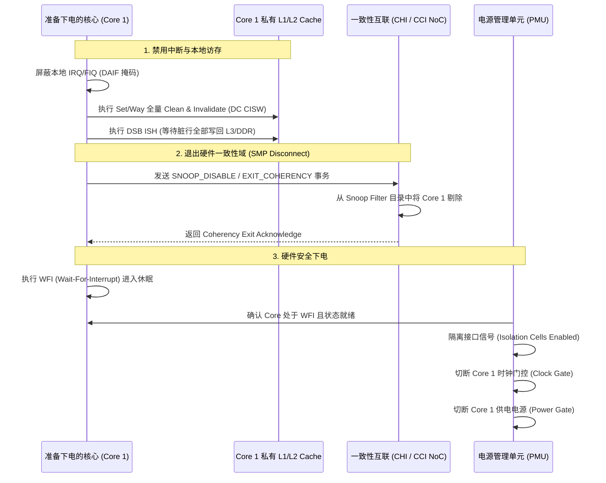
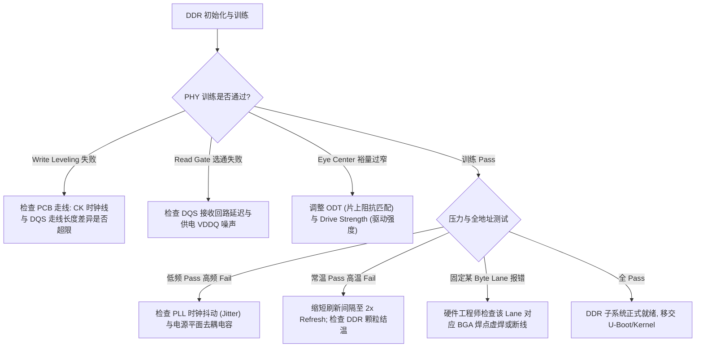

# 存储层次系统工程避坑与调优完全指南

## 1. 存储子系统高频工程关键陷阱与风险速查矩阵

| 陷阱类别 | 典型故障现象 | 硬件微架构根因 | 工业级最佳实践 / 规避方案 |
| :--- | :--- | :--- | :--- |
| **Cache 组冲突** | 工作集仅 20KB（远小于 32KB L1），但 Miss 率高达 90% | 数据步长恰好等于 Set 容量倍数，所有数据落入同一 Set | 数组末尾 Padding、矩阵分块（Tiling/Blocking） |
| **I/D Cache 不一致** | JIT 代码生成后执行报错 Undefined Instruction 或执行旧指令 | L1I 与 L1D 分离，写入指令未从 D-Cache 刷回 PoU 并使 I-Cache 失效 | 严格调用 `DC CVAU + DSB + IC IVAU + ISB` 架构同步序列 |
| **DMA 脏行踩踏** | 网络收包头部几个字节随机被旧数据篡改覆盖 | 接收 Buffer 未独占 Cacheline，与 CPU 频繁写入的邻接变量共享行，脏行写回覆盖了 DMA 数据 | 优先使用标准 DMA API 与分配器（依赖 `ARCH_DMA_MINALIGN` 隔离），禁止同 Cacheline 混合不同所有权区域 |
| **CPU 下电死锁** | CPU Core 进入 Deep Sleep 后，其他 Core 在访存时总线挂死 | Core 下电前未退出 CHI/ACE 一致性域，总线向断电 Core 发送 Snoop 导致超时 | 严格执行：`DC CISW 清空私有缓存` $\to$ `发送 Exit Coherency 请求` $\to$ `等待 Ack` $\to$ `断电` |
| **Row Conflict 崩溃** | DDR 理论带宽 25.6GB/s，多线程并发时实测仅 2.5GB/s | 多个线程步长相同，请求集中打向同一 Bank，引发大量 Precharge+Activate | 启用内存控制器的 **XOR Bank Hash 映射**，打碎线性对齐 |
| **高温 ECC 告警** | 常温烤机正常，高温箱 70℃ 运行时周期性出现单比特 ECC 错误 | 高温下电容漏电加速，$t_{REFI}$ 刷新间隔无法维持电荷 | 绑定芯片热传感器，温度超限自动切换为 **2x Refresh ($3.9\mu\text{s}$)** |
| **未 Scrubbing 崩溃** | 使能 DDR ECC 瞬间，首次读取未写入内存触发 SError/MCE | 上电复位后内存电荷随机，校验位不匹配被判定为不可纠正严重错误 | 开启 ECC 中断前，必须使用 DMA 或硬件写循环执行**全内存填零（Memory Scrubbing）** |

---

## 2. CPU 下电/休眠与一致性总线断开标准时序（PSCI / CPU Hotplug）

当多核系统中的某个 CPU 核心准备下电（Core Power-down / CPU Hotplug / PSCI `CPU_SUSPEND`）时，**绝不能直接切断电源或关闭时钟**！

### 违反时序的严重后果
- 若 Core 1 未向 Fabric 确认退出就直接下电，其他 Core 访问曾经被 Core 1 缓存过的地址时，Home Node 会向 Core 1 的探针通道发送 Snoop 请求。
- 由于 Core 1 已经掉电/时钟门控，Snoop 探针永远得不到响应，导致片上一致性总线在数千周期后触发 **Snoop Timeout SError**，拉死整个 SoC！

---

## 3. DDR 启动与训练工程问题排查诊断树

---

## 4. ECC 故障分类处理与 RAS（可靠性）闭环策略

1. **单比特可纠正错误（Correctable Error, CE）**：
   - 硬件自动实时纠错，业务数据无损。
   - **闭环策略**：内核注册 ECC 错误中断处理函数，维护按“Channel-Rank-Bank-Row”为维度的故障计数器。
   - 当某物理页在 1 小时内 CE 计数超过阈值（如 100 次），触发 **Page Offline 机制**（内核自动将该物理页置为坏页并迁移数据，防止恶化为多比特错误）。
2. **多比特不可纠正错误（Uncorrectable Error, UE）**：
   - 硬件无法纠正，数据已被破坏。
   - **包含机制（Memory Poisoning）**：将该物理 Cacheline 标记为 Poison（投毒态）。
   - 若该页属于普通用户进程，内核仅向该进程发送 `SIGBUS` 信号将其终止（Kill Process），**主操作系统保持平稳运行**；只有当破坏发生在内核核心代码或页表时，才触发系统级 Panic 重启。
