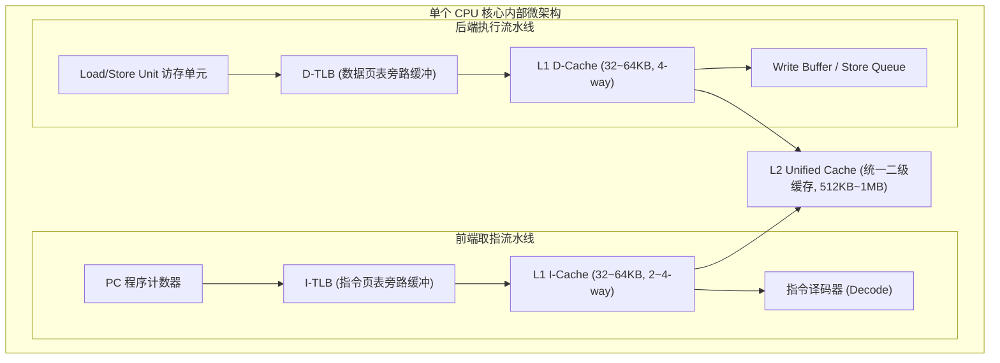
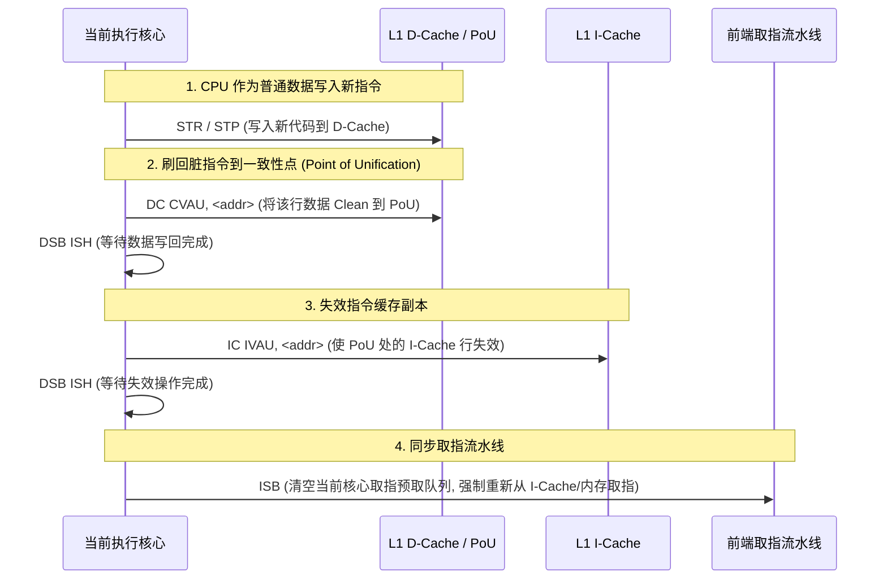

# I-Cache 与 D-Cache 微架构深度剖析：设计考量、调试排查与工程实践

## 1. 哈佛架构分离的微架构动因与硬件拓扑

在现代通用高性能应用处理器（如 ARM Cortex-A 系列、高性能 RISC-V 核及 x86 处理器）中，L1 存储层次普遍采用 **修改型哈佛架构（Modified Harvard Architecture）**——L1 指令缓存（I-Cache）与 L1 数据缓存（D-Cache）在物理上分为两套独立的 SRAM 阵列、Tag 阵列与访问通路；但在 L2 级别通常重新汇聚为统一缓存（Unified Cache）。



### 分离设计的硬件考量
1. **消除结构冲突（Structural Hazard）**：取指操作与 Load/Store 访存在流水线各级并发执行。如果共享单套 L1 Cache 端口，取指与访存会产生直接的端口争用，迫使流水线插入气泡（Bubble）。分离后两者拥有各自独立的访问端口，可实现完全并发。
2. **访问特征差异与阵列精简**：
   - 从 CPU 执行流水线角度看，**取指路径只读不写**。虽然在 Cache Line Fill、失效/维护操作（如 `IC IVAU`）、BIST 测试与调试扫描时仍需向 I-Cache SRAM 写入，但流水线不需要支持高频的 Store 写入、字节写使能（Byte Strobes）与脏行（Dirty）标记管理。
   - 相比之下，D-Cache 必须应对乱序执行流水线频繁的读写请求，配备复杂的 Store Buffer、写合并（Write Combining）、Snoop 侦听以及脏行写回（Write-Back）状态机。
3. **TLB 分离与替换策略独立**：指令访问具备强顺序性和局部循环特征，而数据访问常包含随机指针跳转和大块跨步遍历。分离 I-TLB 与 D-TLB 允许微架构针对不同访问模式独立调整条目数量、全相联/组相联度与预取策略。

---

## 2. I-Cache 与 D-Cache 硬件设计差异对比

| 设计维度 | L1 I-Cache | L1 D-Cache |
| :--- | :--- | :--- |
| **流水线访存特征** | 取指路径只读；更新由 Fill/维护通路执行 | 支持 Load/Store 读写双向高频访问 |
| **Dirty（脏行）标记** | 无需 Dirty 状态（不产生就地修改脏数据） | 具备 Dirty 位（Write-Back 策略下必须追踪） |
| **写缓冲区/队列** | 无需对接流水线的 Store Queue | 配备 Store Buffer / Store Queue |
| **多核一致性参与度** | 通常不直接响应数据写嗅探，由 L2/Snoop Filter 协助失效管理 | 深度参与 MESI/MOESI/CHI 状态跃迁与 RFO 嗅探 |
| **典型容量与相联度** | 32KB 或 64KB（常见 2-way 或 4-way） | 32KB 或 64KB（常见 4-way 或 8-way） |
| **索引与标签方式** | 多采用 **VIPT**（并行查询 TLB 与 Cache 索引） | 多采用 **VIPT** 或 **PIPT** |
| **典型预取器类型** | Next-Line 预取、分支目标预取 | 步长预取器（Stride）、流预取器（Stream） |
| **校验与纠错设计** | 常见 Parity 校验或 SECDED ECC（因只读，检错后可从下级重载） | 多采用 SECDED ECC（Dirty 行损坏无法简单从下级恢复） |
| **软错误处理特征** | 未修改行检测到校验错误时，可直接失效并从 L2/内存重新填充 | 处于 Modified 状态的脏行若发生不可纠正错误，会直接造成数据丢失 |

---

## 3. I-Cache 关键设计考量与调试要点

### 3.1 I-Cache 校验错误与异常上报机制

- **现象**：系统长时间运行偶发 `Undefined Instruction` 或非法跳转异常，且指令地址对应合法代码段。
- **机制与原因**：
  - 辐射粒子（SEU）或供电噪声可能引起 SRAM 存储单元发生比特翻转。
  - 部分处理器对 I-Cache 采用 Parity（奇偶校验）检测而非多比特纠错 ECC。当校验错误未被微架构自动触发重填，或者错误上报逻辑配置不当时，错误的指令码可能进入译码阶段，导致译码器产生非法指令异常或执行非预期指令。
- **平台设计与调试要点**：
  - 在支持 RAS（Reliability, Availability, and Serviceability）扩展的架构（如 ARMv8.2+ RAS 扩展）中，需正确配置错误产生控制寄存器与同步错误同步屏障（如 `SCTLR_ELx.IESB`）。
  - I-Cache 软错误的标准恢复路径应是：硬件自动丢弃（Invalidate）当前错误 Cacheline，并向 L2 Cache 发起重新填充（Refill）；若硬件不支持自动重填，则需在固件异常处理中执行失效与重试。

### 3.2 分支预测器与 I-Cache 取指吞吐

- **现象**：进程上下文切换后短时间内 IPC（每周期执行指令数）明显下滑。
- **机制与原因**：
  - 流水线前端依赖分支预测器（BTB / BHT / TAGE）提前预测下一周期的取指 PC。
  - 上下文切换后，预测结构中残留着旧进程的历史分支状态。新进程运行初期分支预测失准率上升，导致流水线前端反复刷新预取队列，使得 I-Cache 的有效指令流命中率阶段性降低。
- **硬件与软件考量**：
  - 现代核心通过 ASID/VMID 隔离分支预测表项，或在切换时选择性重置局部历史以降低污染影响。

### 3.3 VIPT 别名（Aliasing / Synonym）条件与大页效应

- **VIPT 别名产生的数学条件**：
  - 设虚拟页大小为 $\text{Page\_Size}$（如 4KB，页内偏移为 $\text{VA}[11:0] = \text{PA}[11:0]$）。
  - 设单路容量（Way Size）为 $\text{Way\_Size} = \frac{\text{Cache\_Size}}{\text{Ways}}$。
  - 若 $\text{Way\_Size} \le \text{Page\_Size}$：Index 所需的全部地址位均位于页内偏移范围内（如 32KB 8-way，$\text{Way\_Size} = 4\text{KB}$，Index 位为 $\text{VA}[11:6]$）。此时虚拟索引与物理索引严格一一对应，**不可能产生同义词别名（No Aliasing）**。
  - 若 $\text{Way\_Size} > \text{Page\_Size}$（例如 4KB 页下采用 32KB 2-way，$\text{Way\_Size} = 16\text{KB}$，Index 需要 $\text{VA}[13:6]$）：由于 $\text{VA}[13:12]$ 不受页内偏移保证，两个映射到相同 PA 的不同 VA 可能具有不同的 $\text{VA}[13:12]$，导致同一物理地址的数据在 Cache 内存在两个不同 Set 的副本（Synonym Aliasing）。
- **大页（Huge Page）的实际影响**：
  - 使用 2MB 大页时，页内偏移为 $\text{VA}[20:0] = \text{PA}[20:0]$。
  - 只要单路容量小于 2MB，所有 Index 位在虚拟地址与物理地址间天然保持一致，因此**大页映射天然消除了 VIPT 别名风险**，而非增加风险。
- **4KB 页下的别名规避**：
  - 架构设计层面：通常将 L1 I-Cache 几何参数约束为 $\text{Way\_Size} \le 4\text{KB}$，或在硬件中集成别名检测/重映射 CAM。
  - 操作系统层面：在存在别名风险的旧架构上采用页着色（Page Coloring）分配物理页。

---

## 4. D-Cache 关键设计考量与调试要点

### 4.1 Store-to-Load Forwarding（存储转发）约束

- **现象**：紧随写入之后进行的读取操作执行延迟明显增加。
- **微架构原因**：
  - CPU 的 LSU 包含 Store Buffer，用于缓冲已执行但尚未写入 L1 D-Cache 的写操作。
  - 当后续 Load 指令访问同一内存区域时，硬件尝试直接从 Store Buffer 将数据转发给 Load（Store Forwarding），避免等待写回。
  - 转发成功的条件通常包括：Store 的地址与 Load 完全匹配，且 Store 的字节范围能够完全覆盖 Load 请求的宽度。如果出现部分覆盖（如先 Store 4 字节，紧接着 Load 8 字节）或跨 Cacheline 边界访问，硬件无法完成就地合并转发，必须等待 Store 提交到 Cache 后才能完成 Load，产生额外的流水线停顿。
- **软件实践**：避免对同一内存地址混合使用不同宽度的非对齐读写操作。

### 4.2 D-Cache Dirty 行的 ECC 保护要求

- **与 I-Cache 的关键区别**：
  - I-Cache 中的内容下级内存均有完整副本；而处于 Write-Back 模式下的 D-Cache，**Dirty（Modified）行承载了系统中最新的唯一有效数据**。
  - 一旦 Dirty 行发生超出纠错能力的存储错误（Uncorrectable Error, UE），系统无法通过简单的重填恢复数据。
- **RAS 架构处理**：
  - 硬件生成错误中断或同步中止（如 ARM SError / Synchronous External Abort）。
  - 操作系统 RAS 框架（如 Linux APEI/GHES）根据故障页所属上下文判断：若损坏处于用户态堆栈，可发送 `SIGBUS` 终止特定进程；若损坏属于内核关键数据结构，则触发系统 Panic 防止损坏扩散。

### 4.3 非时序写入（Non-Temporal Store）语义与缓存状态

- **指令属性**：
  - ARM 架构中的 `STNP`（Store Non-temporal Pair）或 x86 中的 `MOVNT*` 指令在规范中被定义为**非时序提示（Non-temporal Hint）**。
  - 架构允许微架构将该数据流绕过部分缓存层级（如直接合并写入 Write-Combining 缓冲），但在具体实现中，如果目标地址已经缓存在 D-Cache 中，不同核心的处理行为可能不同（可能仍更新现有 Cacheline）。
- **工程注意点**：
  - 非时序写入适用于只写一次且后续不再立即读取的大块流式数据（如视频帧缓冲）。
  - **切勿在非时序写入后对含有有效脏数据的地址盲目执行 `DC IVAC`（Invalidate）**；若 Cache 中存在该地址的 Dirty 行，未执行写回的 Invalidate 会直接丢弃脏数据造成数据破坏。应严格依靠正确的内存映射属性（如 Normal Non-Cacheable / Write-Combining）或配对的 Clean 操作管理一致性。

---

## 5. I/D Cache 联合调试：自修改代码与跨核同步

### 5.1 代码动态生成（JIT / Dynamic Patching）的同步序列

由于修改型哈佛架构中指令取指通路与数据写入通路分离，软件通过 D-Cache 写入新机器码后，I-Cache 与取指前端无法自动感知数据更新。



### 5.2 跨核指令可见性与体系结构约束（SMP Instruction Coherency）
- **架构规范与多核同步全景分析**：
  - **体系结构版本与 Shareability 域**：在 ARMv8-A/ARMv9-A 中，作用于统一性点（PoU）的 `IC IVAU` 针对 Inner Shareable 内存属性时，硬件微架构会将指令缓存维护操作传递至同一 Shareability 域内所有 PE 的指令缓存结构中。而在 RISC-V 等架构下，基础指令缓存刷新（如 `fence.i`）通常仅约束本地 Hart，跨核同步必须依赖 SBI（Supervisor Binary Interface）发送 Remote Fence IPI。
  - **硬件透明一致性指示（`CTR_EL0.IDC / DIC`）**：
    - 当 `CTR_EL0.IDC == 1` 时：表示硬件提供数据到指令的透明一致性（PoU 处的 `DC CVAU` 操作可由软件省略）；
    - 当 `CTR_EL0.DIC == 1` 时：表示硬件提供指令到数据的透明一致性（`IC IVAU` 操作可由软件省略）。
  - **远端 PE 上下文同步事件（Context Synchronization Event）的必要性**：
    - 单纯依赖硬件将 `IC IVAU` 广播至远端 PE 的 I-Cache 层次结构，**并不能清空远端 PE 内部前端取指队列（Fetch Queue）、分支目标预测缓存（BTB）或乱序预取流水线中已加载的陈旧指令**。
    - 远端 PE 必须执行**上下文同步事件**（如执行 `ISB` 指令、进入/退出异常上下文 `ERET`、或发生进程上下文切换），才能确保从已失效的缓存/内存中重新取指。
  - **操作系统层封装（如 Linux `flush_icache_range`）**：
    - Linux 内核将指令与数据缓存的同步逻辑统一封装在 `flush_icache_range(start, end)` 等体系结构抽象函数中。在非全硬件透明的 SMP 系统中，内核会结合 IPI 机制向其他活动核心分发同步请求，驱动与应用层（如 JIT 编译器）应调用标准 API（或 `__builtin___clear_cache`）而非直接裸写维护指令。

---

## 6. 性能监测与问题定位（PMU）

### 6.1 常用 PMU 事件参考（ARMv8/v9）
| 事件码 | 事件标识符 | 说明 |
| :--- | :--- | :--- |
| `0x0001` | `L1I_CACHE_REFILL` | L1 I-Cache 填充次数（取指未命中引发） |
| `0x0014` | `L1I_CACHE` | L1 I-Cache 总访问次数 |
| `0x0003` | `L1D_CACHE_REFILL` | L1 D-Cache 填充次数（数据访存未命中引发） |
| `0x0004` | `L1D_CACHE` | L1 D-Cache 总访问次数 |
| `0x0010` | `BR_MIS_PRED` | 分支预测错误次数 |

### 6.2 性能分析命令示例
```bash
# 监控指令与数据缓存缺失情况
perf stat -e L1-icache-loads,L1-icache-load-misses,L1-dcache-loads,L1-dcache-load-misses,branch-misses ./target_app
```
- 若 I-Cache Miss 偏高：通常与代码体积过大、冷路径展开过多、间接跳转密集或动态加载库分散相关。
- 若 D-Cache Miss 偏高：通常与数据工作集超过容量、访存步长跨越 Cacheline、数据结构未对齐或多核数据竞争相关。
