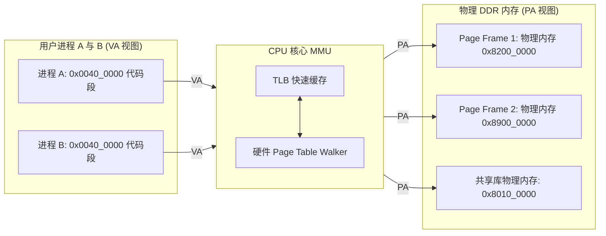
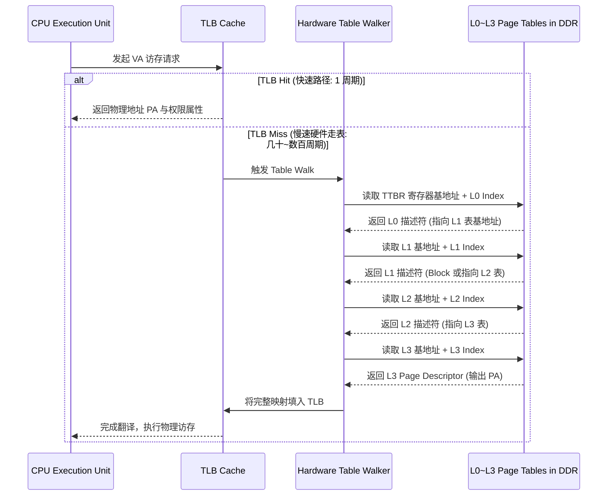

# MMU、地址空间与多级页表深度解析

## 1. 虚拟内存与 MMU 本质：从物理隔离到按需分页

内存管理单元（MMU, Memory Management Unit）是现代支持多任务操作系统（如 Linux）的 CPU 核心硬件组件。其核心职责包括：
1. **地址空间隔离（Address Space Isolation）**：为每个用户进程提供独立的 $2^{48}$ 或 $2^{64}$ 连续虚拟地址空间（Virtual Address Space, VAS），防止进程间非法互相踩踏。
2. **硬件级权限控制（Access Permissions）**：通过页表属性限制特定内存区域的读（Read）、写（Write）、执行（Execute）权限（实现 **$W \oplus X$** 安全法则）。
3. **物理内存离散化与按需分页（Demand Paging）**：将连续的虚拟页映射到物理 DDR 中任意离散的页框（Page Frame），支持写时复制（COW）与内存换页。



---

## 2. 为什么需要多级页表：以 64 位 ARMv8 4 级页表为例

如果采用单级扁平页表映射 48 位虚拟地址空间（$256\text{ TB}$）：
- 每页 4KB 需要 $2^{48} / 2^{12} = 2^{36}$（约 687 亿）个页表项（PTE）。
- 每个 PTE 占 8 字节，单级页表本身将耗费 **$512\text{ GB}$ 物理内存**，这在工程上完全无法实现！

**多级页表（Multi-Level Page Tables）**采用树状稀疏表示法，**只为实际分配使用的虚拟地址区域分配下级页表页**，未使用的巨大稀疏空间仅需将上级描述符标记为 Invalid（0 字节内存开销）。

### 48 位 VA 在 4KB Granule 下的 4 级拆分数学模型
```text
63           48 47       39 38       30 29       21 20       12 11        0
+--------------+-----------+-----------+-----------+-----------+------------+
|  Top / Sign  | L0 Index  | L1 Index  | L2 Index  | L3 Index  | Page Offset|
+--------------+-----------+-----------+-----------+-----------+------------+
                  9 bits      9 bits      9 bits      9 bits      12 bits
                 (512 GiB)    (1 GiB)     (2 MiB)     (4 KiB)
```



---

## 3. 页表描述符（PTE）关键位域与硬件安全属性

一个标准的 64 位页表项（PTE）不仅仅包含物理页框基地址，还包含密集的硬件控制位域：

| 关键位域 | 位宽度 / 标志 | 硬件作用与安全意义 |
| :--- | :--- | :--- |
| **Valid (Bit 0)** | 1 bit | `1` 表示该映射有效；`0` 触发 **Translation Fault**（按需分配 / COW 核心入口） |
| **Type (Bit 1)** | 1 bit | 在 L1/L2 层级决定该条目是直接映射的大块内存（Block: 1GB/2MB），还是指向下一级页表（Table） |
| **AttrIndx [2:0]** | 3 bits | 索引 `MAIR_ELx` 系统寄存器，决定该内存是 `Normal Cacheable` 还是 `Device-nGnRnE` |
| **AP [2:1]** | 2 bits | **访问权限（Access Permission）**：`00`=EL1读写/EL0无权限，`01`=EL1/EL0均可读写，`10`=内核只读，`11`=用户/内核均只读 |
| **SH [1:0]** | 2 bits | **共享性（Shareability）**：`Non-shareable`, `Inner Shareable` (SMP 多核一致性必须设为此项), `Outer Shareable` |
| **AF (Bit 10)** | 1 bit | **Access Flag（访问标志）**：首次被访问时置位；若硬件不支持自动置位且为 0，则触发 Access Flag Fault（供 OS 统计热页） |
| **PXN (Bit 53)** | 1 bit | **Privileged Execute Never**：特权级（内核态）严禁执行该用户页代码（**彻底封堵 ret2user / SMEP 内核提权攻击**） |
| **UXN / XN (Bit 54)** | 1 bit | **User Execute Never**：用户态严禁执行该数据页（实现堆栈数据区不可执行，**防御 Shellcode 栈溢出攻击**） |

---

## 4. 常见关键陷阱与风险、缺页故障与排查手册

### 陷阱 1：修改页表未遵循 BBM（Break-Before-Make）导致未定义行为或 TLB 冲突
- **现象**：动态调整页映射（如将 2MB Block 拆分成 4KB 小页，或修改映射物理地址/属性）时，系统可能出现不可预期的翻译错误、数据损坏或触发 **TLB Conflict Abort**。
- **硬件根因**：
  - 根据 ARM 体系结构规范，直接将一个有效（Valid）描述符原地修改为另一个不同的有效描述符属于 **CONSTRAINED UNPREDICTABLE** 行为。
  - 在多核并发访问或具备微相联 TLB 结构的处理器中，硬件可能同时缓存新旧两种不同大小或属性的条目，导致同时命中冲突（触发 TLB Conflict Abort），或者处理器不可控地交替使用新旧映射。
  - 在支持 ARMv8.4-A FEAT_BBM 的核心上，部分特定属性（如只修改 Dirty 位或特定权限）放宽了 BBM 要求，但通用映射变更仍需遵循标准序列。
- **标准 BBM 规避时序**：
  1. **Break**：将目标 PTE 的 Valid 位置 0（写入 Invalid 描述符）。
  2. **Barrier**：执行 `DSB ISHST`（保证 Invalid 写入内存生效）。
  3. **Invalidate**：执行 `TLBI VAAE1IS, <VA>`（向所有核心广播失效该 VA 的旧 TLB 缓存）。
  4. **Sync**：执行 `DSB ISH + ISB`（等待全系统 TLBI 确认完成，并刷新本地流水线）。
  5. **Make**：写入新的有效描述符，再次执行 `DSB ISHST + ISB`。

### 陷阱 2：Page Table Walker 自身访存触发 External Abort
- **现象**：开启 MMU（置位 `SCTLR_EL1.M`）的瞬间，CPU 立即发生关键 Synchronous External Abort。
- **根因**：
  - `TTBR0_EL1` 中配置的根页表基地址指向了一段尚未初始化的物理内存（如外部 DDR 未完成训练），或者该物理地址被片上总线防火墙（TZC）阻断。
  - CPU 取第一条虚拟地址指令时，硬件 Walker 去读取页表，总线返回 `DECERR`/`SLVERR`，导致刚开 MMU 瞬间即崩溃。
- **规避检查清单**：
  - 在置位 `SCTLR_EL1.M` 之前，必须使用物理地址（MMU 关闭状态）完成全部页表项初始化与清零。
  - 若在使能 MMU 前开启了 D-Cache 写入页表，必须执行 Clean 操作（如 `DC CVAC`）将页表数据刷写至一致点（PoC），确保硬件 Page Table Walker 能从物理内存读出最新页表，并确认基地址严格满足 4KB 对齐。
