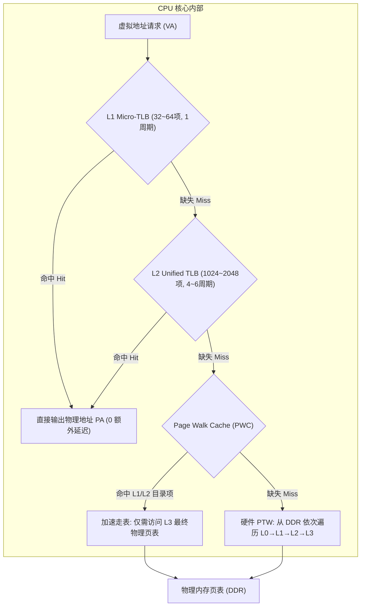
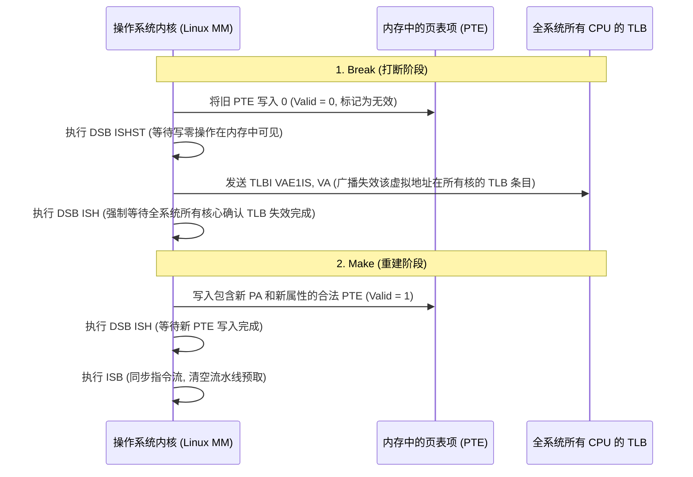

# TLB 架构、Break-Before-Make 协议与内存属性深度解析

## 1. 多级 TLB 硬件拓扑与 Page Walk Cache（PWC）

为了避免每次指令取指或数据访存都要消耗 4 次 DDR 访问走完 4 级页表（带来高达 200~300 个 CPU 周期的严重延迟），MMU 内部构建了严密的分层缓存体系：



### TLB 条目匹配要素：VA + ASID + VMID
TLB 存储的并非单纯的 `VA → PA` 映射，每个条目还附带元数据：
- **ASID（Address Space Identifier，8位或16位）**：代表当前用户进程的唯一标识。
- **nG（non-Global 标志位）**：
  - `nG = 0`（全局内核映射）：对所有进程生效，匹配时**忽略 ASID**。
  - `nG = 1`（用户私有映射）：只有当当前系统寄存器 `TTBR0_EL1` 中的 ASID 与 TLB 条目的 ASID **完全一致**时才判定为命中。
- **核心工程价值**：Linux 进程切换（Context Switch）时**完全无需清空（Flush）TLB**，只需切换 `TTBR0_EL1` 中的 ASID，极大降低了进程切换带来的冷启动抖动！

---

## 2. Break-Before-Make（BBM）协议的硬件根因与 5 步标准序列

在 ARM64 架构下，**严禁直接覆盖修改一个已经处于有效（Valid）状态的页表项（PTE）**。

### 为什么必须“先打断、再建立”（Break-Before-Make）？
- **架构约束与一致性保障**：ARM 架构将直接原地覆写有效描述符定义为 CONSTRAINED UNPREDICTABLE 行为。
- 当映射大小改变（如 2MB 大页拆分为 4KB 小页）或物理地址变更时，若未先置为无效，微架构内部的不同级 TLB（如 Micro-TLB 与 Main TLB）可能同时匹配到重叠的地址范围，在具备冲突检测的核心上触发 **TLB Conflict Abort**，或在不同核间产生不一致的翻译视图。



---

## 3. 内存属性体系：Normal Memory 与 Device Memory（MAIR_EL1）

ARM64 将所有内存地址的属性编码在系统寄存器 `MAIR_EL1`（Memory Attribute Indirection Register）中。页表项（PTE）中的 `AttrIndx[2:0]` 字段仅作为索引选择 `MAIR_EL1` 中的对应字节：

| 内存属性类别 | MAIR 编码 | 硬件微架构行为 | 典型应用物理区域 |
| :--- | :--- | :--- | :--- |
| **`Device-nGnRnE`** | `0x00` | **绝对强序**：禁止聚集（no Gathering）、禁止指令重排（no Reordering）、禁止总线提前确认（no Early Write Ack） | 关键中断控制器（GIC）、安全寄存器 |
| **`Device-nGnRE`** | `0x04` | 允许总线 Early Ack（写缓冲），但严格保持访问先后顺序 | **大多数外设 MMIO 寄存器**（如 UART、SPI） |
| **`Normal Non-Cacheable`** | `0x44` | 弱序，支持推测读，但绕过 L1/L2/L3 Cache 直接写 DDR | DMA 环形缓冲区、显卡帧缓冲（Frame Buffer） |
| **`Normal Inner-Shareable WB/WA`** | `0xFF` | 允许全部 Cache 缓存、支持多核硬件一致性、支持写回（Write-Back）与写分配（Write-Allocate） | **常规操作系统 DDR 物理内存** |

---

## 4. 硬件 Access Flag（HA）与硬件 Dirty（HD）机制

为了评估物理内存页的活跃度（用于 LRU 页面置换与换出），页表项包含：
- **AF（Access Flag，PTE Bit 10）**：标记该页是否被读取过。
- **DBM（Dirty Bit Modifier，PTE Bit 51）**：结合权限位标记该页是否被写入过。

```mermaid
flowchart LR
    Access["CPU 发起读写访问"] --> Check_AF{"PTE.AF 是否为 1?"}
    Check_AF -->|AF == 1| Normal["正常访问通过"]

    Check_AF -->|AF == 0| HW_Mode{"TCR_EL1.HA 硬件管理是否使能?"}
    HW_Mode -->|HA == 1 (硬件使能)| HW_Set["硬件 PTW 自动发起原子总线写, 将 PTE.AF 置为 1 (零软件开销)"]
    HW_Mode -->|HA == 0 (软件管理)| SW_Trap["硬件触发 Access Flag Fault 异常, 陷入内核由软件置 1 后重试"]
```

- **现代 SoC 优化**：在 `TCR_EL1` 中使能 `HA`（Hardware Access Flag Update）与 `HD`（Hardware Dirty Management），显著降低了数以万计的软件缺页陷入，提升应用冷启动性能 **15% 以上**。

---

## 5. 常见关键陷阱与风险与排查手册

### 陷阱 1：外设 MMIO 错误映射为 Normal Memory 导致 FIFO 读破坏
- **现象**：网卡或加密硬件的数据读取 FIFO 偶尔发生数据丢失或乱序，且出现幽灵读取。
- **微架构根因**：
  - 驱动开发者使用了错误的内存属性（将 MMIO 区域配成了 Normal Cacheable 或 Normal Non-cacheable）。
  - Normal 属性**允许 CPU 硬件预取器（Hardware Prefetcher）进行推测执行（Speculative Read）**！
  - CPU 预取逻辑在分支预测阶段私自向 FIFO 寄存器发起了一次未授权的读取，导致 FIFO 内部硬件指针自动出栈（Pop），当真实代码执行读取时，前几个字节已经被硬件预取丢弃了！
- **规避原则**：所有具有硬件副作用（Side-effect，如自动出栈、自动清除标志）的外设寄存器，**应根据外设特性选择配置，通常使用 `Device-nGnRE` 或 `Device-nGnRnE` 属性映射（Linux 下必须使用 `ioremap()`）**！

### 陷阱 2：同一物理地址（PA）存在冲突的属性别名（Memory Type Aliasing）
- **现象**：某个物理内存在驱动中通过普通指针（Normal WB）访问，同时在另一个驱动中被 `ioremap_wc()` 映射为 Non-cacheable，系统在高负载下出现数据静默损坏。
- **根因**：ARM 架构手册明确指出：**对同一物理地址建立不同 Cacheability 的映射属于软件架构违例（Unpredictable Behavior）**。CPU 内部的 Snoop 逻辑在处理不同属性的同一 PA 时可能发生死锁或脏数据与非缓存数据竞争覆写。
