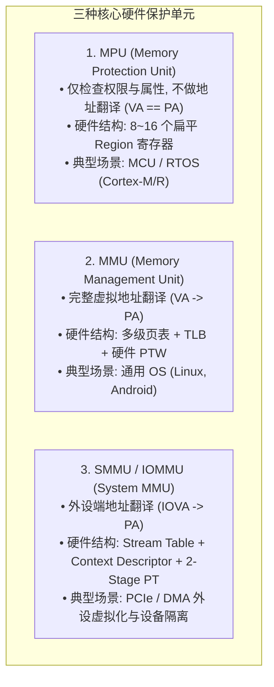
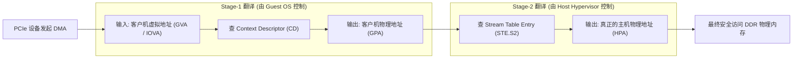

# MPU 内存保护、SMMU 硬件隔离与两阶段虚拟化完全指南

## 1. MPU、MMU 与 SMMU/IOMMU 架构特性全景对比

在不同的处理器平台与硬件节点上，内存保护与地址翻译硬件分工明确：



### 核心参数与微架构对比表
| 维度 | MPU (PMSAv8) | MMU (VMSAv8-64) | SMMUv3 (ARM IOMMU) |
| :--- | :--- | :--- | :--- |
| **地址转换能力** | **无**（物理地址直通） | **有**（VA $\to$ PA 动态映射） | **有**（IOVA $\to$ PA 动态映射） |
| **内存管理粒度** | 静态 Region（32B ~ 4GB，受限于寄存器数） | 动态页（4KB / 64KB / 2MB / 1GB） | 动态页（4KB / 64KB / 2MB / 1GB） |
| **硬件复杂度与面积** | 极小（几千门，纯比较器阵列） | 中等（多级 TLB + 复杂 Walker） | 极大（支持 ATS、PASID、两阶段翻译） |
| **上下文切换开销** | 极低（写几个 Region 寄存器，$<10$ 周期） | 切换 `TTBR0` + ASID，可能引发 TLB 刷新 | 切换 StreamID 映射，管理 Command Queue |
| **确定性与实时性** | **绝对确定（零 TLB Miss 延迟抖动）** | 存在 TLB Walk 延迟抖动（50~200ns） | 存在 I/O TLB Walk 延迟 |

---

## 2. ARM PMSAv8 MPU 区域匹配与抢占规则

ARM Cortex-M/R 采用 **PMSAv8（Protected Memory System Architecture）**：
- 每个 Region 由基地址寄存器（`RBAR`）和限制地址寄存器（`RLAR`）界定，并包含访问权限（Read/Write/Execute/Privileged）与属性（Normal/Device）。

```mermaid
flowchart TD
    CPU_Access["CPU 发起物理访存 (Address)"] --> Match_Region{"遍历 8~16 个 MPU Region"}

    Match_Region -->|命中单个 Region| Check_Perm["检查读写/执行与特权级权限 (Privileged / Unprivileged)"]

    Match_Region -->|命中多个重叠 Region| Rule["PMSAv8 规则: 编号最高的 Region (Highest Region ID) 优先级最高, 覆盖低编号规则!"]

    Match_Region -->|未命中任何 Region| Background{"是否开启了 Default Background Map?"}
    Background -->|是 (Privileged 模式)| Normal_Pass["按默认特权级属性通过"]
    Background -->|否| Fault["硬件立即触发 MemManage Fault 异常!"]
```

---

## 3. SMMUv3 两阶段虚拟化翻译（Stage-1 与 Stage-2）

在 KVM 虚拟化与 PCIe 设备直通场景中，SMMU 支持**两阶段硬件级联翻译**：



- **安全边界**：恶意或崩溃的虚拟机只能修改 Stage-1 页表，即使它尝试发起恶意 DMA，SMMU 的 **Stage-2 硬件强校验（由 Hypervisor 锁定）** 会将其牢牢限制在已分配给该 VM 的物理内存范围内，阻止越权逃逸。
