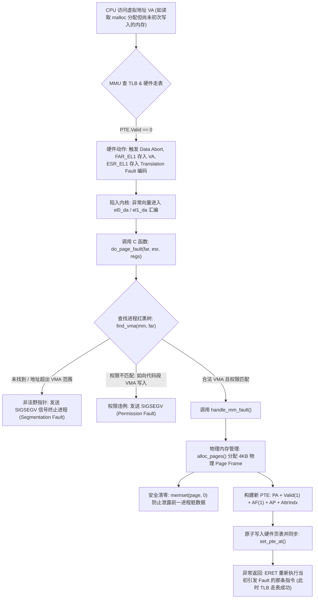
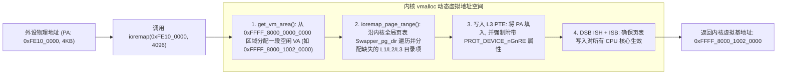

# MMU 映射全流程、Fault 异常分类与内核缺页处理深度解析

## 1. Linux 内核缺页异常（`do_page_fault`）处理全生命周期

当 CPU 访问某个虚拟地址但 MMU 无法完成翻译时，硬件与操作系统共同协同完成缺页处理：



---

## 2. 六大 MMU Fault 类别微架构根因与 ESR 诊断速查

当内核触发 Oops 时，`ESR_EL1` 的低 6 位（`DFSC / IFSC`，Data/Instruction Fault Status Code）直接指明了故障本质：

| Fault 类别 | ESR DFSC 编码 | 硬件微架构触发根因 | 常见软件 Bug 场景 |
| :--- | :--- | :--- | :--- |
| **Translation Fault** | `0b000100` (L0)<br>`0b000101` (L1)<br>`0b000110` (L2)<br>`0b000111` (L3) | 走表过程中，对应级别的页表描述符 `Valid bit (Bit 0) == 0` | • 空指针解引用（访问 `0x00000000`）<br>• 使用了已释放的野指针（UAF）<br>• 匿名内存延迟分配（按需分配，属于正常缺页） |
| **Permission Fault** | `0b001101` (L1)<br>`0b001110` (L2)<br>`0b001111` (L3) | 描述符有效，但违反了 `AP[2:1]` 或 `PXN/UXN` 权限限制 | • 用户态试图执行或写入内核特权页<br>• 尝试修改只读代码段（`.text`）<br>• 写时复制（COW，属于正常写保护缺页） |
| **Access Flag Fault** | `0b001001` (L1)<br>`0b001010` (L2)<br>`0b001011` (L3) | 软件管理 AF 模式下，访问了 `AF == 0` 的页表项 | 触发内核将该页标记为活跃，更新置 1 |
| **Address Size Fault** | `0b000000` (L0)<br>`0b000001` (L1)<br>`0b000010` (L2)<br>`0b000011` (L3) | 输入的 VA 或中间走表给出的 PA 超出了硬件支持的物理位宽（如 48-bit） | 页表基地址寄存器 `TTBR` 传入了脏指针 |
| **Synchronous External Abort** | `0b010000` (走表)<br>`0b010100` (访存) | MMU 在走表读取 PTE 描述符时，外部 AXI/CHI 总线返回了 `DECERR` 或 `SLVERR` | • 页表存放在了未初始化的 DDR 中<br>• 访问了已下电模块的 MMIO 寄存器 |
| **Alignment Fault** | `0b100001` | 访问未按数据宽度自然对齐，且目标内存为 Device 类型或启用了对齐检查 | 跨边界读取 Device-nGnRE 寄存器 |

---

## 3. 内核 MMIO 动态映射机制：`ioremap()` 底层硬件动作

当驱动需要访问物理地址为 `0xFE10_0000` 的 UART 寄存器时，**内核绝不能直接将指针赋值为物理地址**，必须通过 `ioremap()` 建立映射：



---

## 4. 实战排错案例：结构体空指针解引用崩溃反解

### 典型崩溃 Oops 日志分析
```text
[   12.345678] Unable to handle kernel NULL pointer dereference at virtual address 0000000000000028
[   12.345680] Mem abort info:
[   12.345681]   ESR = 0x96000004
[   12.345683]   EC = 0x25: DABT (current EL), IL = 32 bits
[   12.345684]   SET = 0, FnV = 0
[   12.345685]   EA = 0, S1PTW = 0
[   12.345686]   FSC = 0x04: level 0 translation fault
[   12.345687] Data abort info:
[   12.345688]   ISV = 0, ISS = 0x00000004
[   12.345689]   CM = 0, WnR = 0
[   12.345690] user pgtable: 4k pages, 48-bit VAs, pgdp=0000000082040000
[   12.345692] [0000000000000028] pgd=0000000000000000, p4d=0000000000000000
[   12.345695] Internal error: Oops: 96000004 [#1] PREEMPT SMP
[   12.345698] pc : my_driver_send_packet+0x18/0x80 [my_driver]
[   12.345700] lr : my_net_xmit+0x44/0x120 [my_driver]
```

### 极速反解链条
1. **为什么 Fault 地址是 `0x0000000000000028`（不是 0）？**
   - 驱动中存在结构体指针 `struct my_device *dev = NULL;`。
   - 代码试图访问成员变量 `dev->tx_ring`。在 C 语言结构体内存排布中，`tx_ring` 字段距离结构体首地址的偏移量（Offset）恰好为 **`0x28`（40 字节）**。
   - 汇编指令编译为 `LDR X0, [X1, #40]`（其中 X1 为 0，计算出的目标 VA 恰好为 `0x28`）。
2. **ESR 综合症判定**：
   - `WnR = 0`：表明这是一次 **读操作（Read）** 触发的故障。
   - `FSC = 0x04`：`Level 0 Translation Fault`，0 级页表直接为空，确认未映射。
3. **定位结论**：直接在 `my_driver_send_packet` 入口处对传入的 `dev` 结构体指针增加判空断言 `if (!dev) return -EINVAL;`。
