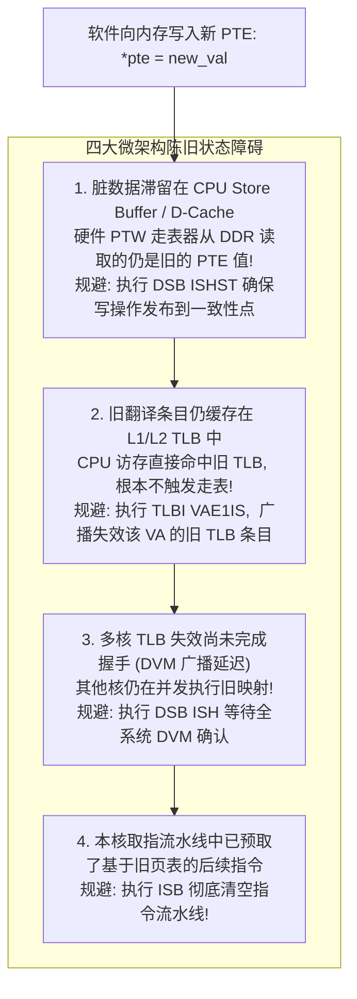

# 4 级页表索引计算、PTE 更新时序与 Fault 综合症精准定位完全指南

## 1. ARM64 4KB Granule 4 级页表索引解算数学推导

在 48 位虚拟寻址（VA[47:0]）、4KB 页颗粒度下，虚拟地址被严格切分为 4 个 9 位的索引字段与 1 个 12 位的页内偏移：

```text
 47        39 38        30 29        21 20        12 11          0
+------------+------------+------------+------------+-------------+
|  L0 Index  |  L1 Index  |  L2 Index  |  L3 Index  | Page Offset |
|   (9 bits) |   (9 bits) |   (9 bits) |   (9 bits) |   (12 bits) |
+------------+------------+------------+------------+-------------+
```

### 索引提取公式与算例
$$\text{L0\_Index} = (\text{VA} \gg 39) \ \& \ 0\text{x1FF}$$
$$\text{L1\_Index} = (\text{VA} \gg 30) \ \& \ 0\text{x1FF}$$
$$\text{L2\_Index} = (\text{VA} \gg 21) \ \& \ 0\text{x1FF}$$
$$\text{L3\_Index} = (\text{VA} \gg 12) \ \& \ 0\text{x1FF}$$
$$\text{Page\_Offset} = \text{VA} \ \& \ 0\text{xFFF}$$

- **实战算例**：给定虚拟地址 `VA = 0x0000_FFFF_8000_10A8`：
  - $\text{L0\_Index} = (0\text{xFFFF\_8000\_10A8} \gg 39) \ \& \ 0\text{x1FF} = \mathbf{0x1FF} \; (511)$
  - $\text{L1\_Index} = (0\text{xFFFF\_8000\_10A8} \gg 30) \ \& \ 0\text{x1FF} = \mathbf{0x1FE} \; (510)$
  - $\text{L2\_Index} = (0\text{xFFFF\_8000\_10A8} \gg 21) \ \& \ 0\text{x1FF} = \mathbf{0x000} \; (0)$
  - $\text{L3\_Index} = (0\text{xFFFF\_8000\_10A8} \gg 12) \ \& \ 0\text{x1FF} = \mathbf{0x001} \; (1)$
  - $\text{Page\_Offset} = \mathbf{0x0A8}$
- **PTE 物理地址计算**：第 $N$ 级 PTE 的物理内存地址为：
  $$\text{PTE\_PA} = \text{Table\_Base\_PA} + (\text{Index} \times 8)$$

---

## 2. 为什么软件更新了 PTE 之后 CPU 依然发生 Fault？

在动态修改页表（如 `mprotect()` 更改权限、动态加载驱动）后，若未严格执行同步序列，微架构层面的旧状态会导致异常：



---

## 3. 常见 Fault 综合症（`ESR_EL1`）快速诊断决策表

| ESR DFSC 编码 | 故障类型 | 典型排查路径 |
| :--- | :--- | :--- |
| `0b000100` (Level 0) 到 `0b000111` (Level 3) | **Translation Fault (缺页)** | 对应级别的页表项为 0（未映射）。检查 `FAR_EL1`：若为 0x0 为绝对空指针；若靠近 0 为结构体解引用；若为合法虚拟地址，则属于动态按需加载（Demand Paging）的正常缺页 |
| `0b001101` (Level 1) 到 `0b001111` (Level 3) | **Permission Fault (权限违规)** | 页表存在但权限不匹配。检查 `ESR.WnR`：若为 1 则表示试图向只读页（`AP=RO` 或 `const`）写入；检查 `FAR` 是否属于内核地址而用户态尝试访问（`AP=EL0禁止`） |
| `0b010001` (Synchronous External Abort) | **外部总线同步中止** | PTW 走表器在读取页表时总线返回了 `DECERR`/`SLVERR`。排查 `TTBR0/1_EL1` 页表基地址是否指向了未初始化的内存或已被 TZC 防火墙隔离的区域 |
| `0b100001` (Alignment Fault) | **对齐错误** | 访问了配置为 `Device` 属性的 MMIO 寄存器，但使用了非对齐的指针解引用（如通过奇数地址读取 32 位整型） |
