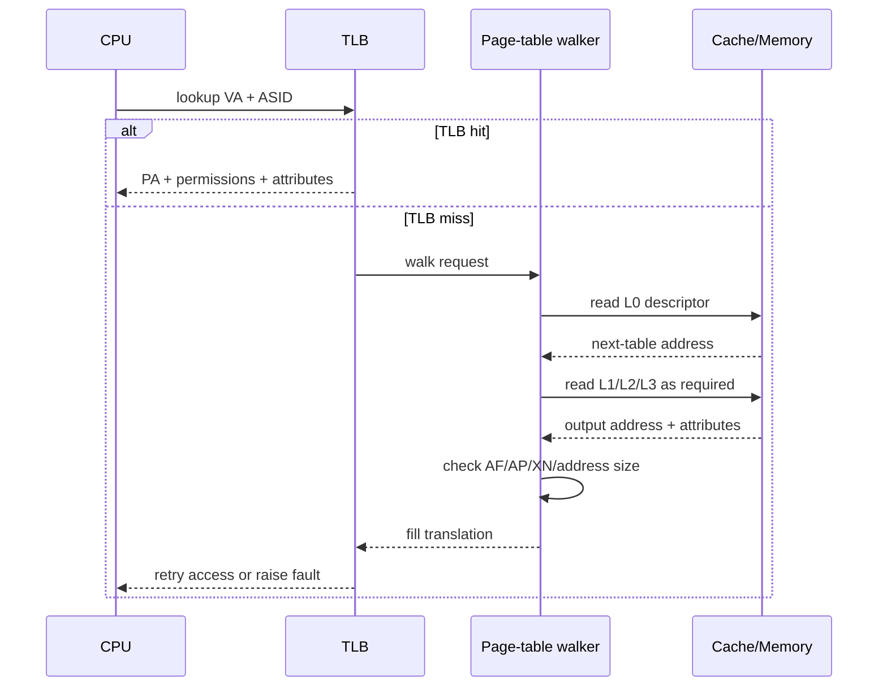

# ARM 4 KiB 四级页表与内存属性

## 48-bit VA 位域

4 KiB Granule、每项 8 Byte，使一张 4 KiB 表容纳 512 项，即每级消耗 9 位。48-bit VA 的拆分为：

```text
63                         48 47       39 38       30 29       21 20       12 11       0
+----------------------------+-----------+-----------+-----------+-----------+----------+
| sign extension / top bits  | L0 index  | L1 index  | L2 index  | L3 index  | 4K offset|
+----------------------------+-----------+-----------+-----------+-----------+-----------+
                                9 bits      9 bits      9 bits      9 bits      12 bits
```

L0 一项覆盖 512 GiB，L1 Block 覆盖 1 GiB，L2 Block 覆盖 2 MiB，L3 Page 覆盖 4 KiB。是否允许某级 Block 取决于 Granule 和级别。

## 硬件 Page Table Walk



页表读取本身可能命中 Cache，也可能产生外部 Abort。Walk Cache 可缓存上级描述符；因此修改上级表后也必须执行正确 TLBI，不能只刷新最终页项。

## Descriptor 字段

常见字段包括 Valid/Type、输出地址、`AttrIndx`、AP、SH、AF、nG、PXN/UXN。`AttrIndx` 索引 `MAIR_ELx` 中的 8-bit 属性编码；PTE 不是直接写“WB”字符串。相同 PTE 编码若配合不同 MAIR，会产生不同内存行为，因此上下文切换和固件交接要保证 MAIR 契约。

## Device 子类型

ARM Device Memory 用三个约束维度描述：Gathering、Reordering、Early Write Acknowledgement。

| 类型 | Gathering | Reordering | Early Ack | 典型约束 |
| --- | --- | --- | --- | --- |
| Device-nGnRnE | No | No | No | 最严格，写需到达末端后确认 |
| Device-nGnRE | No | No | Yes | 允许早期写确认 |
| Device-nGRE | No | Yes | Yes | 允许一定重排 |
| Device-GRE | Yes | Yes | Yes | 允许合并、重排与早期确认 |

“允许”不表示实现一定会重排，而是软件不能依赖其不发生。控制寄存器通常使用 nGnRE 或平台规定类型；对强副作用、严格到达要求的区域可能需 nGnRnE。

Normal WB 适合普通 RAM，利用 Cache 和写回；WT 写同时向下层传播；Non-cacheable 避免分配到普通 Cache，但仍属于 Normal Memory，可能允许推测与合并，不能拿它替代 Device 属性。

## 映射切换

改变有效映射的 PA 或属性时使用 Break-before-make：写 Invalid，屏障，TLBI，等待完成，再写新描述符并执行所需同步。若先写新有效项，其他核可能同时持有旧、新两个属性版本，尤其在 Normal↔Device 变化时后果严重。
