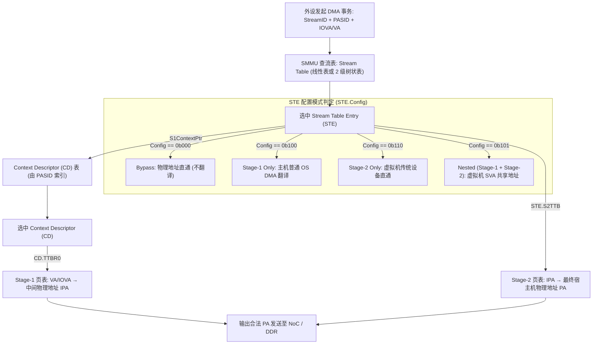
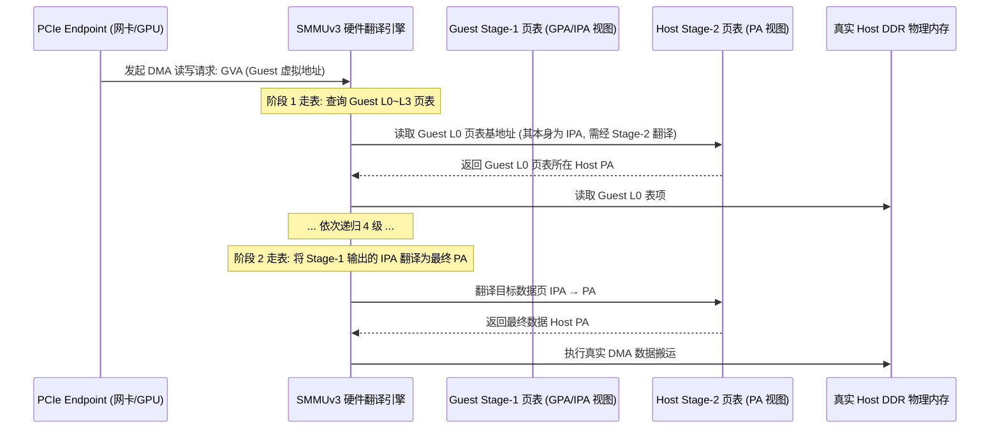
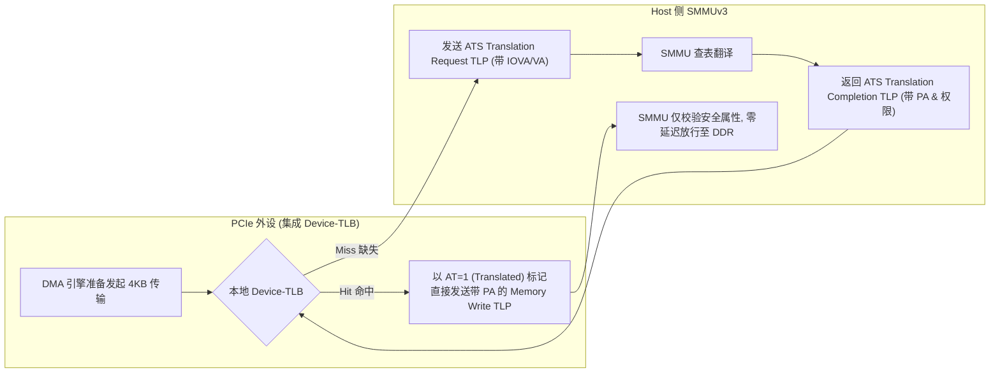
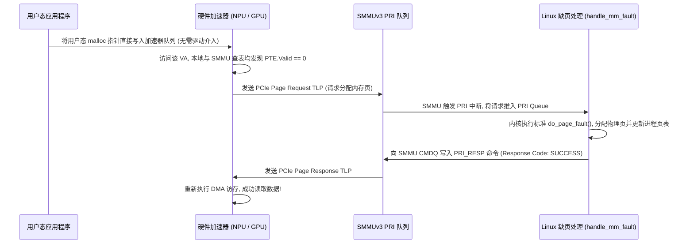
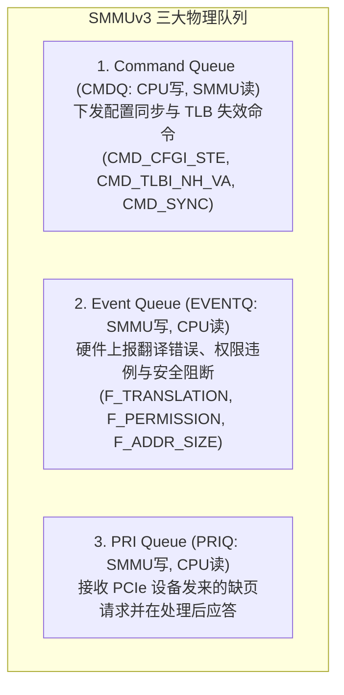

# SMMUv3 嵌套翻译、PCIe ATS、PRI 与共享虚拟寻址（SVA）深度解析

## 1. SMMUv3 两级流表与上下文描述符（CD）硬件查找架构

在系统级 IOMMU（ARM SMMUv3）中，外设发起的每一个 DMA 事务都携带 **StreamID（标识具体物理外设，通常由 PCIe RequesterID/BDF 派生）** 与可选的 **PASID（Process Address Space ID，标识进程）**。

---

## 2. 虚拟机直通两阶段嵌套翻译（Nested Translation）的硬件开销

在云计算虚拟化场景下（KVM / VFIO），当虚拟机内部运行的 Guest OS 试图让直通网卡直接使用用户进程虚拟地址（VA）时，SMMU 必须进行 **Stage-1（Guest 虚拟化）与 Stage-2（Hypervisor 隔离）的嵌套翻译**：

- **二维走表放大效应**：若未命中 TLB，一次完整的 4 级 Stage-1 + 4 级 Stage-2 走表，**硬件需要访问外部总线高达 $(4+1) \times (4+1) - 1 = 24$ 次！**
- **性能救星——IOTLB 与 Walk Cache**：SMMUv3 内部深度集成了 **Walk Cache**（缓存中间 Stage-2 转换条目），将平均走表内存访问次数压减至 2~3 次。

---

## 3. PCIe ATS（地址翻译服务）与 Device-TLB 硬件协议

为了彻底卸载 SMMU 的翻译压力，PCIe 规范定义了 **ATS（Address Translation Services）**，允许高性能外设（如 NVMe 控制器、高端 GPU）在本地集成 **Device-TLB**：

### ATS Invalidation 协议与失联死锁
- 当操作系统解除了某个页表映射时，必须向 PCIe 设备广播 **ATS Invalidation Request TLP**。
- 设备在清除本地 Device-TLB 后必须回复 **ATS Invalidation Completion TLP**。
- **关键陷阱与风险**：若 PCIe 设备由于固件跑飞未在规定超时时间（通常 $10\text{ms} \sim 1\text{s}$）内回复 Completion，SMMU 会触发关键 **ATS Timeout 异常**，拉死相关总线。

---

## 4. 共享虚拟寻址（SVA）与 PRI（Page Request Interface）缺页握手

在传统 DMA 中，用户空间指针必须先通过 `pin_user_pages()` 锁死在物理内存中并由驱动建立 IOVA 映射。**SVA（Shared Virtual Addressing）彻底打破了这道墙**：

---

## 5. SMMUv3 三大硬件环形队列管理与命令

SMMUv3 与驱动软件完全通过内存中的 3 个**环形缓冲区（Ring Buffers）**解耦通信：

---

## 6. 常见关键直通陷阱与排查手册

### 陷阱 1：VFIO 直通网卡触发 `F_PERMISSION` 导致网卡死锁
- **故障现象**：在 KVM 虚拟机中将物理网卡通过 VFIO 直通给虚拟机，驱动加载时网卡直接超时，宿主机 `dmesg` 疯狂报错：`arm-smmu-v3: event 0x07: F_PERMISSION for StreamID 0x1800, IOVA 0x82000000`。
- **微架构根因**：
  - Event `0x07` 为 **Permission Fault**。
  - KVM 在初始化该直通设备的 Stage-2 映射时，错误地将 DMA 描述符环形缓冲区所在的内存页映射为了 **只读（`IOMMU_READ`）**。
  - 网卡在接收到网络数据包后，DMA 试图将写回状态（Descriptor Status）写入该物理页，触发 SMMU 权限阻断，DMA 事务被丢弃。
- **排查法则**：检查 VFIO 分配映射时的标志位，确保包含 `IOMMU_WRITE` 读写双向权限。

### 陷阱 2：DMA 寻址超出硬件 DMA Mask
- **故障现象**：设备在某些 64GB 内存服务器上运行正常，在 512GB 内存服务器上随机触发 `F_ADDR_SIZE` 错误。
- **根因**：
  - 设备硬件只支持 32 位或 36 位 DMA 寻址能力，但驱动未调用 `dma_set_mask_and_coherent(dev, DMA_BIT_MASK(36))` 显式声明；
  - 操作系统给设备分配了超出 36 位物理边界（`> 64GB`）的高位物理页，STE 检测到地址越界直接抛出 `F_ADDR_SIZE` 严重异常事件。
