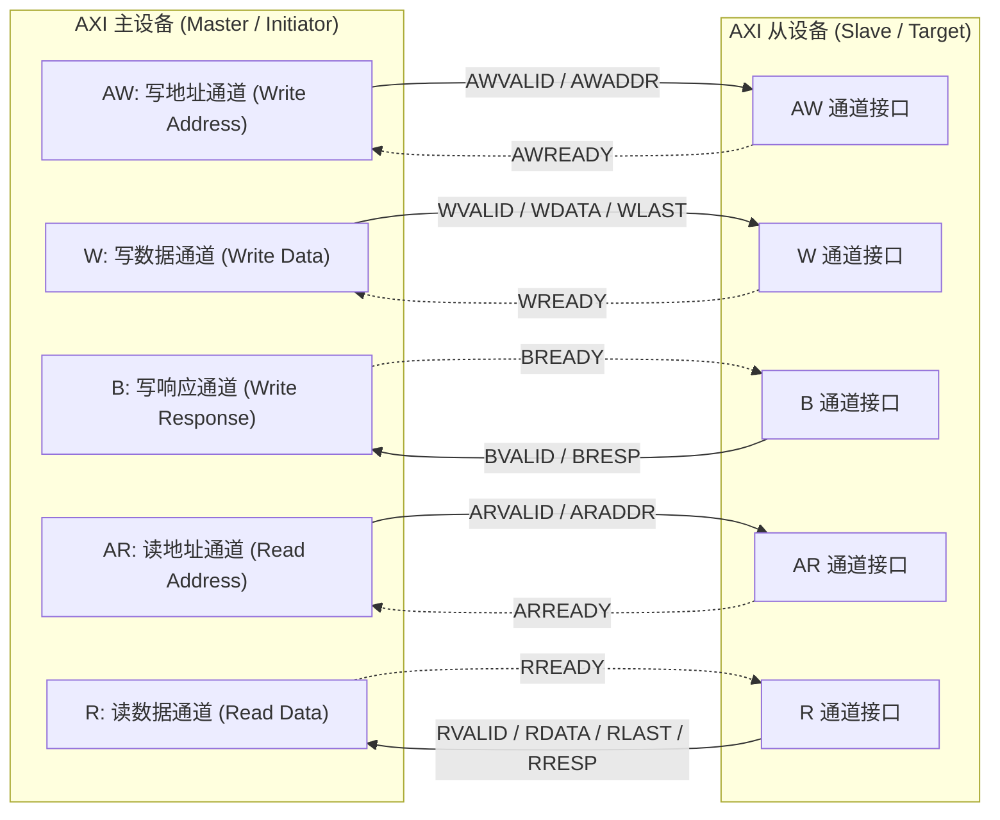

# AMBA 与 AXI 事务与协议深度解析

## 1. AMBA 协议族演进与架构定位

AMBA（Advanced Microcontroller Bus Architecture）是 ARM 主导的片上互联行业标准。在现代复杂 SoC 中，不同总线协议服务于不同带宽、延迟与面积需求的子系统：

| 协议 | 适用场景 | 拓扑与通道特征 | 吞吐能力 | 硬件复杂度 |
| :--- | :--- | :--- | :--- | :--- |
| **APB (APB3/4/5)** | 外设寄存器配置（UART、I2C、GPIO、Timer） | 单主多从、非流水线、无 Burst、2 周期简单状态机 | 低（适合 MMIO 配置） | 极低（仅需十几行状态机） |
| **AHB (AHB-Lite/5)** | 片上 SRAM、MCU 高速外设、简单 DMA | 单主/仲裁多主、地址与数据两级流水线、支持 Burst | 中等 | 中等 |
| **AXI4** | CPU Cluster、DDR 控制器、PCIe、GPU、高速 DMA | 5 个独立通道、支持乱序（OoO）、多 Outstanding、Burst 传输 | 极高（全双工并发） | 高（需要大量 Queue 与 ID 追踪逻辑） |
| **AXI-Stream** | 视频图像处理（ISP/MIPI）、以太网数据包流 | 无地址通道，仅数据 + VALID/READY 连续点对点流式传输 | 峰值流线速率 | 低~中 |
| **CHI (Issue B~E)** | 多核一致性互联（如 CMN-700）、大型数据中心 NoC | 基于分包路由（Packetized），拆分 Request/Snoop/Response/Data 通道 | 超高（支持数百核与大型缓存目录） | 极高 |

---

## 2. AXI4 五通道机制与 VALID/READY 握手协议

AXI4 架构将读写事务彻底解耦为 5 个单向独立的物理通道：
- **读通道组**：AR（读地址通道）、R（读数据与响应通道）。
- **写通道组**：AW（写地址通道）、W（写数据通道）、B（写响应通道）。

### 握手规则与“死锁组合环”防范
所有通道均遵循统一的 **VALID/READY** 双向握手机制：
1. **数据有效承诺（Stability Rule）**：发送方拉高 `VALID` 后，其携带的 Address/Data/Control 信号**必须保持绝对稳定**，直到接收方置起 `READY` 并在时钟上升沿完成采样的那一周期（Handshake Beat）。
2. **握手依赖协议限制（Anti-Deadlock Rule）**：
   - **合法依赖**：接收方可以等待发送方拉高 `VALID` 后，再拉高 `READY`（`READY` depends on `VALID`）。
   - **关键非法依赖（协议严格禁止）**：发送方**绝不能等待 `READY` 为高后才置起 `VALID`**（`VALID` cannot depend on `READY`）。
   - **死锁成因**：若 Master 内部逻辑设计为“等 Slave READY 才发 VALID”，而 Slave 逻辑又设计为“等 Master VALID 才发 READY”，则两端组合逻辑形成死锁环（Combinational Deadlock），总线永久挂死！

---

## 3. Burst 传输、对齐与 4KB 边界硬约束

AXI 支持三种突发类型（`AxBURST`）：
1. **FIXED**：地址固定不变，专用于向 FIFO 寄存器重复搬运数据。
2. **INCR**：地址按传输位宽递增，用于绝大多数线性内存读写。
3. **WRAP**：地址在达到回绕边界时环形回滚，专门服务于 Cache Line 的 **Critical Word First（关键字优先）** 填充。

### 为什么 AXI 协议严格禁止单个 Burst 跨越 4KB 地址边界？
- **硬件译码粒度约束**：在 SoC 顶层 Interconnect 中，地址译码器（Address Decoder）通常以 4KB 为最小边界来决定将事务路由到哪一个 Slave（如 SRAM、DDR 还是外设）。
- **严重后果**：若允许 Burst 跨越 4KB，该 Burst 的前几拍可能属于 Slave A，而后几拍属于 Slave B。AXI 协议不支持单次 Burst 中途动态切换从设备，跨界会导致总线译码混乱、路由死锁或触发 `DECERR` 关键异常。
- **软件与驱动责任**：DMA 引擎或硬件加速器在切片生成 AXI Burst 时，必须包含 **4KB Boundary Splitting** 算法，在接近 `0xXXXX_X000` 时强制断开为两个独立 Burst。

---

## 4. AXI ID 体系、Outstanding 深度与并发乱序

### AXI ID 的乱序与保序规则
- **相同 ID（Same ID）**：必须遵循严格的先后顺序（In-Order）。Master 发出的具有相同 `ARID` 的读请求，Slave 必须按请求到达顺序返回数据。
- **不同 ID（Different ID）**：完全允许乱序完成（Out-of-Order Completion）。
  - 例如 Master 发起 `ID=1`（访问慢速 DDR，耗时 100 周期）和 `ID=2`（访问片上快速 SRAM，耗时 5 周期）。
  - Slave/NoC 可以先返回 `ID=2` 的数据，Master 通过检查返回的 `RID` 准确分拣至对应的内部缓冲区。

### Outstanding 传输与内存延迟隐藏
- **Outstanding（未决事务深度）**：Master 在尚未收到前一个事务的响应/数据时，允许连续发出的最大请求数量。
- **吞吐量计算**：
  $$\text{Throughput} = \min\left(\text{Bus Bandwidth}, \frac{\text{Outstanding Depth} \times \text{Burst Size}}{\text{Round-Trip Latency}}\right)$$
- 如果访问外部 DDR 的往返延迟为 120ns，突发长度为 64 Byte，若 Outstanding 仅设为 1，则带宽上限被锁死在 $64\text{ B} / 120\text{ ns} \approx 533\text{ MB/s}$；若将 Outstanding 提升至 16，则可跑满 $8.5\text{ GB/s}$ 带宽。

---

## 5. 常见工程问题、总线死锁与排查手册

### 陷阱 1：写响应丢失或软件忽略 `BVALID` 导致的系统挂死
- **现象**：CPU 执行 MMIO 写操作或触发外设 DMA 后，整个 CPU Core 随后在下一条强同步屏障（`DSB`）处永久卡死。
- **硬件根因**：
  - AXI 规定每次写事务必须在 `B` 通道返回一个 `BRESP` 握手。
  - 某些缺陷 Slave 或桥接模块在接收到写数据后，漏发了 `BVALID`，或者 Master 的 Interconnect 路由丢失了该 Response。
  - CPU 发出 `DSB` 时，硬件必须等待所有在途写事务收到 `B` 响应。由于响应永不返回，CPU 流水线完全停滞。
- **排查与规避**：
  - 用 Logic Analyzer 或片上 NoC Trace 抓取 `BVALID/BREADY` 信号。
  - 在总线 Interconnect 集成阶段，必须开启 **Bus Timeout Watchdog**：若 Slave 超过 2048 周期不响应，Interconnect 强制合成 `SLVERR` 响应，释放 CPU 并触发 SError 中断。

### 陷阱 2：AXI-to-APB 异步桥死锁
- **现象**：读取处于低功耗门控（Clock Gated）状态的外设寄存器时，总线瞬间卡死。
- **根因**：AXI-to-APB 桥接器将 AXI 读转换为 APB 传输，但目标外设时钟已关闭，`PREADY` 永远为低。桥接器无限期等待，进而导致上游 AXI `RREADY` 阻塞，反压传导至整个 CPU/NoC 互联。
- **规避方案**：
  - 驱动访问外设前，必须确保时钟（CCF）与电源域（Power Domain）处于 Active 状态。
  - APB Bridge 硬件必须内置超时计数器（如 256 个 APB 周期），超时后主动拉高 `PSLVERR` 并释放总线。
