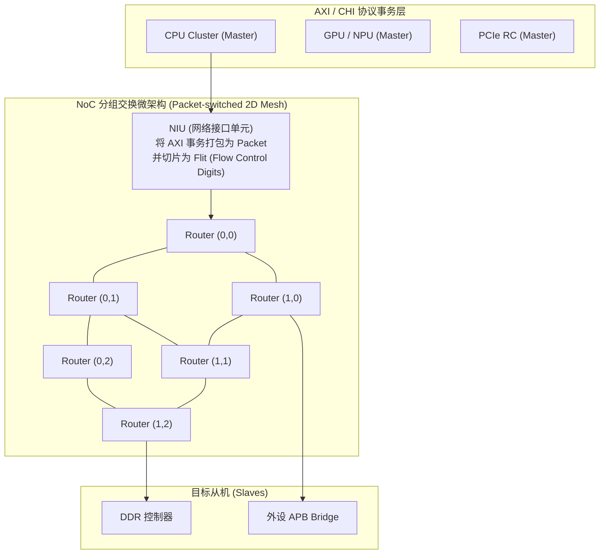
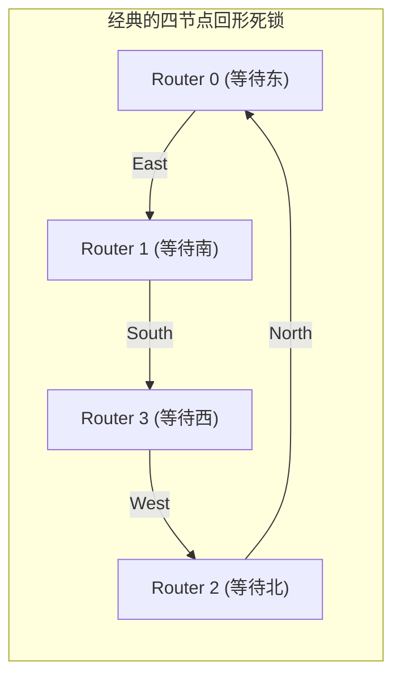

# NoC 架构、QoS 仲裁策略与片上路由死锁消除完全指南

## 1. 从 Crossbar 到 NoC（片上网络）的架构演进

在早期的紧耦合 SoC 中，主从设备通过集中式 **Crossbar（交叉开关阵列）** 互联。随着 IP 核心数增加至数十个，Crossbar 的布线复杂度呈 $O(N \times M)$ 几何级数爆炸，物理时序收敛与布线拥塞难以为继。现代复杂 SoC 普遍采用 **NoC（Network-on-Chip: 片上网络）** 分组交换架构：



### Flit（流控制单元）微架构切片
NoC 将上层庞大的 AXI 数据包拆分为三个维度的标准 Flit 单元在 Router 间管道传输：
1. **Head Flit**：包含路由目标坐标（X, Y）、流 ID（Flow ID）、QoS 优先级与虚拟通道（VC）分配；
2. **Body Flit**：承载实际的数据 Payload；
3. **Tail Flit**：包含端到端 CRC 校验和，释放当前链路的虚拟通道资源。

---

## 2. QoS（服务质量）多级仲裁算法与防饥饿机制

片上互联必须为不同特性的业务流提供确定性保障：

```mermaid
flowchart TD
    Traffic["进入 NoC 路由器的多路流量"] --> Arbiter{"QoS 调度器 (Multi-level Arbiter)"}

    Arbiter -->|硬实时流 (Hard Real-Time): Display 扫描/音频| Fixed["1. 绝对高优先级 (Fixed High Priority)\n优先抢占总线, 保障最低 60Hz 帧扫描不发生欠载闪屏 (Underflow)"]

    Arbiter -->|计算吞吐流: GPU / NPU 批处理| WRR["2. 加权轮询 (Weighted Round-Robin: DWRR)\n按配额 (Weight) 分配带宽, 允许跑满空闲带宽但禁止无上限独占"]

    Arbiter -->|低优先级尽力而为流: 后台 DMA| Age["3. 动态老化提升 (Age-based Dynamic Elevation)\n长时间未获响应的请求，硬件自动逐级提升其 QoS 权重，防止低优先级请求发生长期饥饿。"]
```

---

## 3. NoC 路由死锁（Routing Deadlock）与虚拟通道（Virtual Channels）

### 死锁产生的物理充要条件：依赖环路（Cyclic Dependency）
当多个 Router 之间的缓冲区（Buffer）全部填满，且四个方向的包相互等待对方释放下游队列时，形成**通道依赖死锁环（Routing Deadlock）**。



### 工业级两大破环方案：
1. **X-Y 维度确定性路由（Dimension-Order Routing, DOR）**：
   - 规则：所有报文**必须严格先在 X 轴方向路由完毕，再拐弯向 Y 轴方向路由**（禁止 $Y \to X$ 拐弯）。由于切断了逆向拐弯路径，通道依赖图（CDG）天然为无环有向图（DAG），从拓扑数学上证明无死锁！
2. **虚拟通道（Virtual Channels, VC）隔离请求与响应**：
   - AXI 读请求（AR）与读响应（R）在物理链路上分配至不同的独立虚拟通道（`VC0` 与 `VC1`），避免“读响应被待处理的读请求队列反向阻塞”引发的协议级死锁。

---

## 4. AXI 事务顺序（Ordering）与 Doorbell 同步实战

- **AXI ID 顺序模型**：
  - 相同 `ARID` 或 `AWID` 的事务：必须严格保持顺序返回；
  - 不同 ID 的事务：允许在总线互联中乱序（Out-of-Order）执行与交织（Interleaving）。
- **设备写与 Doorbell 的同步准则**：
  ```c
  /* CPU 向 DDR 写入 4KB 描述符，随后写 PCIe Doorbell 寄存器通知外设 */
  memcpy(dma_desc_va, &desc, sizeof(desc));
  dma_wmb();  /* 使用 dma_wmb() 表达 DMA 描述符发布顺序；具体屏障指令由 Linux 架构实现决定 (如 arm64 上通常映射为 dmb(oshst))，驱动中不应自行硬编码替换为 DSB 或 DMB */
  writel(1, pcie_doorbell_reg); /* 写入外设 MMIO (Device-nGnRE) */
  ```
