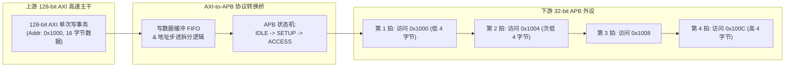
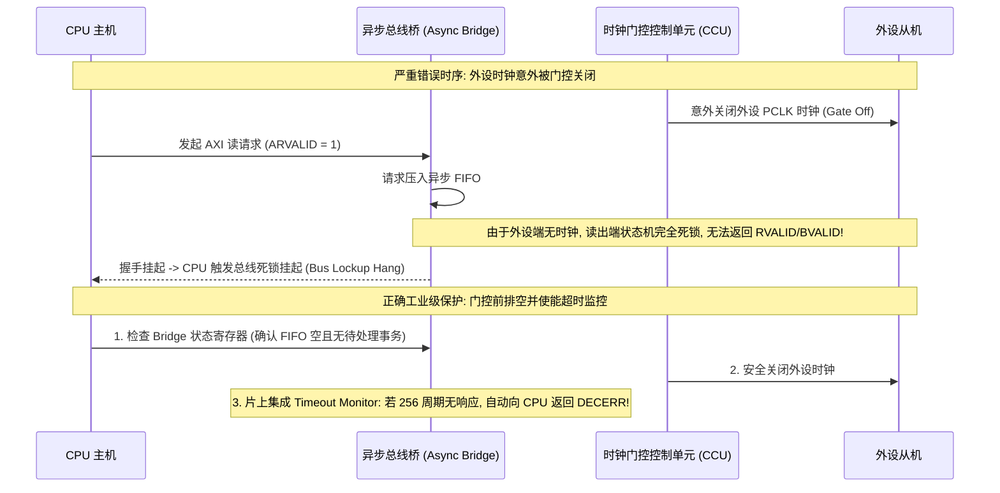

# 协议转换桥、异步跨时钟域、总线错误记录与带宽建模完全指南

## 1. 协议转换桥（AXI-to-APB / AXI-to-AHB）与位宽转换微架构

在 SoC 内部，高性能主干总线通常为 **128-bit / 256-bit AXI**，而低速外设通常仅支持 **32-bit APB** 接口。协议转换桥（Bridge）负责完成协议转换与数据拆分：

### 带宽与位宽转换的副作用警示：
- **寄存器访问原子性破坏**：若外设为 32 位定时器或 32 位 FIFO 寄存器，CPU 如果使用 64 位指令（`STR X0`）写入，转换桥会自动将其拆分为两次连续的 32 位 APB 传输，可能导致外设 FIFO 被非预期地连续压入两次数据！**驱动访问外设 MMIO 必须使用与外设位宽一致的原生读写接口（`readl()` / `writel()`）**。

---

## 2. 异步时钟桥（Async Bridge）与时钟门控联动规避

当 AXI 总线运行在 $500\text{MHz}$，而目标外设运行在 $50\text{MHz}$ 时，跨时钟域（CDC）由内部集成的异步 FIFO 隔离。

---

## 3. 总线错误记录器（Bus Error Logger / Fault Syndromes）

为了精确定位非法访问（如 DMA 踩内存、非法地址访问），现代 SoC 互联在关键节点部署了硬件 **Fault Logger**：

| 错误字段 | 记录寄存器 | 诊断分析价值 |
| :--- | :--- | :--- |
| **Fault Address** | `NOC_ERR_ADDR_LOW / HIGH` | 记录引发错误的 64 位物理地址，判断是否落在未映射空洞 |
| **Master ID** | `NOC_ERR_USER_ID / MASTER_ID` | **精确指出是哪一个硬件 Master 触发的违规**（如 CPU Core 2、GPU、DMA 引擎 #1） |
| **Transaction Type**| `NOC_ERR_TYPE` | 记录是读操作（Read）还是写操作（Write）、访问宽度（AxSIZE）、Burst 长度（AxLEN） |
| **Response Code** | `NOC_ERR_RESP` | 明确区分是 **`DECERR`（地址解码错误: 无此地址）** 还是 **`SLVERR`（从机报错: 从机拒绝访问/权限违规）** |

---

## 4. 互联理论带宽与实际有效吞吐数学模型

### 理想物理带宽上限公式
$$\text{Bandwidth}_{\text{ideal}} = \text{Data Width (Bytes)} \times \text{Clock Frequency (Hz)} \times \text{Peak Utilization Ratio}$$

- **案例计算**：对于 128-bit（16 字节）位宽、运行在 $800\text{MHz}$ 的 AXI 主干总线，理论峰值吞吐为：
  $$\text{BW}_{\text{ideal}} = 16 \text{ Bytes} \times 800 \times 10^6 \text{ Hz} = \mathbf{12.8 \text{ GB/s}}$$

### 影响实际有效带宽的四大微架构衰减因子：
1. **地址握手开销（Address Overhead）**：突发长度越短（如 `INCR1` 4B），每个数据 Beat 之间地址通道协商占比越高；
2. **VALID/READY 气泡（Pipeline Bubbles）**：Master 或 Slave 由于内部 Buffer 满而插入的等待周期；
3. **跨通道读写转换开销（Turnaround Overhead）**：DDR 读写方向切换导致的等待气泡；
4. **实际有效带宽公式**：
   $$\text{BW}_{\text{actual}} = \text{BW}_{\text{ideal}} \times \eta_{\text{burst}} \times \eta_{\text{handshake}} \times (1 - \text{Penalty}_{\text{turnaround}})$$
   在典型的混合负载下，实际总线效率通常在 **$65\% \sim 85\%$** 之间。
