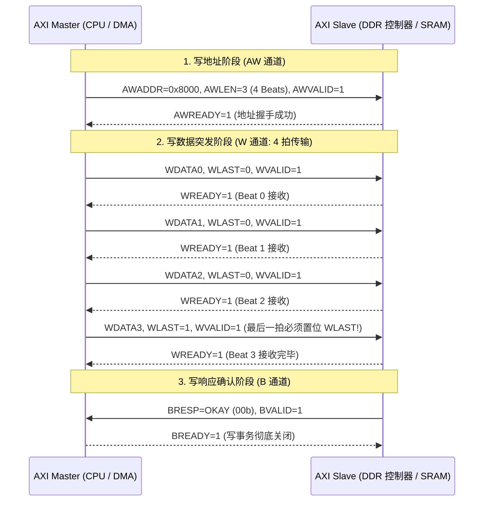

# AXI 典型时序波形案例、READY 死锁与总线故障定位完全指南

## 1. AXI4 标准写事务时序推进与 WLAST 完整性

在 AXI4 协议中，写事务由 **写地址通道（AW）**、**写数据通道（W）** 和 **写响应通道（B）** 协同完成：



### 关键时序陷阱：`WLAST` 与 `AWLEN` 不匹配
- **若数据少于预期（提前置位 WLAST）**：从机一直等待后续数据到来，写事务卡死，不返回 `BVALID`；
- **若数据多于预期（未置位 WLAST）**：从机在接收完第 $N$ 拍后强行终止或由协议断言器（Protocol Checker）触发 `Assertion Violation`。

---

## 2. `READY` 信号永久为低的断点定界决策树

```mermaid
flowchart TD
    Hang["AXI 总线事务挂起 (VALID=1 但 READY 持续为 0)"] --> Channel{"卡在哪个通道?"}

    Channel -->|卡在 AR 通道 (ARVALID=1, ARREADY=0)| Case_AR["1. 读地址队列阻塞\n• 下游从机内部请求缓冲区已满\n• 目标外设时钟被关闭 (Clock Gated) 或处于复位态\n• 排查: 查看下游模块的空闲状态与队列深度"]

    Channel -->|卡在 R 通道 (RVALID=1, RREADY=0)| Case_R["2. 主机消费端受阻 (责任在 Master!)\n• Master 内部接收缓冲溢出, 无法消费返回的数据\n• Master 发生内部死锁或中断卡死\n• 排查: 检查 Master 侧是否有反压信号"]

    Channel -->|卡在 B 通道 (BVALID=1, BREADY=0)| Case_B["3. 写响应未处理\n• Master 发起连续非阻塞写后, 未及时将 BREADY 置高接收响应"]
```

---

## 3. DMA 地址截断导致 DECERR 崩溃复盘

- **故障场景**：在 64 位 SoC 平台上，某自研硬件加速器通过 DMA 写入 `0x1_2000_0000`（4GB 以上的高端物理地址）时，总线立即返回 `DECERR`，导致系统触发总线异常。
- **微架构根因**：
  - 该硬件加速器内部集成的 DMA 控制器其 AXI Master 地址位宽仅设计为 **32-bit（`AWADDR[31:0]`）**；
  - 当驱动将 64 位物理地址 `0x1_2000_0000` 写入 DMA 寄存器时，高位 `Bit[32]` 在进入总线前被硬件静默截断，总线实际收到的地址为 `0x2000_0000`；
  - 在系统的内存地址映射表中，`0x2000_0000` 恰好属于**未分配任何外设或 RAM 的空白地址空洞（Unmapped Hole）**；
  - NoC 解码器无法找到任何目标 Slave，由 Default Slave 立即返回 `DECERR`（Decode Error）。
- **规范修复手段**：
  1. 在 Linux 驱动中配置正确的 DMA 寻址能力掩码：`dma_set_mask_and_coherent(&pdev->dev, DMA_BIT_MASK(32))`，通知内核从低 4GB 内存池分配缓冲区；
  2. 或在加速器前端使能 SMMU / IOMMU，通过 I/O 页表将 64 位物理内存映射为 32 位虚拟 IOVA。

---

## 4. QoS 优先级配置不当引发的尾延迟劣化案例

- **场景**：系统同时运行视频硬解码（4K @ 60fps DMA 连续写 DDR）与 CPU 实时交互任务。
- **问题**：视频吞吐完全达标，但 CPU 读写外设 MMIO 寄存器的延迟偶发飙升至 **$300\mu\text{s}$**，导致系统发生卡顿。
- **根因分析**：
  - NoC 互联将视频 DMA 配置为最高静态优先级（`QoS = 15`），而 CPU AXI 端口被配置为默认值（`QoS = 0`）；
  - 视频 DMA 发起长达 256 拍的连续大 Burst 传输，强行霸占了通往存储控制器的仲裁器，CPU 的低延迟小包请求被持续后推。
- **优化方案**：
  - 降低视频 DMA 静态优先级至 `QoS = 8`，并开启**突发长度截断（Burst Chopping: 最大限制为 64 字节）**；
  - 开启 NoC 动态老化机制（Aging Policy）：CPU 请求每等待 16 周期，其 QoS 权重自动递增 1；
  - 调优后 CPU 尾延迟从 $300\mu\text{s}$ 恢复至正常的 $80\text{ns}$，视频流依然稳定不丢帧。
