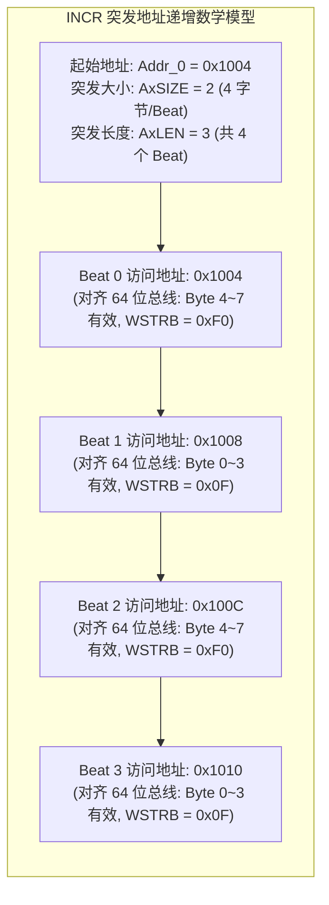
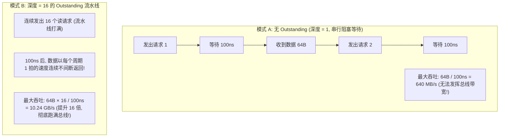
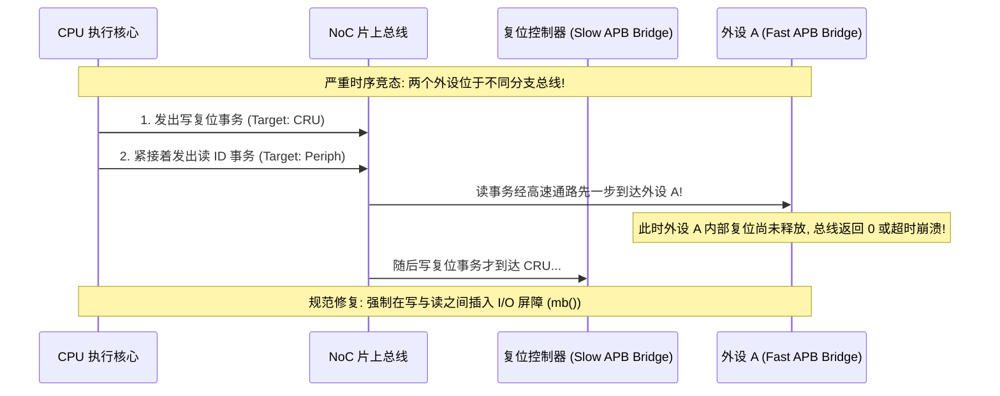

# AXI 突发地址计算、Outstanding 延迟隐藏与总线拥塞深度推演

## 1. AXI4 Burst 突发传输边界与字节使能（WSTRB）计算

AXI 协议支持三种突发模式：`FIXED`（FIFO 专用）、`INCR`（常规内存自增）和 `WRAP`（Cacheline 环绕回填）。



### 4KB 边界对齐规范（4KB Boundary Rule）
- **规范约束**：AXI 协议严格禁止一次突发（Burst）跨越 **4KB 物理地址边界**（例如从 `0x1FF0` 发起 64 字节传输）。
- **微架构动因**：SoC 内部的总线从机解码器与 MMU/SMMU 最小页管理粒度为 4KB。如果允许跨 4KB 边界，单次 AXI 突发可能同时跨越两个完全不同的物理外设或页表保护域，导致总线仲裁与权限校验无法处理。

---

## 2. Outstanding 传输如何隐藏总线延迟：数学模型推演

假设系统外部 DDR 访存平均往返延迟（Round-trip Latency）为 **$t_{\text{latency}} = 100\text{ns}$**，单次 AXI Burst 传输 64 字节有效数据。



- **推论**：在高性能 DMA 和 CPU 设计中，**仅增加总线位宽无法提升吞吐；必须匹配足够的 Outstanding 事务队列深度**，方能完全吸收和掩盖外部 DDR 的固有延迟。

---

## 3. 跨外设访问无序性与 I/O 屏障推演

假设 CPU 顺序执行以下两行代码：
```c
writel(0x1, CRU_RESET_RELEASE_REG); /* 1. 写复位控制器：释放外设 A 的复位 */
val = readl(PERIPH_A_ID_REG);        /* 2. 读外设 A 的 ID 寄存器 */
```



- **排查手段**：在访问不同外设寄存器存在因果依赖时，必须在中间显式插入 I/O 内存屏障（ARM 上为 `dsb sy` / Linux 内核 `mb()`），确保前序总线事务彻底生效并被对端接收后，方可发出后续请求。
