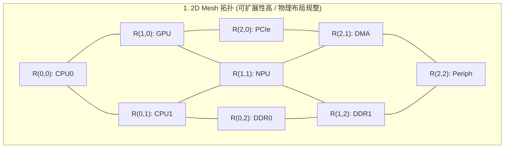
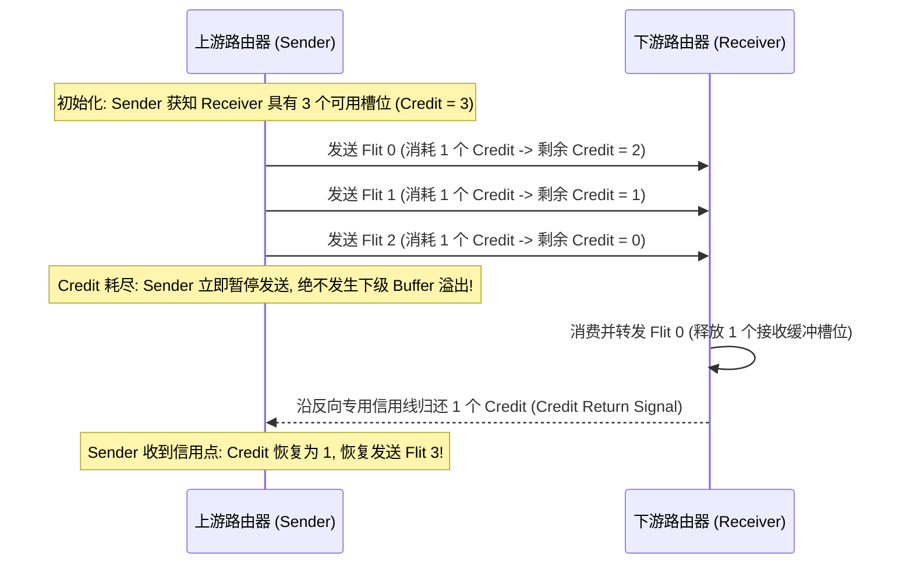

# NoC 路由算法、基于信用的流控（Credit Flow Control）与拓扑深度剖析

## 1. NoC 典型物理拓扑与权衡

在现代异构多核与 AI 芯片中，片上网络（NoC）根据 IP 数量与物理布局选用不同拓扑：

### 拓扑性能与成本对比矩阵
| 拓扑类型 | 节点连接度（Degree） | 网络直径（Diameter） | 典型跳数（Average Hops） | 面积布线开销 | 适用场景 |
| :--- | :--- | :--- | :--- | :--- | :--- |
| **Crossbar** | $N$ | 1 | 1 | $O(N^2)$ 极高 | 8 个节点以内的紧耦合 Cluster |
| **2D Mesh** | 4 | $2 \times (\sqrt{N} - 1)$ | $\frac{2}{3}\sqrt{N}$ | $O(N)$ 极低，适合平面布线 | 16~128 核大型 SoC / 服务器芯片 |
| **Ring（环形）** | 2 | $N / 2$ | $N / 4$ | 极低（环状走线） | 8~16 核桌面与移动端 CPU |
| **Fat-Tree（胖树）** | 随着树高增加 | $2 \times \text{Depth}$ | $\log N$ | 根节点处布线密集 | 多级分层异构处理器 |

---

## 2. 路由算法：X-Y 确定性路由与自适应路由

### 2.1 X-Y 维度确定性路由（Dimension-Order Routing, DOR）
- **算法规则**：设源节点为 $(X_s, Y_s)$，目标节点为 $(X_d, Y_d)$。报文必须先沿水平 X 轴移动至 $X_d$，当且仅当 $X_s == X_d$ 时，方可沿垂直 Y 轴移动至 $Y_d$。
- **数学证明无死锁**：DOR 算法严格禁止了 $Y \to X$ 的拐角动作（在 8 种可能拐角中只允许 4 种），切断了形成通道依赖环路（Channel Dependency Graph）的数学条件，**天然具备零死锁保证**。

### 2.2 自适应路由（Adaptive Routing）与重排缓冲
- **机制**：当 X 轴发生拥塞（下级 Router 满）时，报文可动态拐入 Y 轴绕行。
- **代价**：同一事务流的多个 Flit 可能经过不同物理路径到达，**导致报文乱序（Out-of-Order）**。网络出口必须配备重排缓冲区（Reorder Buffer, ROB）以恢复 AXI/CHI 的顺序语义。

---

## 3. 基于信用额度的流控制（Credit-Based Flow Control）机制

在 NoC 高频管道（如 1GHz+）中，传统的 `VALID/READY` 反压信号由于走线延时无法在一个周期内跨 Router 回传。工业级 NoC 统一采用 **Credit 流控**：

### 满带宽运行所需的最小 Credit 缓冲深度计算公式
$$\text{Buffer Depth}_{\min} = \text{Round-Trip Latency (Cycles)} \times \text{Flit Injection Rate}$$
- **算例**：若 Flit 发送经过 2 拍到达 Receiver，Receiver 消费产生 Credit 经过 2 拍返回，总往返延迟为 8 周期。为了保持链路每周期传输 1 个 Flit 不发生饥饿停顿，Receiver 的虚拟通道缓冲深度**至少必须配置为 8 个 Flit 槽位**。
