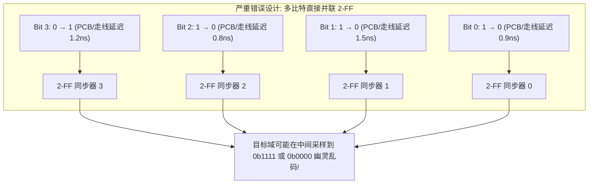
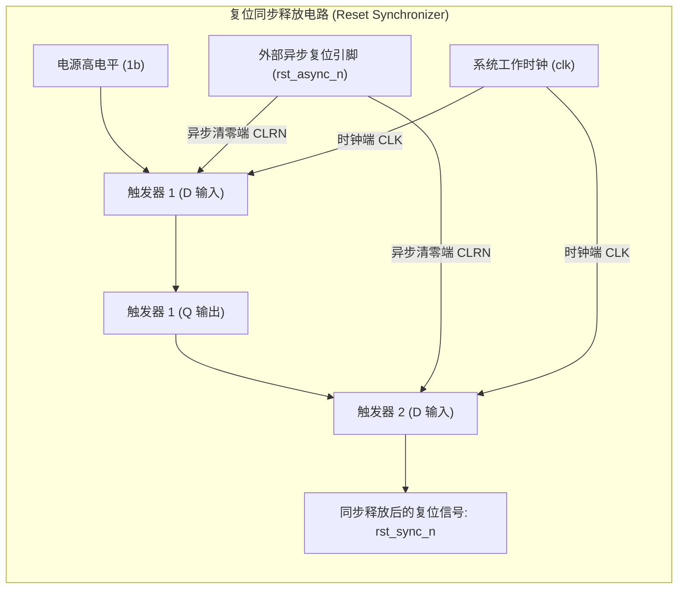

# 跨时钟域（CDC）电路设计、异步 FIFO 与格雷码同步深度解析

## 1. 跨时钟域（CDC）物理本质：亚稳态与 MTBF 模型

当数字信号从源时钟域（$clk_{src}$）跨入目标时钟域（$clk_{dst}$）时，若两个时钟相位无关或频率非整数倍，信号到达目标寄存器时极易违背 **建立时间（$t_{setup}$）** 或 **保持时间（$t_{hold}$）**。


### 亚稳态平均无故障时间（MTBF）数学模型
触发器进入亚稳态后，其输出恢复到确定逻辑电平的时间是概率性的。**平均无故障时间（MTBF, Mean Time Between Failures）** 计算公式为：

$$\text{MTBF} = \frac{e^{\frac{t_{res}}{\tau}}}{T_0 \cdot f_{clk} \cdot f_{data}}$$

其中：
- $f_{clk}$ 为目标时钟频率，$f_{data}$ 为数据翻转频率。
- $\tau$ 与 $T_0$ 为制程工艺物理参数。
- $t_{res}$ 为**允许恢复的时间裕量**（通常为 1 个时钟周期减去触发器传播延迟）。
- **两级触发器（2-FF Synchronizer）的工程意义**：为亚稳态提供了整整 1 个时钟周期的恢复时间 $t_{res}$，指数项 $e^{\frac{t_{res}}{\tau}}$ 将系统故障率从“每分钟崩溃数次”压降至“数千年发生一次”。

---

## 2. 为什么多比特总线绝对禁止直接并联 2-FF 同步？

如果将一个 32 位的二进制数据（例如计数器从 `0b0111` 变为 `0b1000`，4 个 bit 同时翻转）直接用 4 个独立的 2-FF 并联同步：



- **数据偏斜（Data Skew 严重问题）**：由于芯片内部物理布线长度微小差异，各个 bit 到达目标触发器的时刻不可能绝对一致。目标时钟如果在翻转窗口采样，会得到完全错误的瞬态伪值。
- **原则**：**多比特跨时钟域必须使用“握手协议（Handshake）”或“基于格雷码的异步 FIFO”**！

---

## 3. 异步 FIFO 微架构与格雷码（Gray Code）空满判断算法

异步 FIFO 是片上总线异步桥（如 AXI-to-APB 异步跨频桥）的核心组件：

```mermaid
flowchart TD
    subgraph Write_Clock_Domain ["写时钟域 (wclk)"]
        W_Data["写数据输入 wdata"] --> DP_RAM["双口双时钟 SRAM (Dual-Port RAM)"]
        W_Inc["写使能 winc"] --> W_Bin["写二进制指针 wptr_bin"]
        W_Bin --> Bin2Gray_W["二进制转格雷码: wptr_gray = (bin >> 1) ^ bin"]
        Bin2Gray_W --> W_Sync_Reg["写格雷码寄存器"]

        W_Full_Logic{"写满判断逻辑 (Full Detect)"}
        W_Sync_Reg --> W_Full_Logic
        R2W_Sync["读指针经 2-FF 同步到写域"] --> W_Full_Logic
        W_Full_Logic -->|Full 置位| W_Full["wfull 写满信号 (背压写端)"]
    end

    subgraph Read_Clock_Domain ["读时钟域 (rclk)"]
        DP_RAM --> R_Data["读数据输出 rdata"]
        R_Inc["读使能 rinc"] --> R_Bin["读二进制指针 rptr_bin"]
        R_Bin --> Bin2Gray_R["二进制转格雷码: rptr_gray = (bin >> 1) ^ bin"]
        Bin2Gray_R --> R_Sync_Reg["读格雷码寄存器"]

        R_Empty_Logic{"读空判断逻辑 (Empty Detect)"}
        R_Sync_Reg --> R_Empty_Logic
        W2R_Sync["写指针经 2-FF 同步到读域"] --> R_Empty_Logic
        R_Empty_Logic -->|Empty 置位| R_Empty["rempty 读空信号"]
    end

    W_Sync_Reg ==>|格雷码指针跨域 (单比特翻转)| W2R_Sync
    R_Sync_Reg ==>|格雷码指针跨域 (单比特翻转)| R2W_Sync
```

### 格雷码数学本质
格雷码保证了**任意相邻两个数值递增/递减时，有且仅有 1 个 Bit 发生变化**（如 `000 → 001 → 011 → 010 → 110 → 111 → 101 → 100`）。
即使目标时钟采样恰好落在翻转沿上，采样结果要么是旧值，要么是新值，绝不会产生非法中间伪值。

### 核心空/满判定逻辑（$N+1$ 位指针扩展算法）
为了区分“完全读空”与“完全写满”（此时低 $N$ 位指针完全相同），指针位宽需扩展为 $N+1$ 位（深度为 $2^N$）：
1. **读空判断（在读时钟域判断）**：
   - 读格雷码指针与同步过来的写格雷码指针**完全相同**：
     $$\text{rempty} = (\text{rptr\_gray} == \text{wptr\_gray\_sync})$$
2. **写满判断（在写时钟域判断）**：
   - 写格雷码指针与同步过来的读格雷码指针**最高 2 位相反，其余低位完全相同**：
     $$\text{wfull} = (\text{wptr\_gray} == \{\sim\text{rptr\_gray\_sync}[N:N-1], \text{rptr\_gray\_sync}[N-2:0]\})$$

---

## 4. 异步复位同步释放（Async Reset Synchronous Deassert）

芯片上电复位时，如果复位信号释放（从 0 变 1）的时刻恰好落在时钟上升沿附近，触发器内部的传输门将产生亚稳态。



### 硬件动作原理与时序边界
- **异步生效（Asynchronous Assertion）**：`rst_async_n` 一旦拉低，触发器异步清零端立即生效，复位信号瞬间置位输出 0（无论当前目标时钟是否存在）。
- **同步释放（Synchronous Deassertion）**：`rst_async_n` 撤除（变高）时，高电平信号经双级触发器同步打拍后输出，**使下游复位撤销只发生在目标时钟采样边沿附近，并通过两级同步链显著降低亚稳态向下游传播的概率**。
- **工程时序边界**：双级同步器并不能在数学上绝对消除所有亚稳态或时序违例。在芯片物理实现中，复位网络仍必须在静态时序分析（STA）中进行严格的 **Recovery（恢复时间）** 与 **Removal（去除时间）** 检查，并配合复位树时钟偏斜（Skew）约束与 MTBF（平均故障间隔时间）可靠性评估。

---

## 5. 常见关键 CDC 陷阱与排查手册

### 陷阱 1：常规格雷码异步 FIFO 深度非 2 的幂次方导致回绕多比特突变
- **现象**：在采用常规单步二进制转格雷码指针设计的异步 FIFO 中，将深度随意配置为 100（非 $2^N$ 幂次方）后，在指针回绕边界附近偶发指针误判，读取出异常数据。
- **根因**：标准二进制转格雷码（`gray = bin ^ (bin >> 1)`）的单比特翻转循环特性严格建立在模数为 $2^N$ 的全周期回绕基础之上。若直接在 99 处强行截断回绕至 0，其格雷码编码会同时发生多位跳变，失去跨时钟域亚稳态同步保护。
- **设计与实现边界**：
  - 在**常规经典异步 FIFO 设计**中，强烈推荐将深度配置为 $2^N$（如 32, 64, 128, 256, 512），逻辑最简洁且时序鲁棒性最高；
  - 若受面积严格限制必须实现非 $2^N$ 深度（如 depth=100），必须引入专门的非 2 幂格雷码变换电路（例如基于余数对称 Gray Code 偏移算法或双模计数转换），但会额外增加跨时钟域比较逻辑的延迟与面积开销。

### 陷阱 2：快时钟向慢时钟传递单周期脉冲被吞（Pulse Swallow）
- **现象**：Core 运行在 2GHz 发出一个中断脉冲（宽度仅 0.5ns），外设运行在 24MHz（周期 41.6ns），外设中断控制器偶尔完全接收不到中断。
- **根因**：快时钟域的脉冲宽度（0.5ns）远小于慢时钟的采样周期（41.6ns），慢时钟在连续两个上升沿采样时，脉冲已经在中间产生并消失了（被吞噬）。
- **规避方案**：采用 **Level Toggle 翻转握手电路**（源域每次产生脉冲时将电平翻转一次：$0 \to 1$ 或 $1 \to 0$；慢时钟域通过 2-FF 采样并执行异或边沿检测重新还原出单周期脉冲）。
