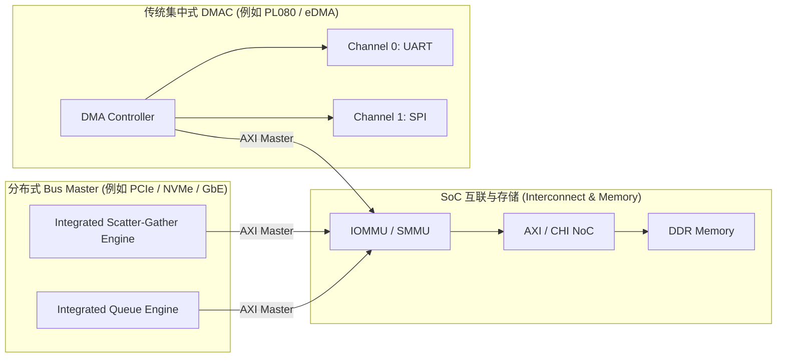
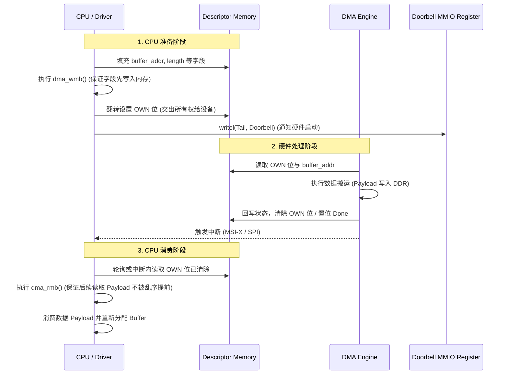

# DMA 引擎与描述符（Descriptor）机制深度解析

## 1. DMA 引擎架构：从集中式 DMAC 到分布式 Bus Master

直接内存访问（DMA, Direct Memory Access）是现代 SoC 卸载 CPU 访存负载、实现高速 I/O 数据吞吐的基石。



### 两种 DMA 架构模式对比
1. **集中式 DMA 控制器（Centralized DMAC）**：
   - 独立于外设，通过硬件 Request/Acknowledge 握手线与低速外设（UART、SPI、I2C、I2S）配合。
   - 通道数量有限（如 8~16 通道），多外设共享总线主端口，适用于物联网与微控制器 SoC。
2. **集成式 Bus Master DMA（Scatter-Gather / Scatter-Gather Ring）**：
   - 高速外设（如千兆以太网 MAC、PCIe NVMe 控制器、GPU、ISP）内部自带独立的 DMA 控制状态机，直接作为 AXI Master 接入总线。
   - 采用多队列（Multi-Queue）与描述符环（Ring Buffer）架构，CPU 仅需配置队列首尾指针（Doorbell），硬件自主解析任务链。

---

## 2. 描述符（Descriptor）数据结构与环形队列（Ring Buffer）

在高性能网络与存储设备中，数据通常分散在多个物理不连续的内存页中。**Scatter-Gather 描述符链表与 Ring Buffer** 彻底解决了零拷贝（Zero-Copy）与链表遍历开销。

### 典型 64 位网卡硬件描述符内存布局
```c
struct rx_desc {
    uint64_t buffer_addr;   /* 数据缓冲区物理地址 (PA/IOVA) */
    uint32_t length_flags;  /* 低 16 位为 Buffer 长度，高位包含 OWN 标志位 */
    uint16_t vlan_tag;      /* 硬件剥离的 VLAN Tag */
    uint16_t csum_status;   /* 硬件 TCP/IP 校验和卸载结果与状态 */
} __attribute__((aligned(32))); /* 严格按 32 字节硬件对齐 */
```

### 环形队列（Ring Buffer）双指针工作流
- **Base Address**：Ring 在物理内存中的起始基地址（必须 64 字节或 4KB 对齐）。
- **Head 指针（硬件维护）**：当前硬件 DMA 引擎正在处理的描述符索引。
- **Tail 指针（软件维护 / Doorbell）**：软件填充完毕的最新描述符索引。
- 当 `Head == Tail` 时表示 Ring 为空；当 `(Tail + 1) % Size == Head` 时表示 Ring 满。

---

## 3. 描述符所有权（Ownership）状态机与严格内存屏障

在非一致性（Non-coherent）系统中，CPU 与 DMA 设备共同读写描述符内存，必须依靠严格的状态转移与内存屏障，严禁产生读写竞争。



---

## 4. 常见关键陷阱与风险、踩内存事故与规避方案

### 陷阱 1：Cache Line 伪共享导致的数据踩踏（The Fatal Cache Invalidation Bug）
- **现象**：网卡 DMA 接收数据时，数据包头几个字节被随机篡改覆盖；或者系统偶发 `skb` 结构体指针损坏崩溃。
- **微架构根因**：
  1. 驱动分配了一个 1500 字节的 RX Buffer，其起始地址没有按 64 字节（CPU Cache Line 大小）对齐，或者紧挨着该 Buffer 分配了一个驱动内部控制变量（如 `struct status`）。
  2. 当设备 DMA 正在将网络数据写入物理 DDR 时，CPU 刚好在另一个 Core 上修改了紧挨着的控制变量，导致该 64B Cacheline 在 CPU 内部被标记为 **Dirty（脏行）**。
  3. 随后，CPU 由于容量淘汰或上下文切换，执行了 **Cache Eviction（自动写回）**。CPU 内部的旧数据瞬间刷入 DDR，**将设备刚刚通过 DMA 写入的新网络数据直接覆盖踩踏！**
- **规避与解决准则**：
  - 驱动应优先使用 Linux 内核提供的标准 DMA 接口（如 `dma_alloc_coherent()`、`dma_map_single()`）和专有分配器。非一致性架构会利用架构定义的 `ARCH_DMA_MINALIGN` 保证分配的缓冲区不与其他内核对象共享 Cache Line。
  - **核心对齐原则**：同一个 Cache Line 内绝对不能混合 CPU 与设备的不同所有权区域；驱动不应在代码中自行硬编码假设 Cache Line 大小，而应依赖系统分配器或在定义内嵌缓冲区时使用 `____cacheline_aligned` 显式隔离。

### 陷阱 2：非一致性平台 Cache Invalidate 时机颠倒与推测预取
- **现象**：DMA 搬运完成后，CPU 读出来的全都是旧数据（Old Data）。
- **根因**：
  - 驱动在设备发起 DMA 传输**之前**就执行了 Cache Invalidate；
  - 随后，CPU 的硬件预取器（Hardware Prefetcher）或乱序执行引擎在等待中断期间，**提前推测加载了该内存地址**，导致内存又被重新读入 CPU Cache！
  - 当 DMA 传输真正完成后，CPU 再次读取该地址，直接命中了推测预取的旧 Cacheline，造成数据不一致。
- **规避方案**：
  - 严格使用 Linux 标准 DMA API：在设备完成中断之后、CPU 读取数据之前，显式调用 `dma_sync_single_for_cpu()` 或 `dma_unmap_single()` 执行最终失效操作。

### 陷阱 3：Doorbell 缺少屏障导致的硬件读空（Race Condition）
- **现象**：偶发性硬件报“空描述符错误”或“未对齐非法地址”。
- **根因**：CPU 在现代弱内存序架构下（ARM64/RISC-V），先向 MMIO Doorbell 寄存器写入了尾指针，而描述符结构体的写入由于延迟仍停留在 CPU 的 Store Buffer 中。硬件收到 Doorbell 后立刻读取内存，读到了尚未完全写入的半个垃圾描述符。
- **规避方案**：
  - 在更新 Doorbell MMIO 寄存器之前，必须插入 `dma_wmb()`（在 ARM 上通常对应 `dmb oshst`）。
