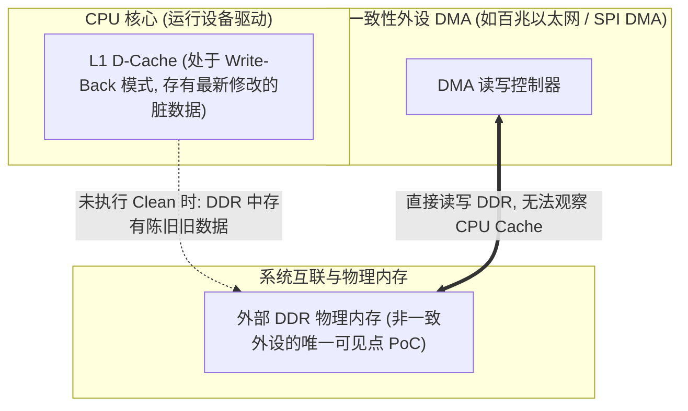
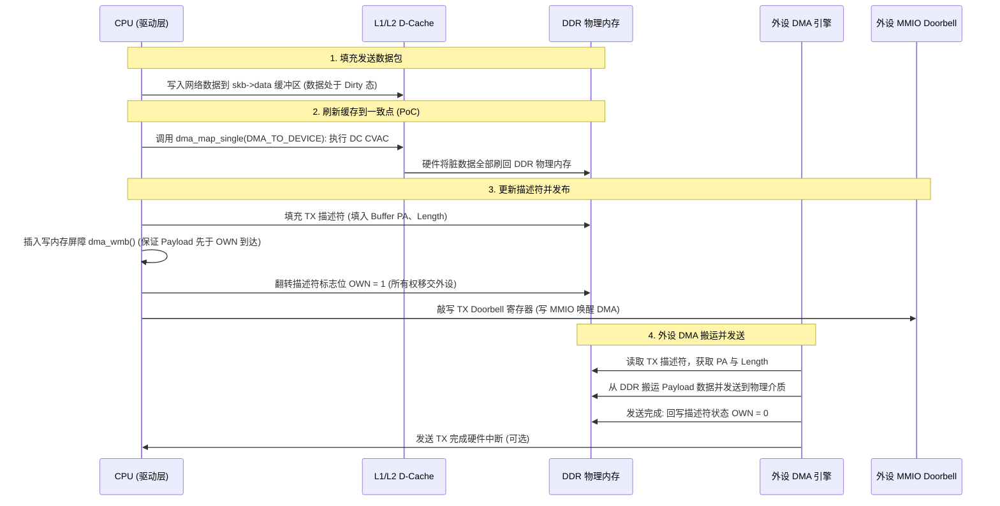
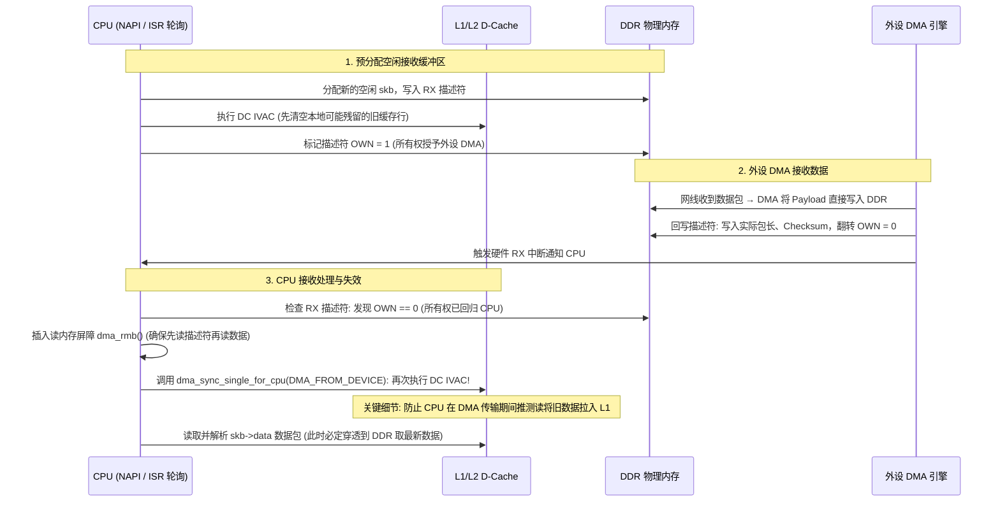

# DMA 环形缓冲区所有权移交、硬件一致性与 Cache 同步全生命周期

## 1. 非一致性 DMA（Non-Coherent DMA）的本质矛盾

在没有硬件一致性互联桥（如 CCI/CHI Snoop 接口）的系统中，DMA 外设直接连接片上 NoC 或 DDR 控制器，**完全绕过了 CPU 的 L1/L2 私有 Cache**：

- **矛盾 1（CPU 写，设备读 - 发送路径）**：CPU 修改了发送缓冲区，但数据停留在 L1 Cache 中尚未刷入 DDR。外设直接从 DDR 读取，**搬走了未更新的旧垃圾数据**！
- **矛盾 2（设备写，CPU 读 - 接收路径）**：外设将网络数据包写入了 DDR，但 CPU 的 L1 Cache 中早已缓存了该地址的历史数据。CPU 后续读取直接命中 Cache，**读到了历史旧数据**！

---

## 2. TX 发送环形缓冲区：所有权移交全时序（CPU → DMA）

---

## 3. RX 接收环形缓冲区：所有权移交全时序（DMA → CPU）

接收路径极易踩坑，**必须在 CPU 读取前执行严格的 Invalidate 操作**：

---

## 4. 硬件一致性 DMA（Coherent DMA）vs 非一致性 DMA

| 特性对比 | 硬件一致性 DMA（Coherent DMA） | 非一致性 DMA（Non-Coherent DMA） |
| :--- | :--- | :--- |
| **SoC 硬件集成方式** | 外设 Master 端口连接至 **CCI / CHI 硬件一致性互联（Snoop 端口）** | 外设 Master 端口直连 NoC 或 DDR 控制器 |
| **Cache 维护与开销** | **省去显式 Cache Clean/Invalidate**：硬件自动进行 Snoop 嗅探与数据直传；但仍有一致性互联流量、Directory 查询、IOMMU 映射及内存屏障开销 | **软件需维护 Cache**：由 DMA API 执行 `DC CVAC` / `DC IVAC` 维护指令，在大吞吐场景下占用较多 CPU 周期 |
| **设备树 DTS 声明** | 设备树中的一致性属性必须遵循对应架构和设备 binding 规范；在许多 ARM SoC 中，通过在设备或总线节点声明 **`dma-coherent;`** 声明该设备具备 DMA 一致性能力，但不能推广成所有平台的通用硬性规则 | 依平台默认模型和 binding 决定（在典型 ARM DTS 中通常未声明 `dma-coherent;`；部分体系结构默认一致，或支持反向的 `dma-noncoherent;` 显式声明） |
| **内存屏障要求** | 仍需要 `dma_wmb()` / `dma_rmb()` 保证描述符与数据包的更新顺序 | 既需要内存屏障，又需要 Cache 维护指令 |

---

## 5. 常见关键 DMA 踩坑案例与排查手册

### 陷阱 1：缓冲区未对齐导致的“脏行逐出（Dirty Eviction）覆写严重问题”
- **故障现象**：网络驱动在高吞吐下偶发性收到被破坏的数据包，且损坏的数据总是集中在数据包的**前 16 字节**。
- **微架构根因**：
  - 驱动分配的 RX 缓冲区起始地址未按 64 字节 Cacheline 对齐（例如分配在 `0x8000_1030`，前 48 字节为相邻的普通内核变量 `struct timer`）。
  - 当外设 DMA 正在向 `0x8000_1030` 写入网络数据包时，CPU 刚好修改了邻接的 `struct timer` 变量；
  - 稍后 CPU 发生 L1 Cache 淘汰，硬件将整条 64 字节 Cacheline（包含修改过的 timer 和**旧的 16 字节脏数据**）强制写回（Eviction）到 DDR；
  - **这一写回动作直接把外设刚刚写入 DDR 的前 16 字节新数据暴力覆盖篡改！**
- **工程准则**：驱动应优先通过标准 Linux DMA API（如 `dma_alloc_coherent()`、`dma_map_single()`）管理内存。在非一致性体系结构中，内核分配器会借助体系结构定义的 `ARCH_DMA_MINALIGN` 保证返回安全对齐的缓冲区，确保其不与其它对象共享 Cache Line；驱动绝不能在代码中自行假定特定的 Cacheline 大小硬编码，核心原则是同一个 Cacheline 内严禁混合 CPU 与外设的不同所有权区域。

### 陷阱 2：颠倒 Invalidate 时序引发的“推测执行污染”
- **故障现象**：开发者在启动 DMA 接收前执行了 Invalidate，DMA 完成后直接读取内存，发现偶尔读到全零。
- **微架构根因**：
  - 在 DMA 正在从网线接收数据的这数微秒时间内，CPU 的分支预测器进行推测执行，**提前向该内存区域发起了一次无序预取读**；
  - 这一次预取读将 DDR 中尚未更新完成的半成品数据重新拉回了 L1 Cache；
  - 当 DMA 真正完成且触发中断时，CPU 由于之前没有再次 Invalidate，直接从 L1 Cache 读取了推测预取的过时数据。
- **规避**：**在确认 DMA 完全结束（OWN=0 且收到中断）之后，CPU 读取数据之前，必须再次执行 `DC IVAC`！**
