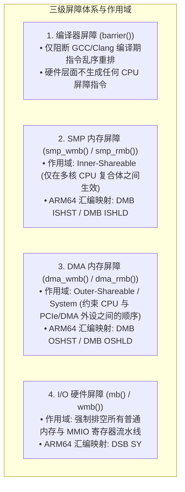
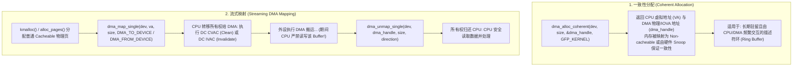
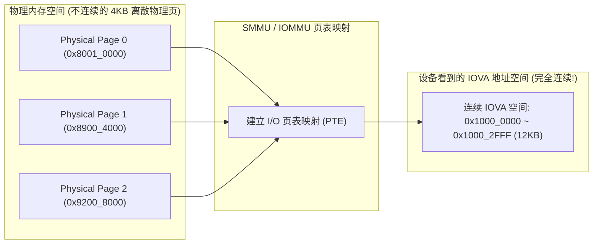

# 内存屏障、Linux DMA API 状态机与 IOMMU 映射完全指南

## 1. 编译器屏障、SMP 屏障与 DMA 屏障的层级与指令映射

在 Linux 内核驱动开发中，存在三套语义相近但硬件作用域截然不同的内存屏障：

### 核心映射对比表
| 内核 API 接口 | 编译生成 ARM64 汇编 | 硬件微架构行为 | 典型使用场景 |
| :--- | :--- | :--- | :--- |
| **`barrier()`** | 无任何指令 | 仅阻止编译器将变量缓存在寄存器中 | 纯 CPU 本地变量标志循环 |
| **`smp_wmb()`** | `dmb ishst` | 等待此前的 Store 写入本核 Store Buffer 后才广播给其他 CPU | 多核无锁环形队列 `kfifo` 生产消费 |
| **`dma_wmb()`** | `dmb oshst` | 保证数据写入 DDR 的可见性先于后续的描述符标志修改 | 填充完 DMA 数据后发布所有权给网卡 |
| **`wmb()`** | `dsb st` | 阻塞 CPU 执行，强制排空 Store Buffer 直至外设/总线确认 | 写入外设 MMIO 寄存器前同步 |

---

## 2. Linux DMA 内存映射两套 API 核心状态机

---

## 3. IOMMU 动态映射与 Scatter-Gather 链表合并机制

在未使能 IOMMU 的系统中，外设只能看到物理地址（PA）；在使能 SMMU/IOMMU 后，DMA API 负责分配 **I/O 虚拟地址（IOVA）** 并建立页表：

- **巨大性能提升**：传统 DMA 必须构建包含 3 个描述符的 Scatter-Gather 链表；经 IOMMU 连续化合并后，外设仅需执行**单次连续 Burst DMA 传输**，吞吐量提升显著。

---

## 4. 常见 DMA API 使用陷阱与排查手册

| 故障现象 | 驱动实现根因 | 排查与修复方法 |
| :--- | :--- | :--- |
| **开启 IOMMU 后设备 DMA 触发 Translation Fault** | 驱动源码中使用了 `virt_to_phys(buf)` 得到物理地址直接填入描述符，而未通过 `dma_map_single()` 获得合法 IOVA | 严禁直接转换物理地址，必须使用 `dma_map_single()` 返回的 `dma_addr_t` |
| **网络接收包头部几个字节偶发错乱** | DMA 传输中途（尚未触发中断完成）CPU 提前调用了 `dma_sync_single_for_cpu()` 或读取了 Buffer | 严格遵循所有权规则，只有在设备释放所有权（中断到达或确认描述符已回写）后方可访问 |
| **系统长时间运行后报 `dma_map_sg: failed to map (No IOVA space)`** | 驱动在处理错误路径或完成中断时漏掉了 `dma_unmap_single()`，导致 IOVA 地址空间耗尽泄漏 | 排查代码中的 `goto out_err` 分支，补齐 `dma_unmap_*` 释放逻辑 |
