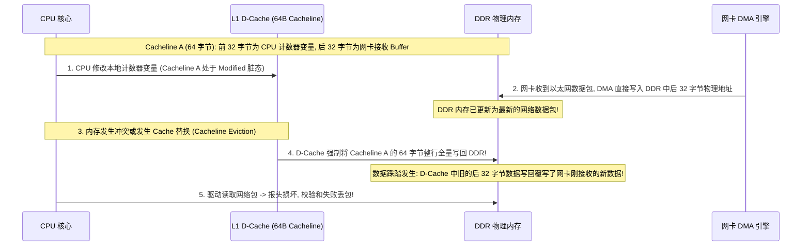
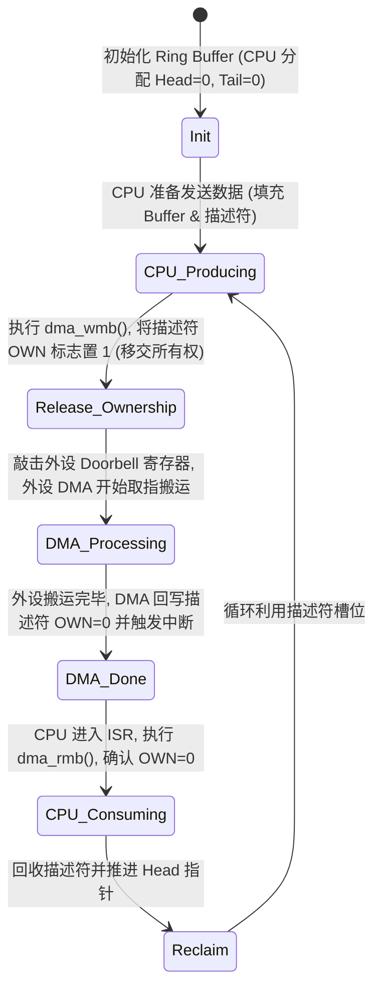

# 非一致性 DMA 脏行覆写、环形缓冲区越界与调试实战

## 1. 经典故障：非对齐非一致性 DMA 脏行覆写（Dirty Line Eviction）复盘

- **微架构根本原因**：Cache 以 **64 字节整行** 为最小读写粒度，而 CPU 写入的数据与 DMA 写入的数据共享了同一条 Cacheline。
- **工业级标准规避**：
  1. 驱动应优先使用标准的 DMA 内存分配接口（如 `dma_alloc_coherent`）或通用分配器，非一致性架构会利用体系结构相关的 `ARCH_DMA_MINALIGN` 保证分配的缓冲区边界独立，避免驱动自行假定 Cacheline 大小；
  2. **所有权隔离原则**：同一个 Cacheline 内严禁混合 CPU 与设备的不同所有权区域，禁止在 DMA 接收缓冲区前后紧挨着定义由 CPU 频繁写入的常规变量（若在结构体内嵌缓冲区，需使用 `____cacheline_aligned` 进行独立行对齐隔离）。

---

## 2. 环形描述符（Ring Buffer）生产者-消费者无锁同步状态机

---

## 3. DMA 踩内存（Silent Memory Corruption）硬件定位法

- **现象**：系统运行几小时后，内核调度器链表或页表突然被写坏为特定数据模式（如全 `0x00` 或带有以太网报头特征），CPU 触发 Panic。
- **定位四步法**：
  1. **特征逆向**：观察被踩内存的数据内容。若包含 `0x0800`（IPv4 协议号）或特定 MAC 地址，直接定界为网卡 DMA 越界；
  2. **使能 IOMMU / SMMU Guard Page**：在驱动申请的 DMA 物理页前后各插入一个未映射的虚拟保护页（Guard Page）。当 DMA 发生越界写时，SMMU 硬件瞬间捕获并记录 `Translation Fault` 与触发该事务的 `StreamID`（硬件外设标识）；
  3. **启用 `CONFIG_DMA_API_DEBUG`**：Linux 内核自带 DMA 调试框架，能够自动检查缓冲区未对齐、重复映射、内存越界和未释放泄漏。
